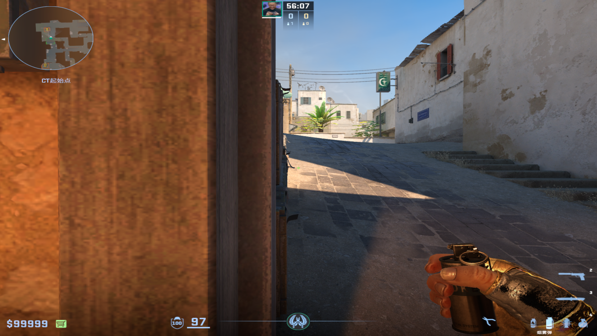
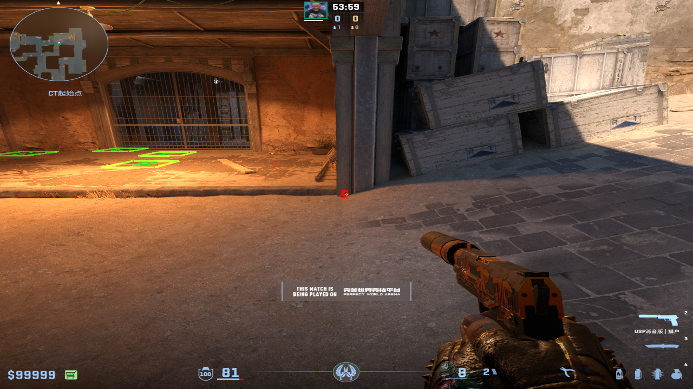
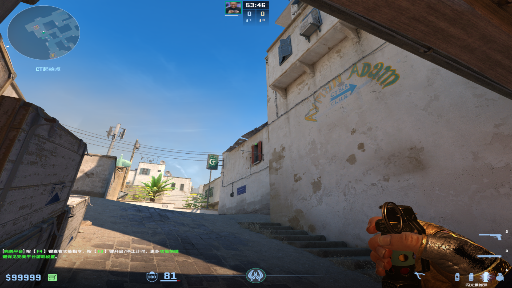
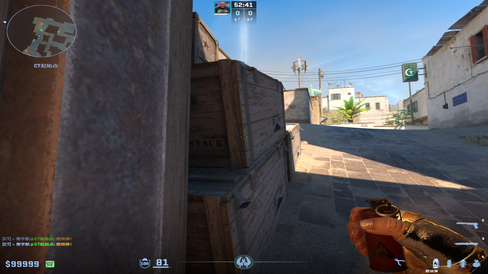
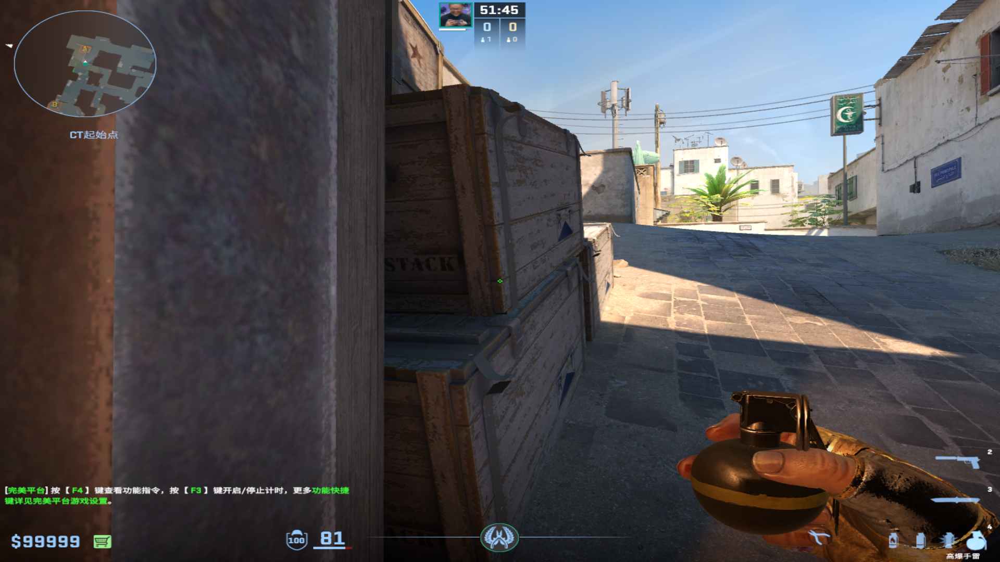
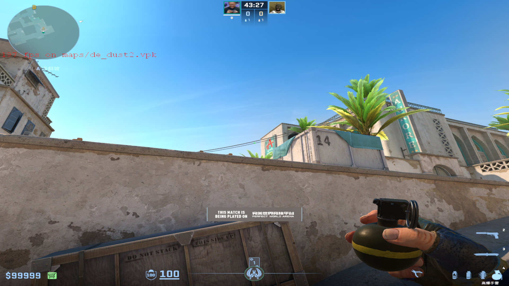

# 烟雾弹
	- ## 回防展开烟
	  collapsed:: true
		- 投掷：左键直接丢
		- 站位：警家边缘
		- 描点：A小箱子中间的线条往右拉一点
		  collapsed:: true
			- {:height 308, :width 533}
-
- # 闪光弹
	- ## 窗户闪
	  collapsed:: true
		- 投掷：左键直接丢
		- 站位：A小门梁最左面
		  collapsed:: true
			- 
			-
		- 描点：窗户上端中间
		  collapsed:: true
			- 
			-
-
- # 燃烧弹/手雷
	- ## 包点雷火
	  collapsed:: true
		- 投掷：双键跳投
		- 站位：A小门梁最左面
		- 描点：A小箱子右端棱的白色斑点
		  collapsed:: true
			- {:height 308, :width 533}
			-
	-
	- ## A小包雷
	  collapsed:: true
		- 投掷：双键跳投
		- 站位：A小门梁最左面
		- 描点：A小上面箱子右端棱的下面交点
		  collapsed:: true
			- 
			-
	-
	- ## 忍者位雷
	  collapsed:: true
		- 投掷：左键直接丢
		- 站位：A大斜坡箱子后面
		- 描点：房子左端
		  collapsed:: true
			- 
			-