# 闪光弹
	- ## 前身位防rush闪光（同投掷方式可以用雷）
	  collapsed:: true
		- 投掷：跑丢
		- 站位：在B通左侧，可以看到描点就可以
		- 描点：右侧光斑的右下角及其区域均可
		  collapsed:: true
			- 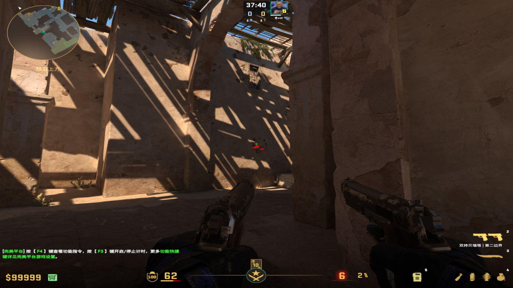
			-
	-
	- ## 自助清B1前点闪光
	  collapsed:: true
		- 投掷：左键直接丢
		- 站位：B1头顶箱子上，偏向右侧站一点
		- 描点：和右侧扶梯把手同水平线，竖直方向为墙壁中心偏左
			- 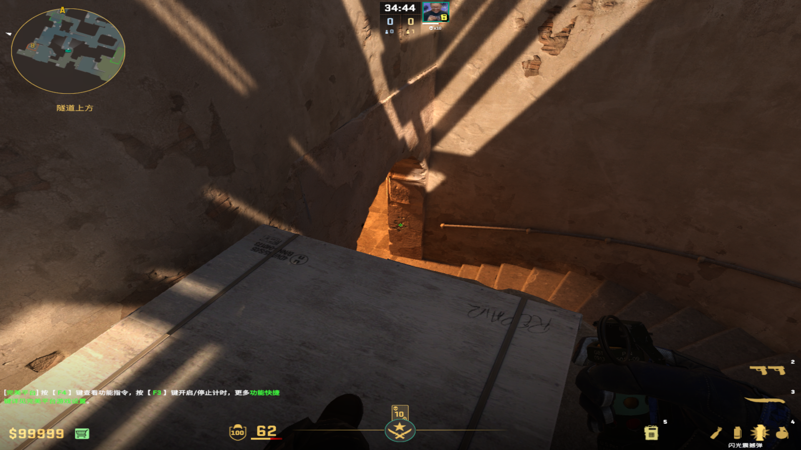
		-
		-
	-
	- ## 协助清B1前点闪光（爆点和上面那个一样）
	  collapsed:: true
		- 投掷：左键直接丢
		- 站位：B通右侧柱子周围均可
		  collapsed:: true
			- 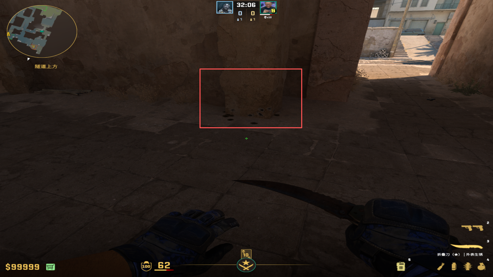
		- 描点：看向楼梯的光斑右下角
		  collapsed:: true
			- 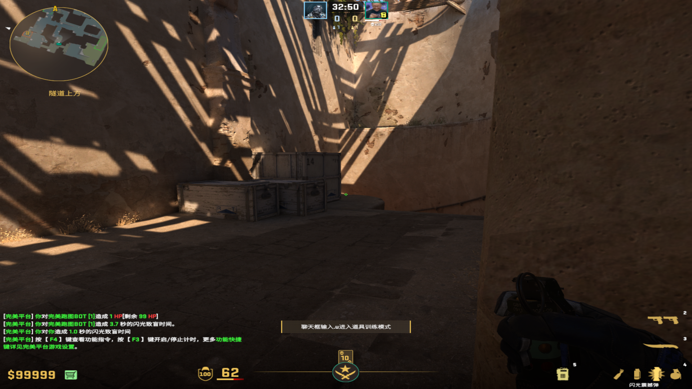
			-
	-
	- ## 防A小偷
	  collapsed:: true
		- 投掷：双键丢
		- 站位：B1楼梯底端，需要看一点右侧墙壁的侧向面
		- 描点：墙壁与水管的交界处
			- 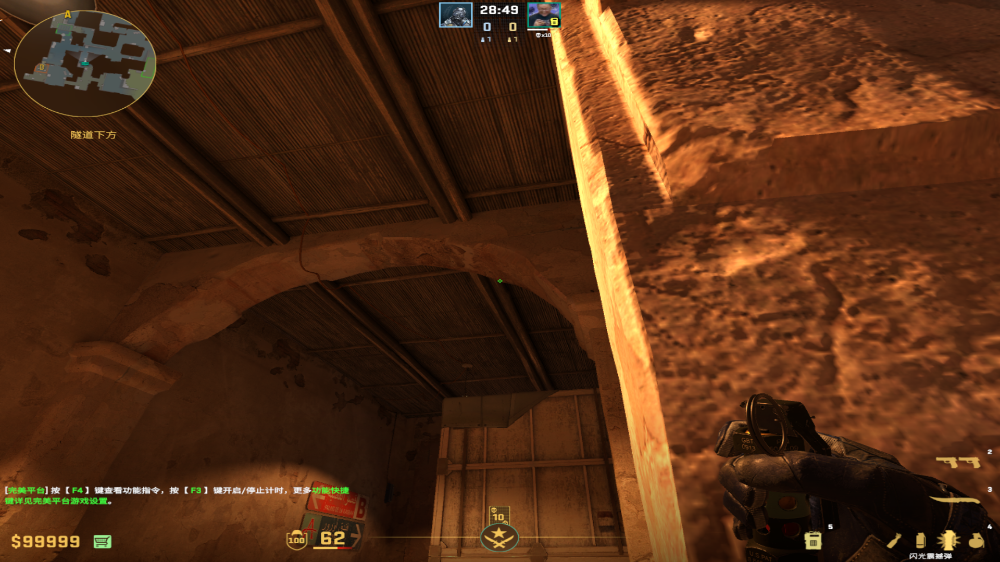
-
- # 烟雾弹
	- ## B1补X箱烟（可以留中路门缝）
	  collapsed:: true
		- 投掷：左键直接
		- 站位：可以看到右侧箱子的左侧面
		- 描点：X箱右侧区域的中间，往上一点（和污渍的中间）
			- 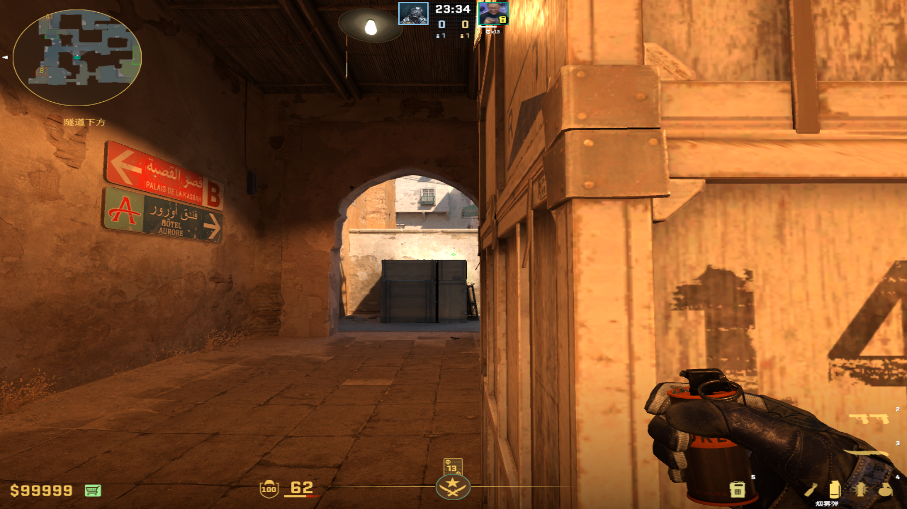
			-
	-
	- ## B1补中门烟I
	  collapsed:: true
		- 投掷：左键直接丢
		- 站位：B1拱门外侧，与墙面平齐
		- 描点：右侧门框的最下面铆钉
			- 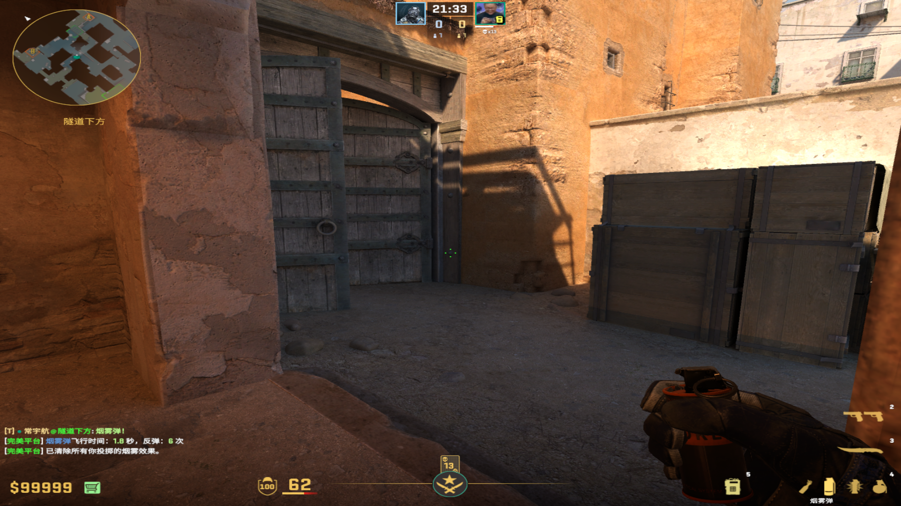
			-
	-
	- ## B1补充中门烟II（阴影问题可能看不到）
	  collapsed:: true
		- 投掷：左键直接丢
		- 站位：拱门里侧中间
		- 描点：污渍与地缝重合处
			- 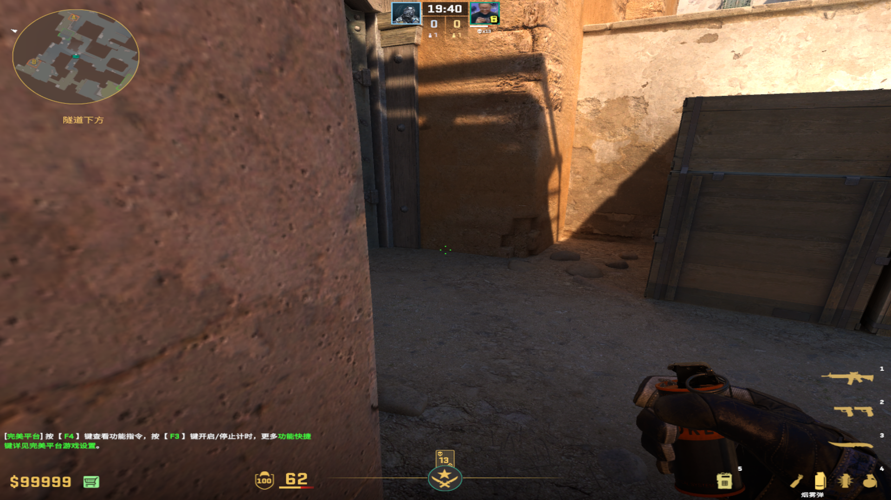
			-
	-
	- ## B1补充挂门烟
	  collapsed:: true
		- 投掷：双键
		- 站位：B1拱门外侧，与墙面平齐
		- 描点：右上方窗户的右下角
			- 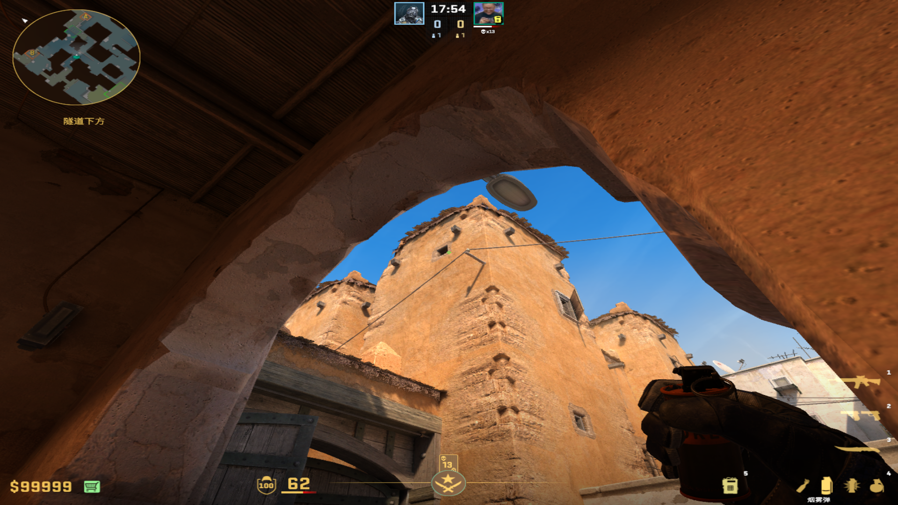
			-
	-
- # 燃烧弹
  collapsed:: true
	- ## 清B1里侧
	  collapsed:: true
		- 投掷：（W走一步）左键直接丢
		- 站位：B1楼梯不漏右手（先清理近点）
		- 描点：离柱子最近的污渍
			- 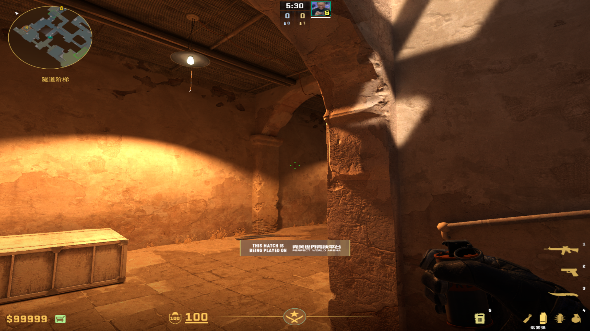
			-
	-
	- ## 清A小楼梯
	  collapsed:: true
		- 投掷：左键跳投
		- 站位：B1拱门外侧，需要看一点右侧墙的面
		- 描点：X箱中间交界线
			- 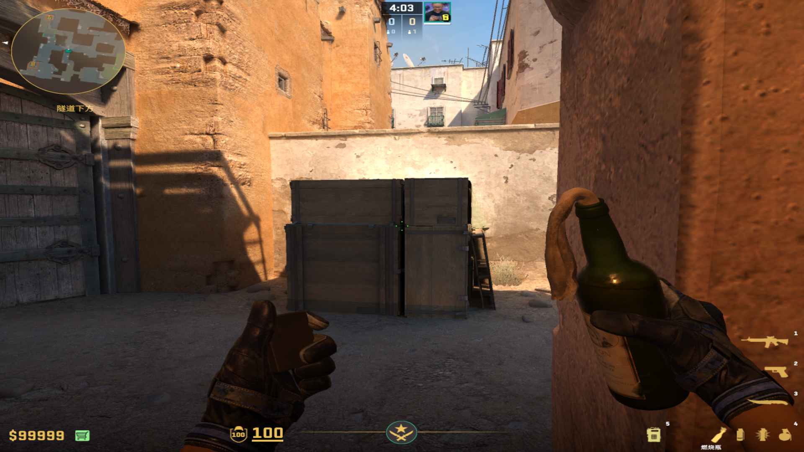
			-
-