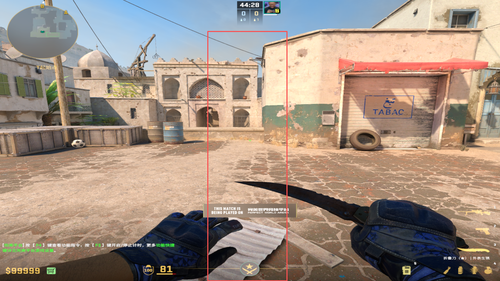
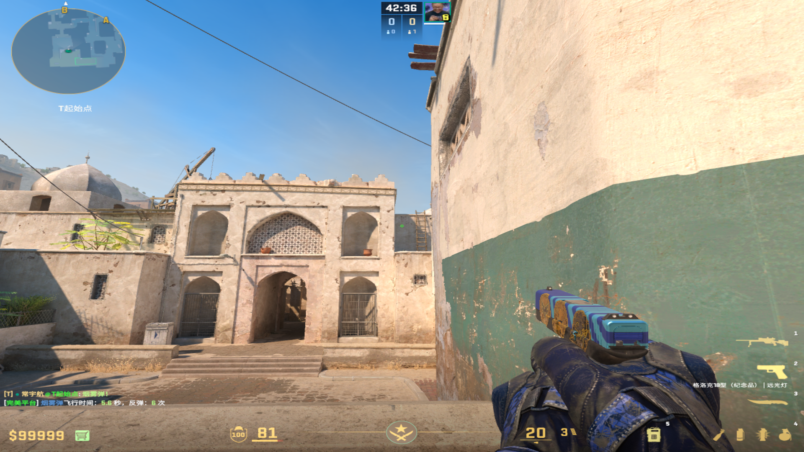
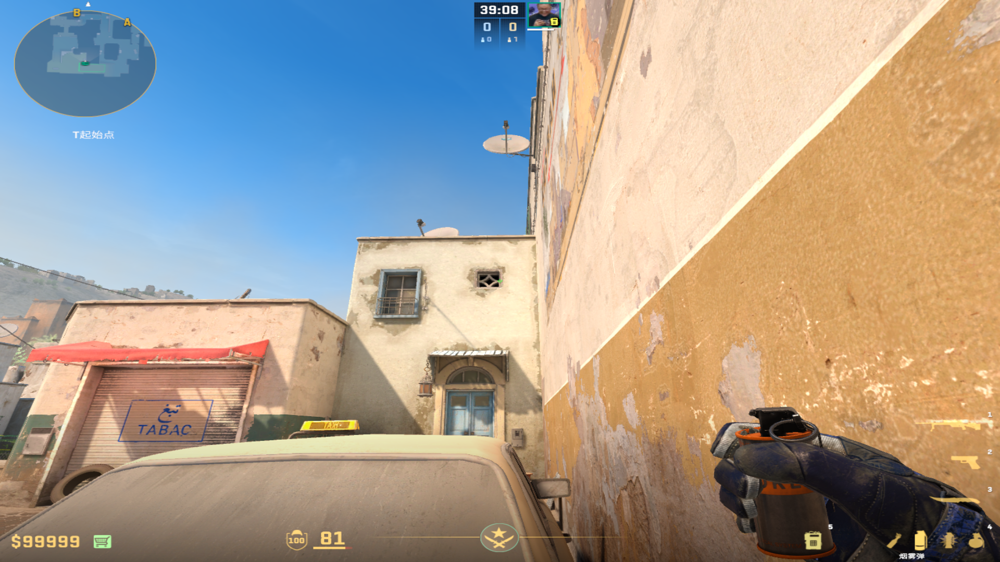
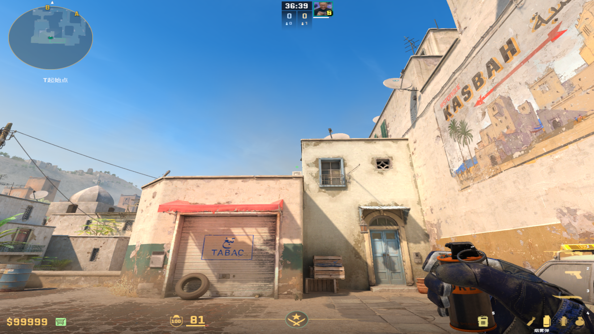

# B门快烟
collapsed:: true
	-
	- ## B门烟
		- ### 最顺路的丢法
		  collapsed:: true
			- 投掷：拉满地速直接跑丢
			- 站位：基本位于白色铁皮/贴近右墙
			  collapsed:: true
				- 
			- 描点：第三个梯子/和右面方块平齐的中间位置
			  collapsed:: true
				- 
	-
	- ## 狗洞快烟
		- ### 可以双弹套餐投掷（描点传烟后双弹方便）
		  collapsed:: true
			- 投掷：走过房檐，静步过为狗洞烟，直走过是B门烟
			- 站位：后花园车位死角
			- 描点：菱形右端尖角，往左平移到空调中心
			  collapsed:: true
				- 
				-
				- 
-
-
-
-