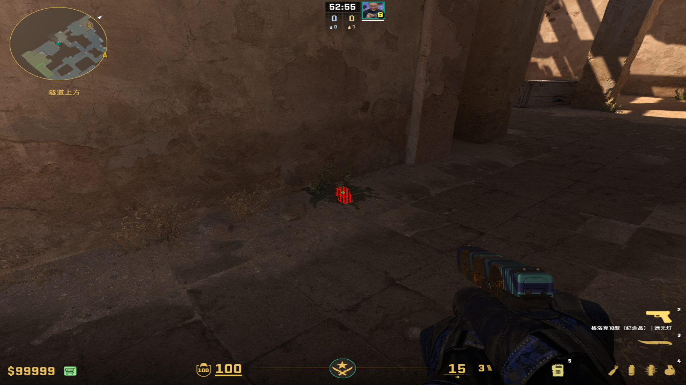
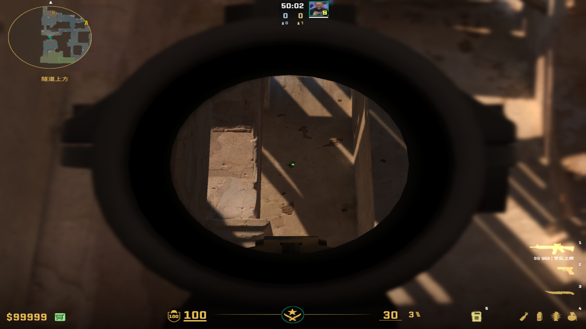
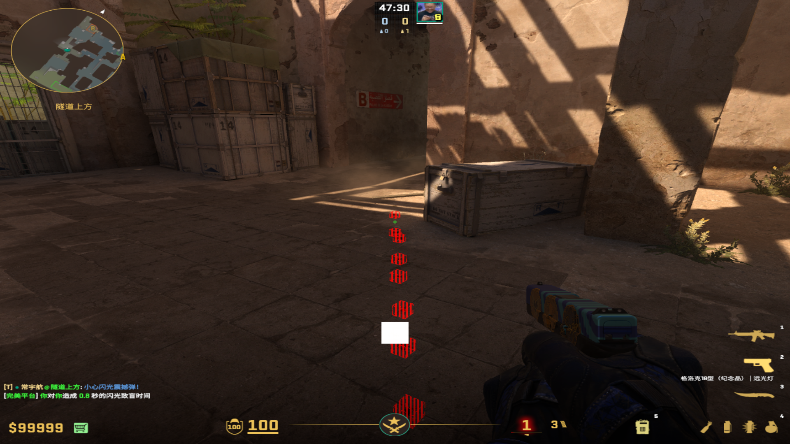
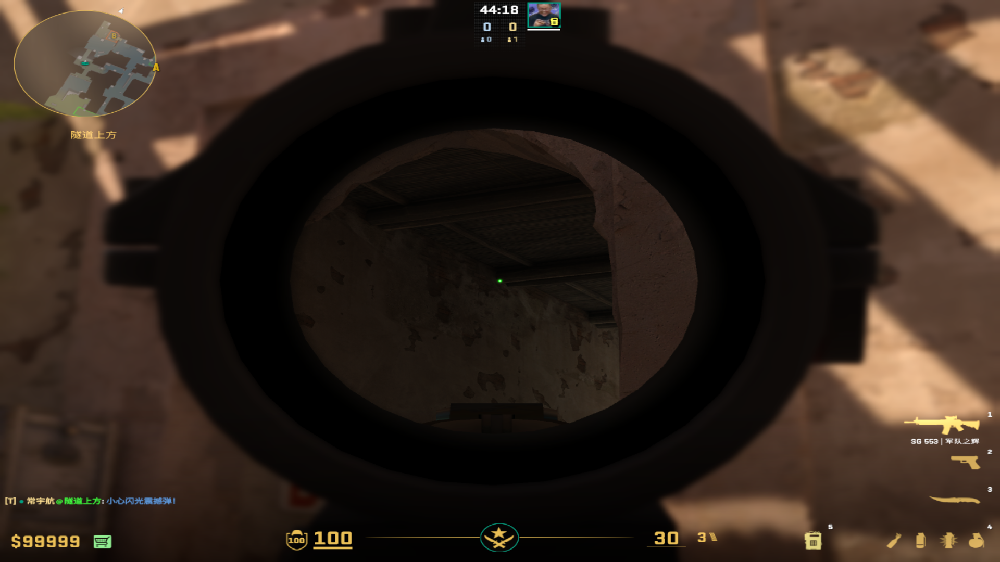
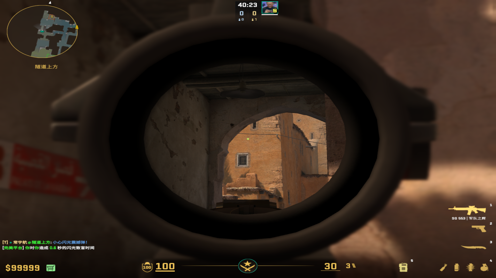

public:: true

- ## 高闪（实测方便好用）
  collapsed:: true
	- 投掷：跳投
	- 站位：B通这个绿草上面
	  collapsed:: true
		- 
	- 描点：合适高度污渍（不能W跳投）
	  collapsed:: true
		- 
-
- ## 出门自助闪光（一身位不管这么多）
  collapsed:: true
	- 投掷：双键跑丢
	- 站位：很顺路的rushB路线
	  collapsed:: true
		- 
	- 描点：第二个木头左端，和展开烟一个描点，可以往上一点
	  collapsed:: true
		- 
-
- ## 假门闪光 （闪白效果和不白队友都是顶级）
  collapsed:: true
	- 投掷：直接跑丢
	- 站位：不漏大箱的B通右侧
	- 描点：地速拉满可以窗户右上角，不满往上延长到拱门都可以
		- 
-