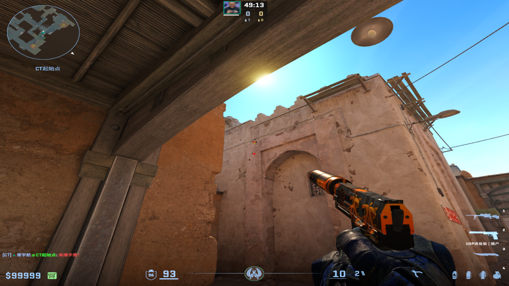
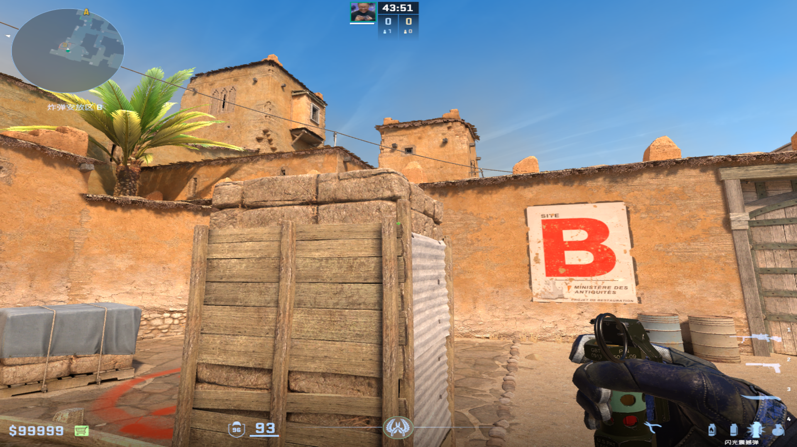
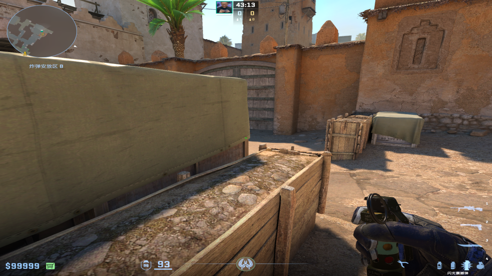
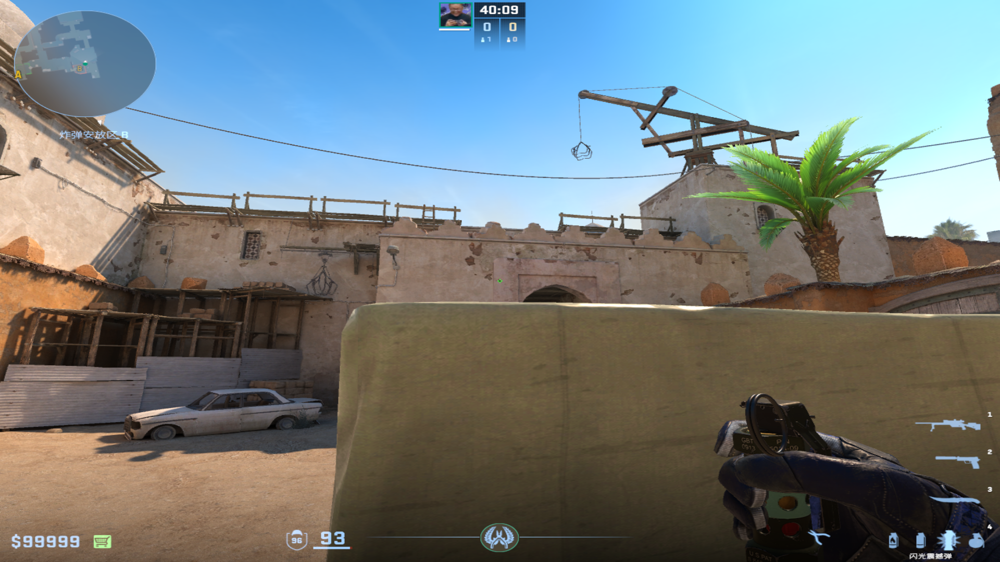
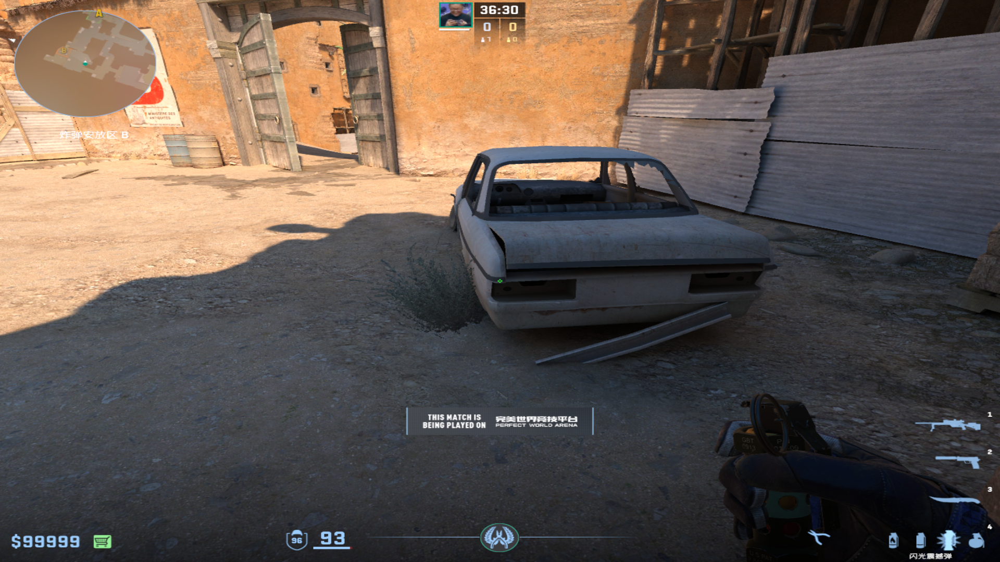
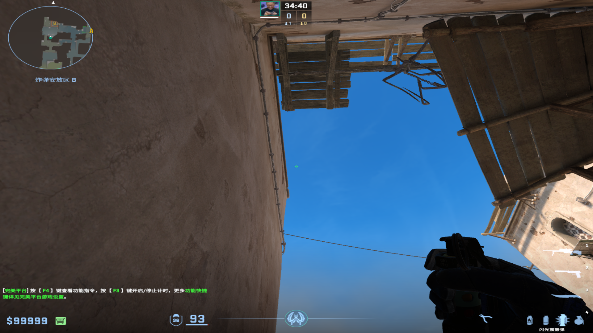
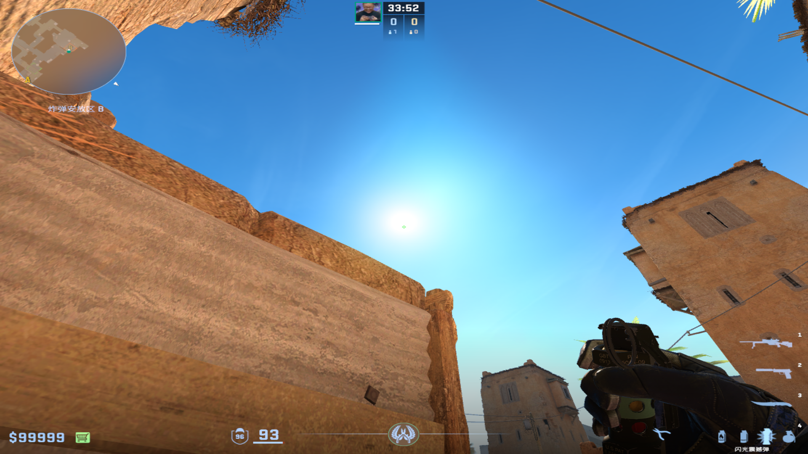

# 手雷
	- ## 炸过点（防被抽和拿信息）
	  collapsed:: true
		- 投掷：跑着双键投掷
		- 站位：没出ct双架箱子
		- 描点：从上面跑到下面点
			- 
			-
-
- # 闪光弹
	- ## 不同位置的自保闪光
		- ### 台阶上大箱角落
		  collapsed:: true
			- #### 箱子上爆
			  collapsed:: true
				- 投掷/描点：高箱右侧左键直接丢
					- 
			-
			- #### 大箱中间爆
			  collapsed:: true
				- 投掷/描点：大箱最右侧钉子右键投掷
					- 
					-
			-
			- #### 可侦查用
			  collapsed:: true
				- 投掷/描点：B通左侧圆圈小污渍左键直接丢
					- 
					-
		-
		- ### B通旁箱子
		  collapsed:: true
			- 投掷：左键直接丢
			- 描点：白车左后车灯
				- 
				-
		-
		- ### 白车里死点
		  collapsed:: true
			- 投掷：双键投掷
			- 描点：左侧房檐向外拉
				- {:height 291, :width 503}
				-
		-
		- ### 包点死点
		  collapsed:: true
			- 投掷：双键投掷
			- 描点：太阳
				- 
				-