# 烟雾弹
	- ## A大保护烟
		- ### Jame烟
		  collapsed:: true
			- 投掷：W+跳投
			- 站位：匪家斜坡跳暗道的边缘
			- 描点：房棱左侧的污渍最右侧
				- 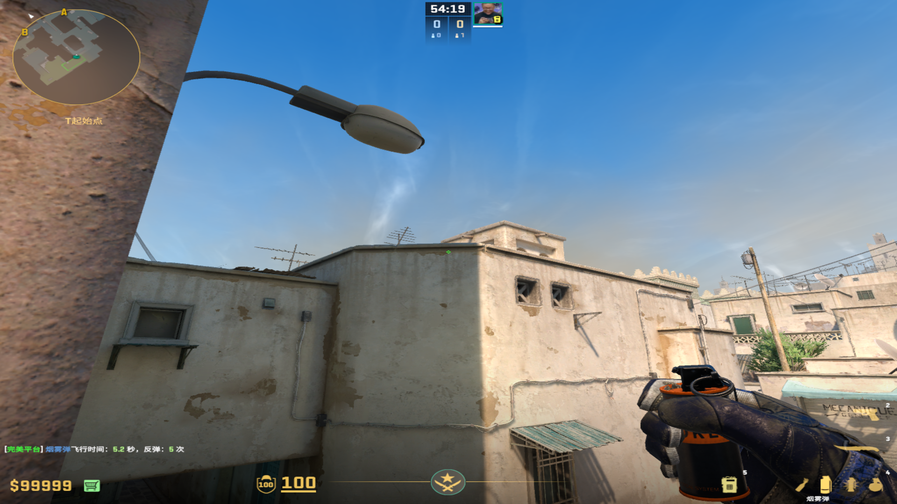
				-
		-
		- ### 出生位快烟
			- 站位：如图
				- 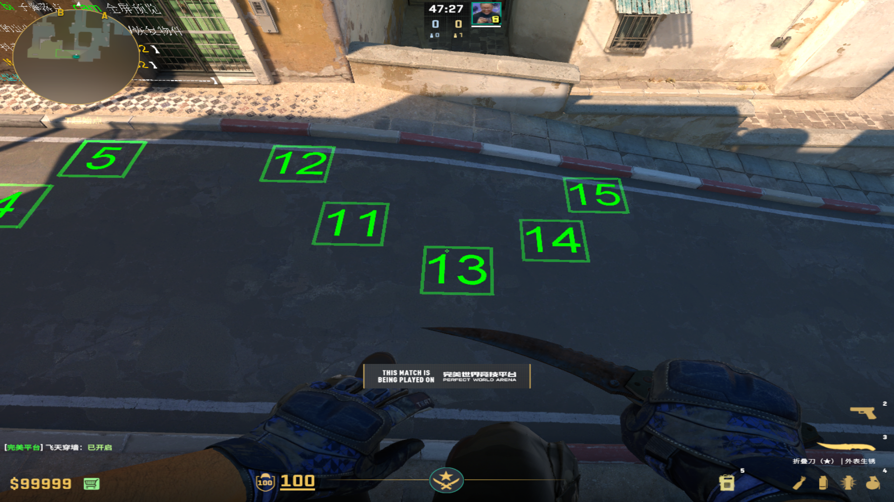
			- #### 12号位
			  collapsed:: true
				- 投掷：W+跳投
				- 描点：最高房的中间棱
					- 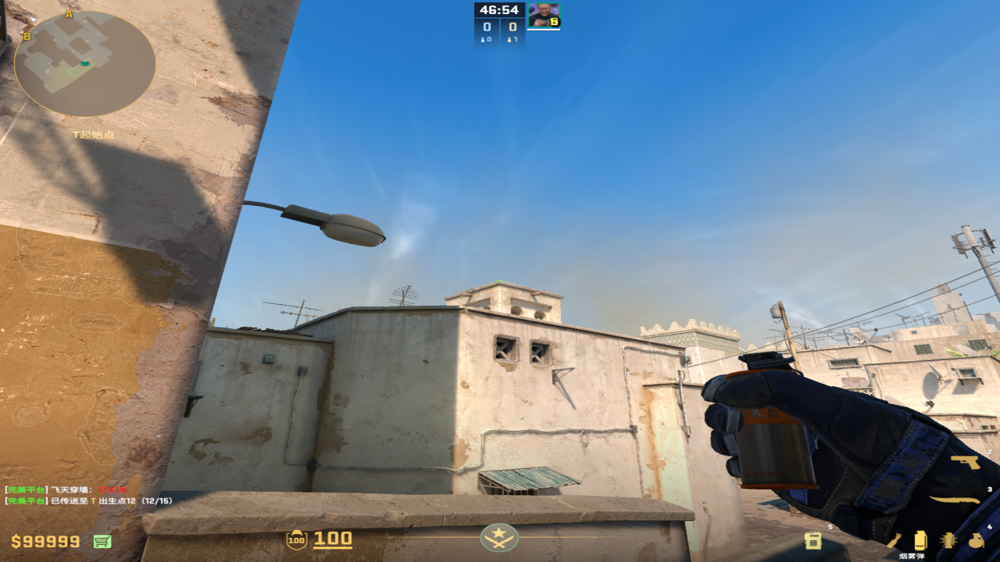{:height 274, :width 473}
			- #### 11号位
			  collapsed:: true
				- 投掷：W+跳投
				- 描点：最高房的水管头
					- 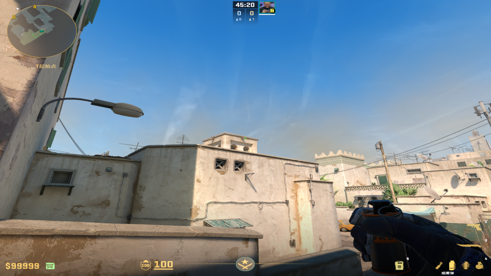
					-
			- #### 13号位
				- 方法1：雨棚烟
					- 投掷：W+跳投
					- 描点：最高房的右侧棱，平移到和水管的中间
						- 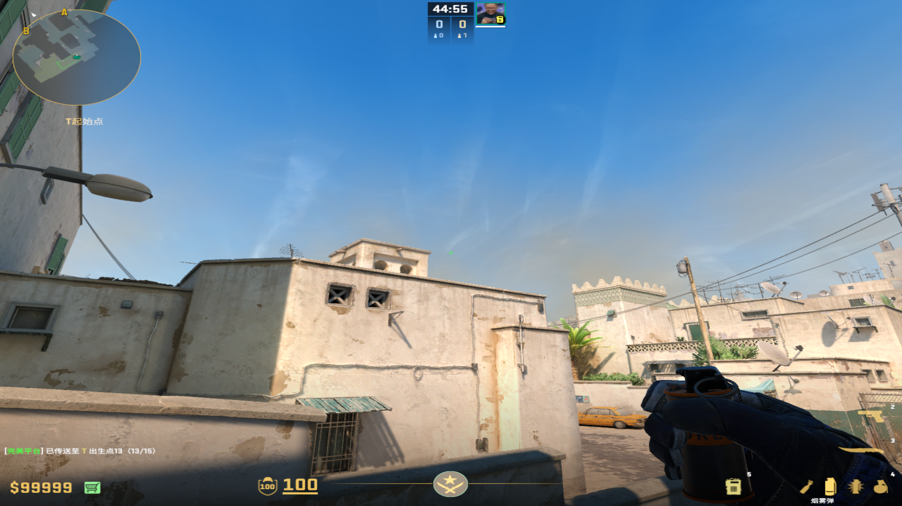
						-
				- 方法2：路上烟
					- 投掷：左键跳投
					- 描点：下方UI右侧和长方形条对齐
						- 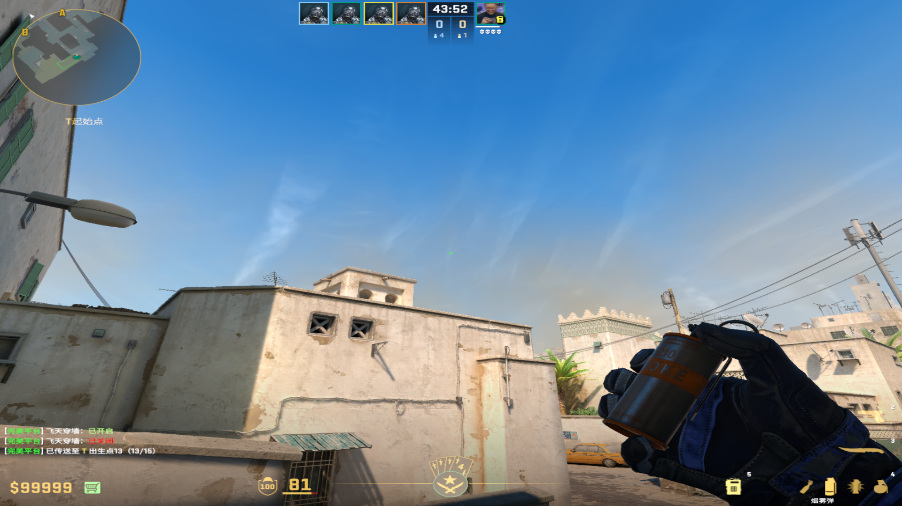
						-
			- #### 14号位
			  collapsed:: true
				- 投掷：按住D，走过右侧丢
				- 描点：左侧方框的左上角，D到右上角
					- 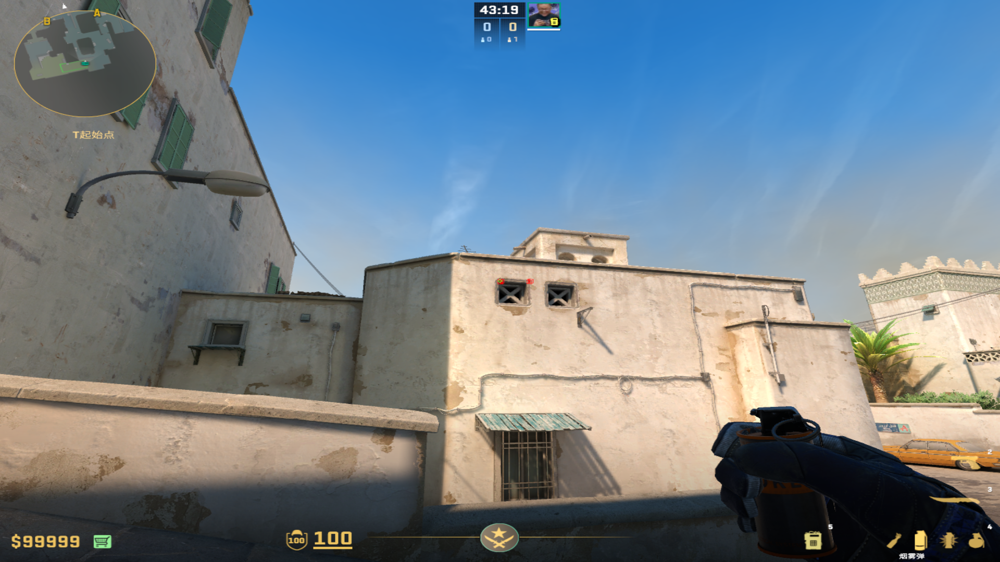
					-
			- #### 15号位
			  collapsed:: true
				- 投掷：按住D，走过右侧丢
				- 描点：左侧方框的左下角，D到右下角
					- 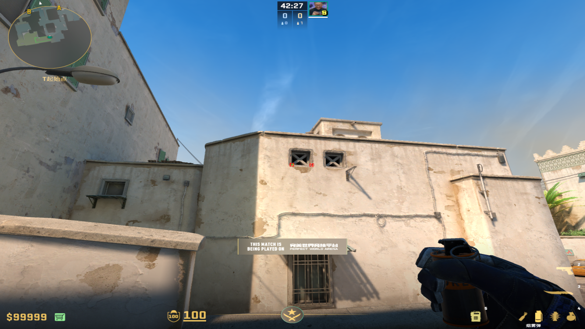
					-
					-
			-
		-
		- ### Monsey二出烟
		  collapsed:: true
			- 投掷：W+跳投
			- 站位：面对着斜坡侧面，如果往左面站多了，准心就得往左多来点，标准的是与墙壁重合
			  collapsed:: true
				- 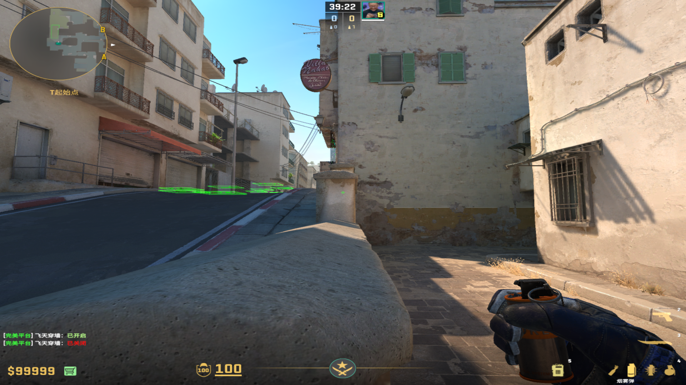
				-
			- 描点：左侧树叶向上平移到天线
			  collapsed:: true
				- 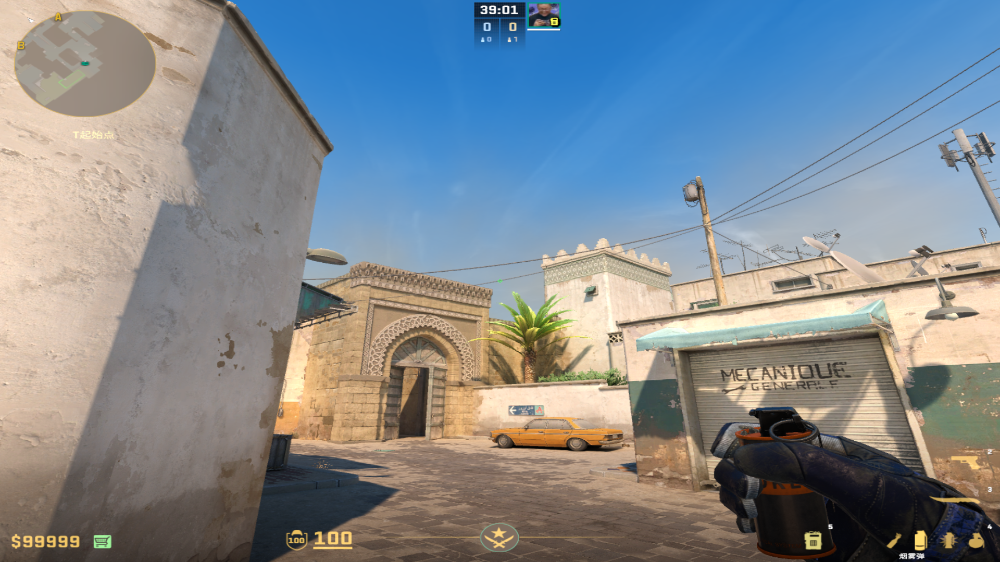
				-
		-
		- ### VP二出A大套餐
		  collapsed:: true
			- 投掷：左键直接丢
			- 站位：卷帘门对准A门门缝
			- 描点：最高树叶和右侧墙壁的连线中点
				- 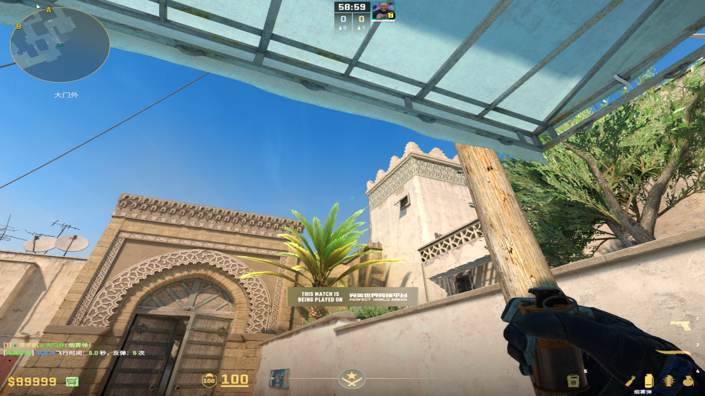
				-
		-
- # 闪光弹
	- ## 一出A大闪
	  collapsed:: true
		- 投掷：左键跳投
		- 站位：经典爆闪位
		- 描点：椰子树左边阴影角
		  collapsed:: true
			- 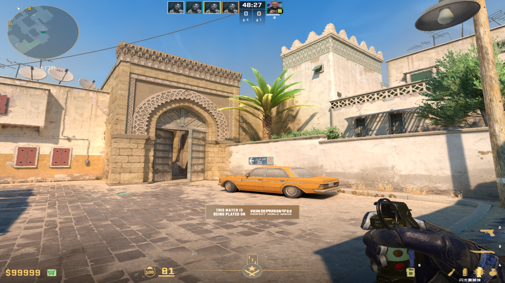
			-
	- ## 后出A大闪
	  collapsed:: true
		- ### 1.5出经典闪光
		  collapsed:: true
			- 投掷：左键跳投
			- 站位：A门外左侧棚子
			- 描点：椰子树左侧阴影左下角
				- 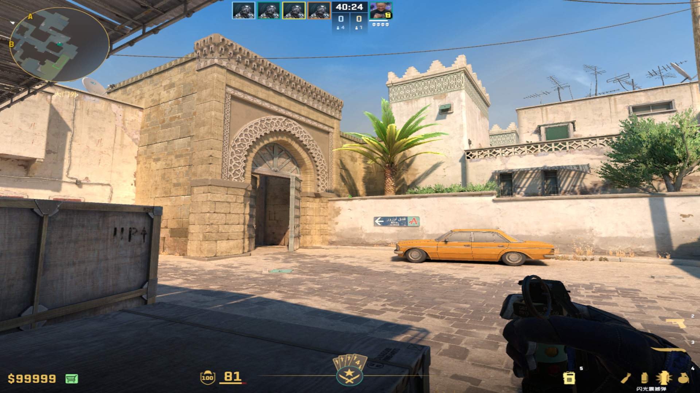
				-
		-
		- ### 2出A大白直架
		  collapsed:: true
			- 投掷：W静步走一步左键投掷
			- 站位：黄车后卷帘门对齐门缝
			- 描点：A门头顶中间原点
				- 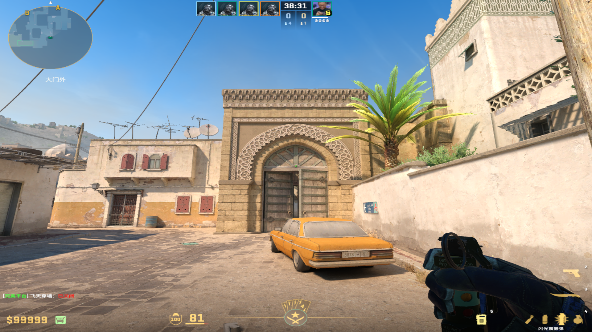
				-
		-
		- ### 2出A大白大坑
		  collapsed:: true
			- 描点：左键跳投
			- 站位：黄车后卷帘门右侧贴近
			- 描点：椰子树下方墙边缘
				- 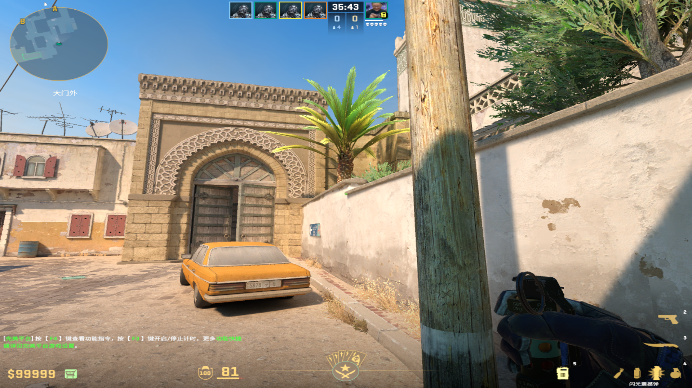
				-
		-
		- ### Lvg出A门闪
		  collapsed:: true
			- 投掷：W+跳投
			- 站位：L位卷帘门前面贴近
			- 描点：蓝色广告牌剪头左上角一点
				- 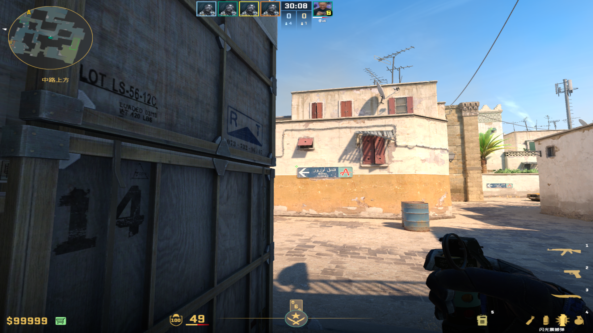
				-