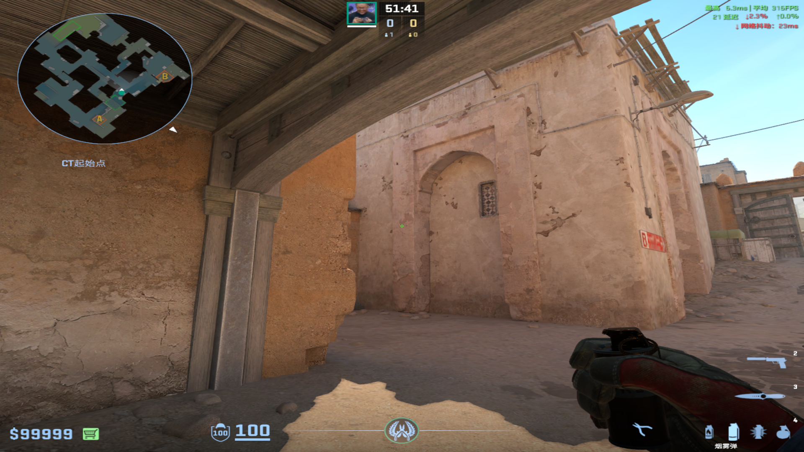
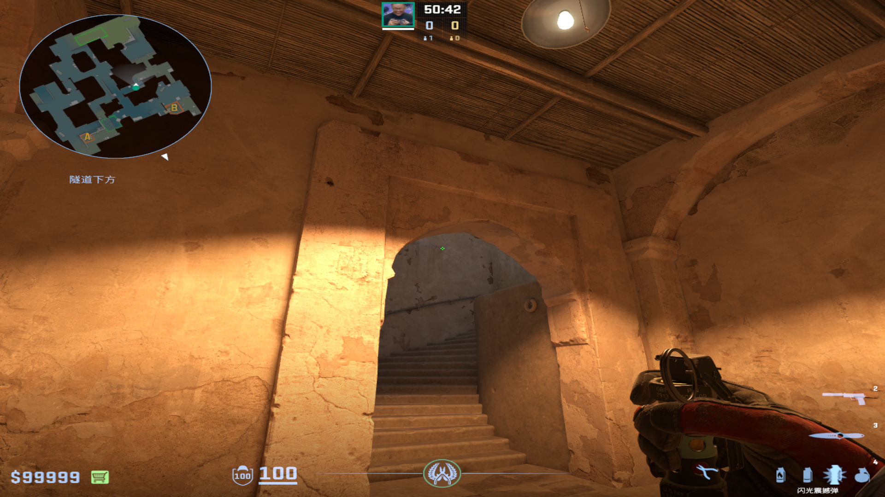
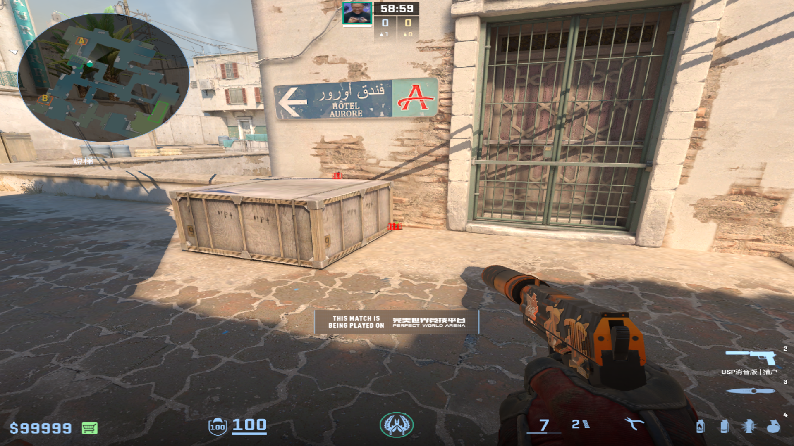
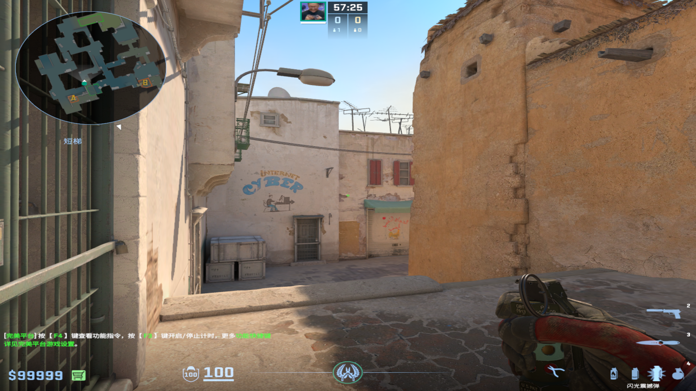
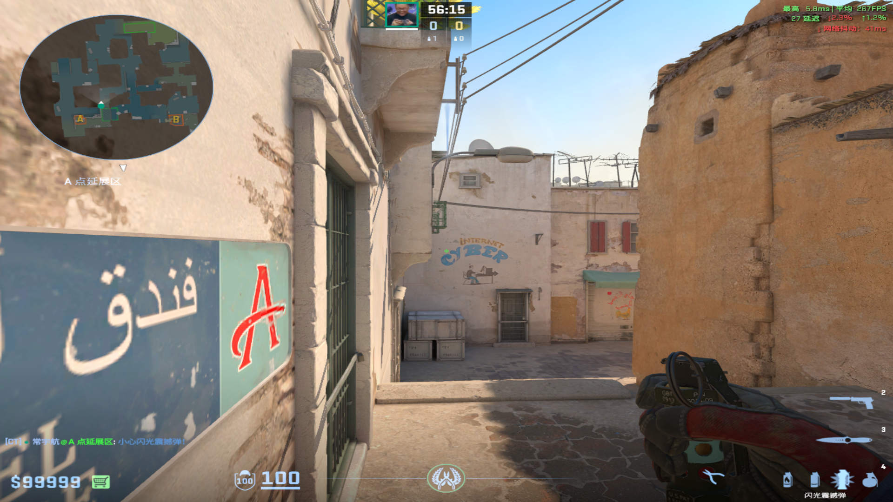
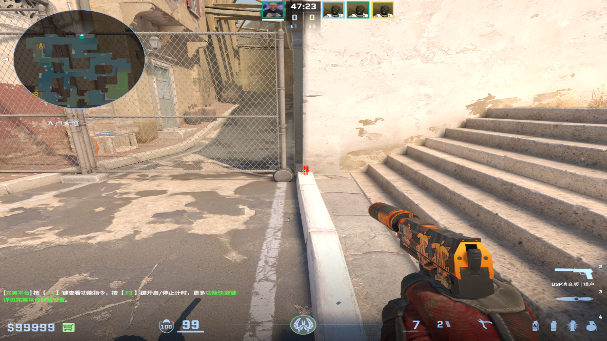
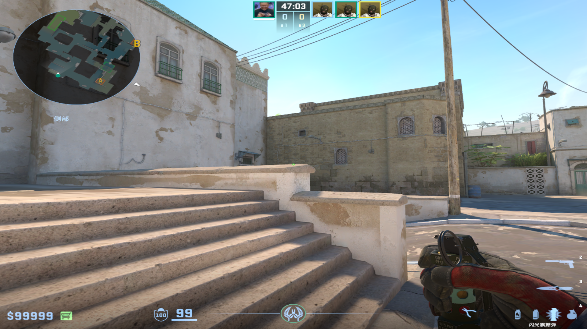

public:: true

- # B1层
  collapsed:: true
	- ## 保护烟
		- 投掷：跑着双键直接丢
		- 站位：警家烟的那个箱子附近
		- 描点：污渍下端
			- 
			-
	-
	- ## B1单向闪
	  collapsed:: true
		- 投掷：跑着左键直接丢
		- 站位：看到描点就行
		- 描点：扶手上端污渍右边
			- 
			-
-
- # 中路
  collapsed:: true
	- ## G2前压组合闪
		- 站位：第一颗下面，第二颗上面
		  collapsed:: true
			- 
			-
		- 描点&投掷：
			- 第一颗：黑色污渍右端&跑一步左键跳投
				- 
			- 第二颗：蓝色C的上端&跑一步跳投
				- 
				-
			-
-
- # A大
  collapsed:: true
	- 投掷：静步走一步左键跳投
	- 站位：厕所白墙
	  collapsed:: true
		- 
		-
	- 描点：台阶上方棱角
	  collapsed:: true
		- {:height 325, :width 563}
		-