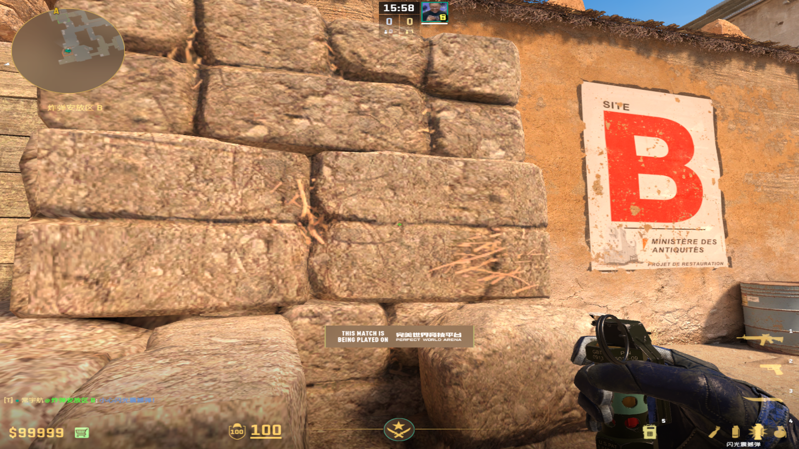
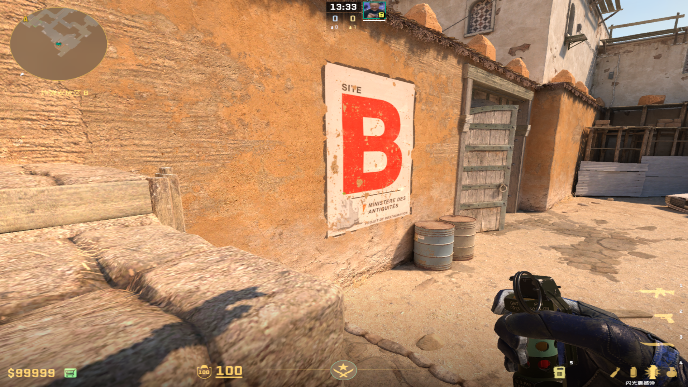
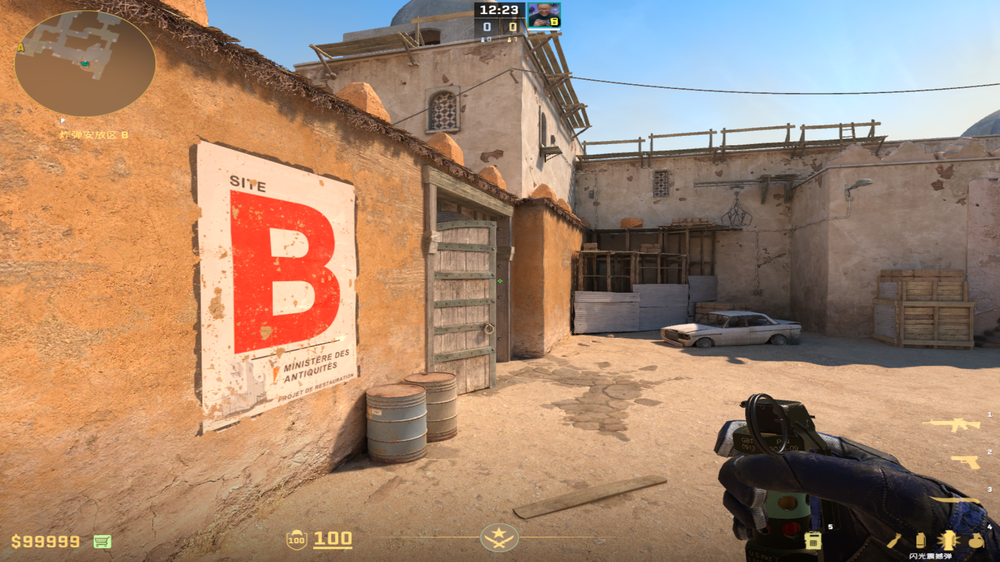

# 闪光弹（清理沙地）
	- ## B包狗洞箱子
		- ### 最顺手的
		  collapsed:: true
			- 投掷：W一直走+右键跳投
			- 站位：箱子下面
			- 描点：上面箱子那个横线
			  collapsed:: true
				- 
				-
		-
		- ### 广告牌
		  collapsed:: true
			- 投掷：右键跳投（可以加W/A）
			- 描点：红B的左下角
			  collapsed:: true
				- 
				-
		-
		- ### B门钉
		  collapsed:: true
			- 投掷：左键直接丢
			- 描点：中间两个钉子都可以
				- 
				-