# B门烟
collapsed:: true
	- ## B通
	  collapsed:: true
		- 投掷：走一步跳投
		- 站位：B通左侧，可以看清楚B的右侧轮廓
		- 描点：B的左下白色区域
			- 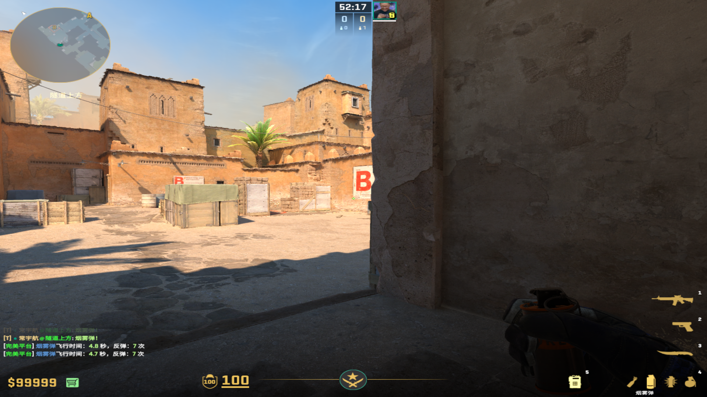
			-
		-
	-
	- ## B通刚出门右侧高箱（蹲着）
	  collapsed:: true
		- ### 方法1（容错低）
			- 投掷：左键直接丢
			- 描点：黄色小横杠平移到墙壁棱角
			  collapsed:: true
				- 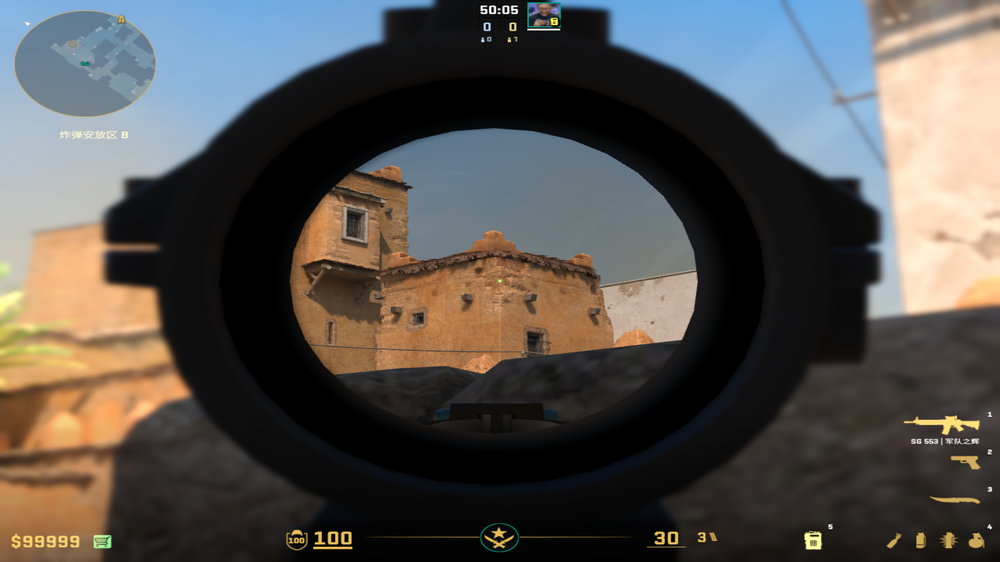
			-
		- ### 方法2（爆的慢）
			- 投掷：弹簧头，直接丢
			- 描点：白色墙棱平移到下面的箱子污渍
				- 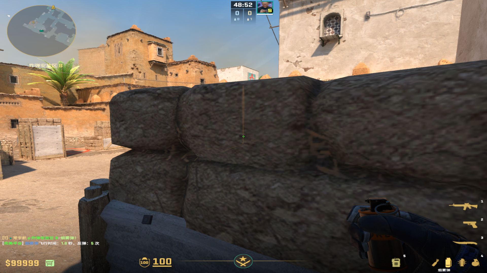
				-
	-
	- ## 大箱旁边
	  collapsed:: true
		- ### 普通丢法
		  collapsed:: true
			- 投掷：左键直接丢
			- 站位：大箱旁边都可以
			  collapsed:: true
				- 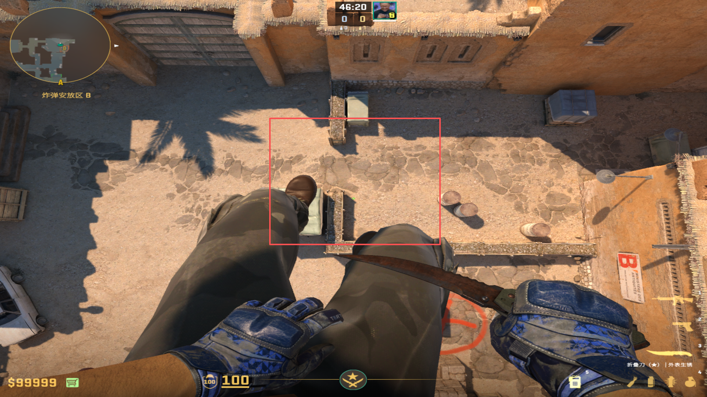
			- 描点：房子板子左上角（如果有尖尖挡着，准心往上多点）
			  collapsed:: true
				- 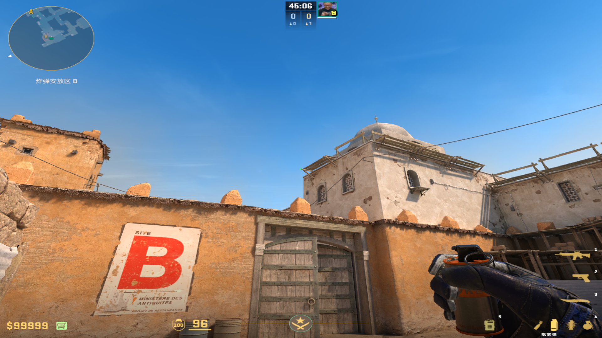
				-
		- 细节描点丢法（更快）
		  collapsed:: true
			- 投掷：双键跳投
			- 站位：台阶上大箱死角
			- 描点：B门下面两个污渍的水平垂直交界
				- 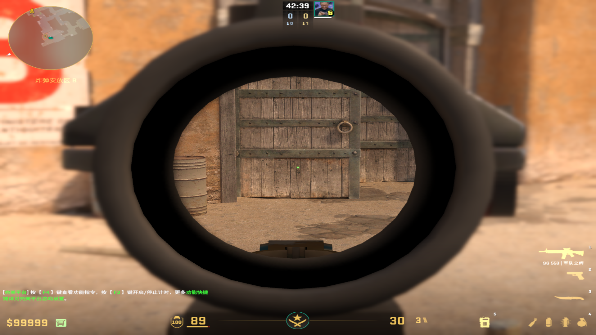
				-
	-
	- ## 包点旁边
	  collapsed:: true
		- 投掷：离得远就左键直接丢，离得近就W+双键走一步左键丢
		- 站位：包点处能看到描点就行
		- 描点：门框上突出方块
			- 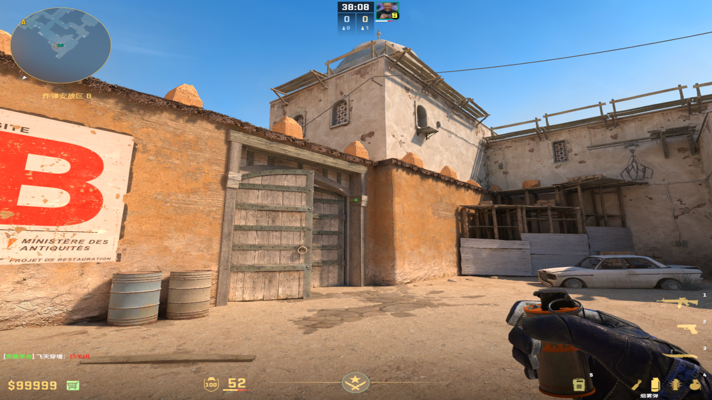
			-
		-
	-
	- ## 包点死点
	  collapsed:: true
		- 投掷：双键投掷
		- 描点：头顶的草丛右下角
		  collapsed:: true
			- 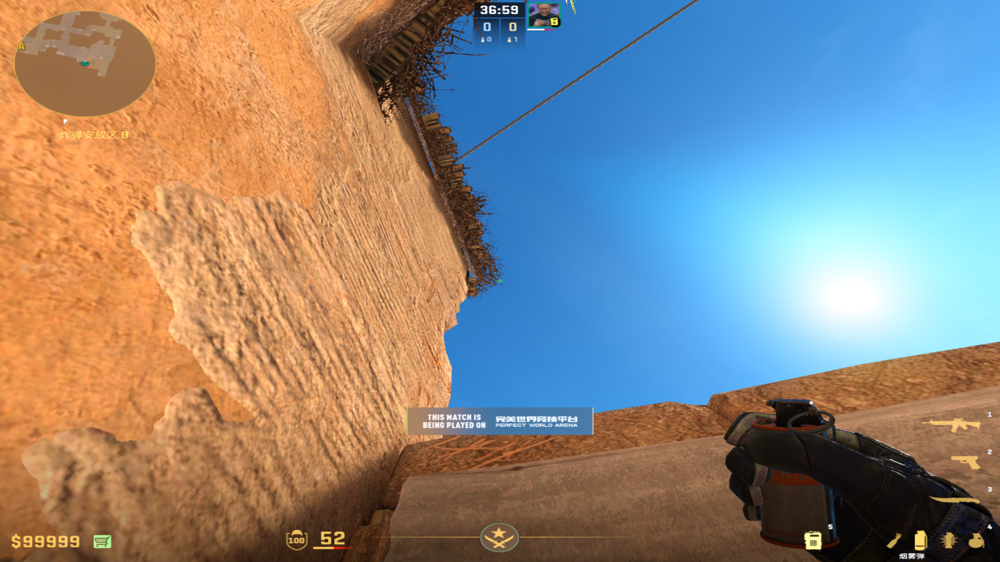
			-
	-
	- ## 我爱站的那个贴墙
	  collapsed:: true
		- ### 随手丢
		  collapsed:: true
			- 投掷：左键直接丢
			- 描点：整个门
				- 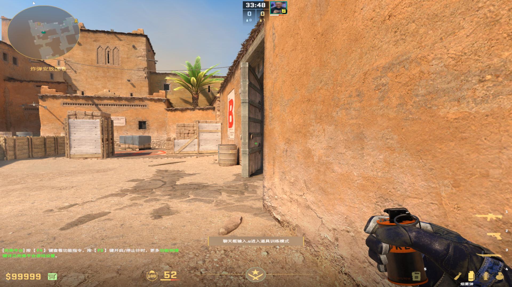
				-
		- ### 装逼丢
		  collapsed:: true
			- 投掷：右键跳投
			- 描点：第一根木条和墙壁上的草的交界处
				- 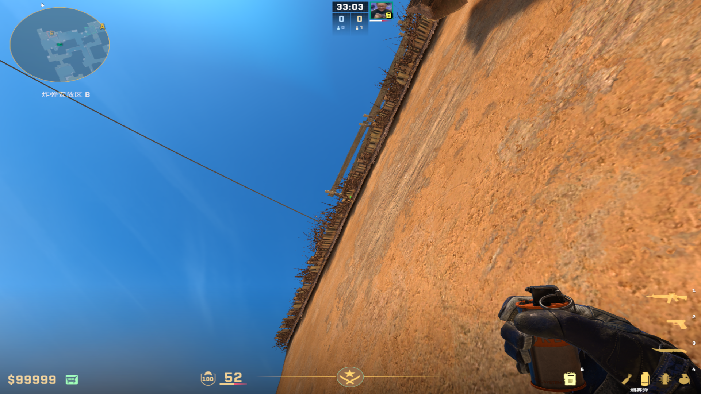
				-
	-
	- ## 狙位
	  collapsed:: true
		- 投掷：走一步左键丢
		- 描点：房顶尖尖
			- 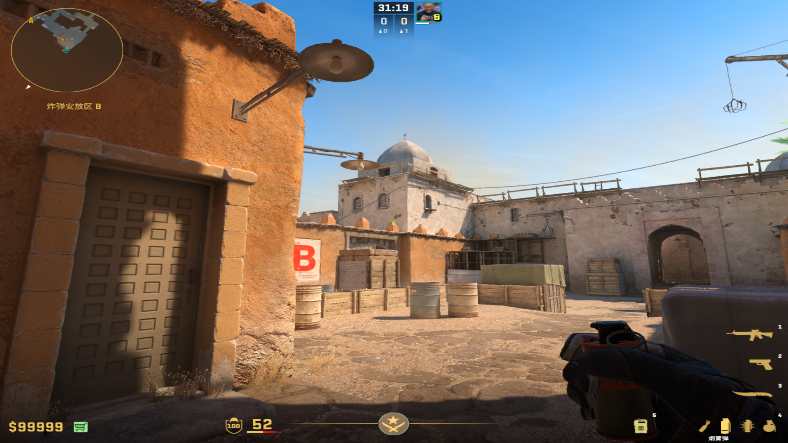
			-
	-
	- ## 死点
	  collapsed:: true
		- 投掷：蹲着+双键丢
		- 描点：整个窗户
			- 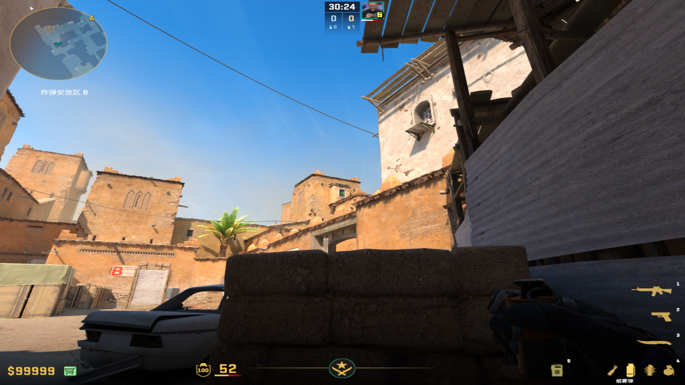
			-
-
- # 狗洞烟
  collapsed:: true
	- ## 大箱丢
	  collapsed:: true
		- ### 万能描点（火烟雷）
		  collapsed:: true
			- 投掷：左键直接丢
			- 描点：窗口右上角污渍
				- 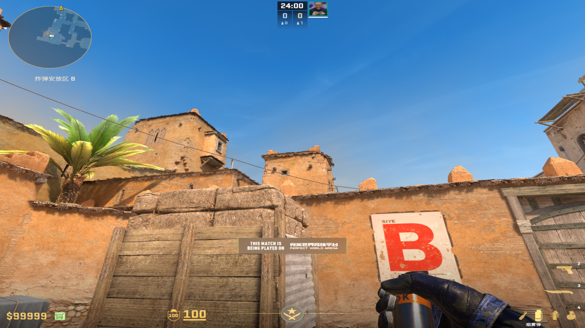
				-
		- ### 配合装逼烟威慑力
		  collapsed:: true
			- 投掷：左键直接丢
			- 描点：窗户中间和左边房檐右侧的交界处
				- 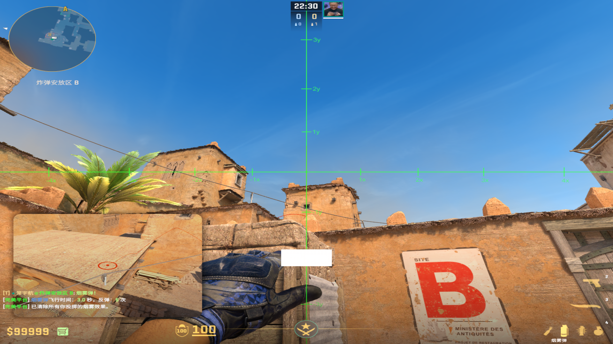
				-