# 双烟组合
	- ## 组合一（综合已被淘汰）
	  collapsed:: true
		- 投掷：两个描点均为跳投
		- 站位：后花园台阶下右侧墙角
		- 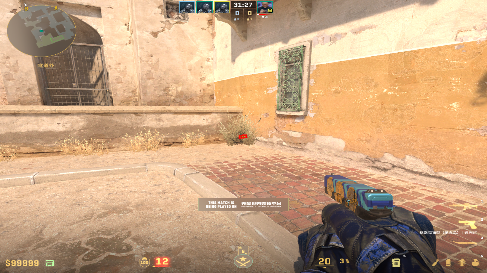
		- 描点：前图为B门烟，后图为狗洞烟（狗洞烟容错不高，盖住左侧3/4同时向上一点）
		- 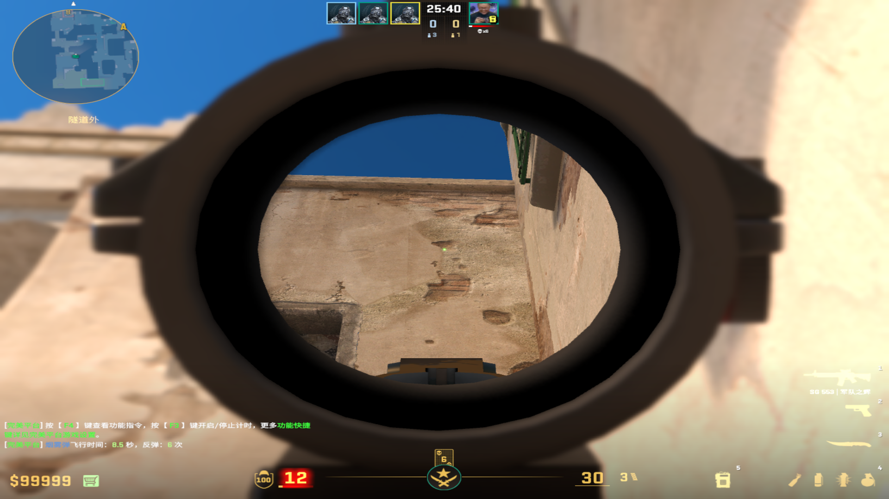
		-
		- 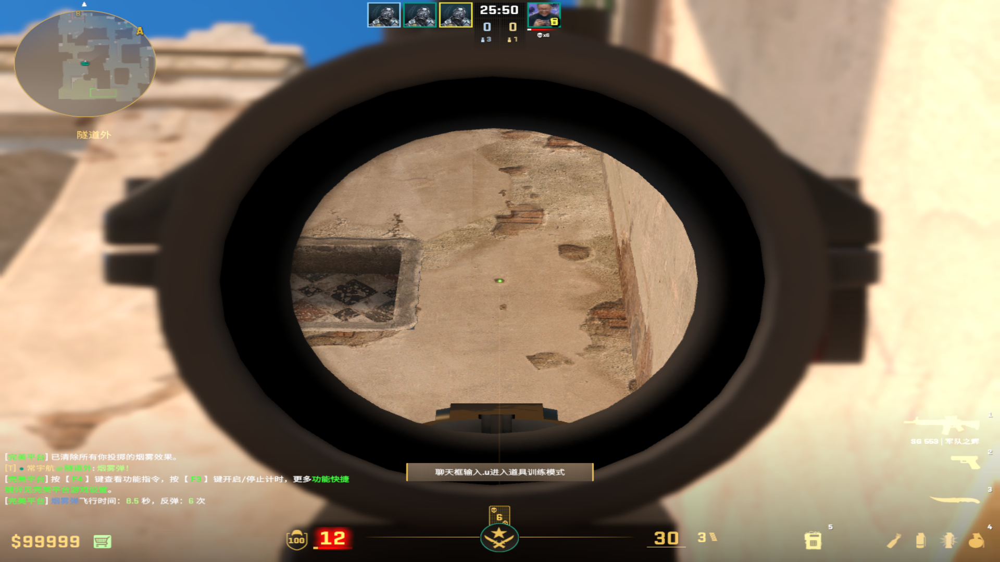
	-
	- ## 组合二（后花园瓷砖）
		- 投掷：跳投=狗洞烟，W+跳投=B门烟
		- 站位：视角拉到最低，对准瓷砖最中心
		- 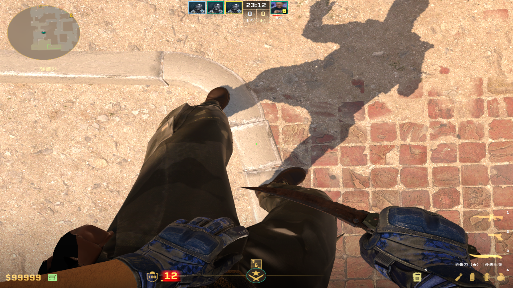
		- 描点：下侧大污渍的右端和右面小污渍的下端平齐
		- 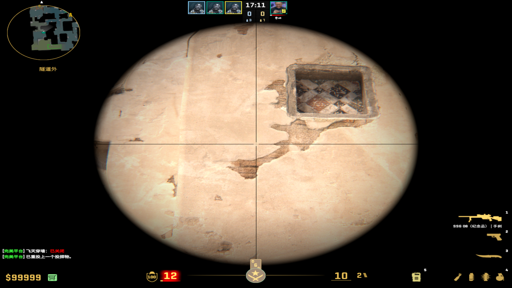
-
- # B门烟
	- ## B通小箱边（适合自助+组合闪）
		- 投掷：双键跳投
		- 站位：对齐左侧边后W滚轮蹭上去
		- 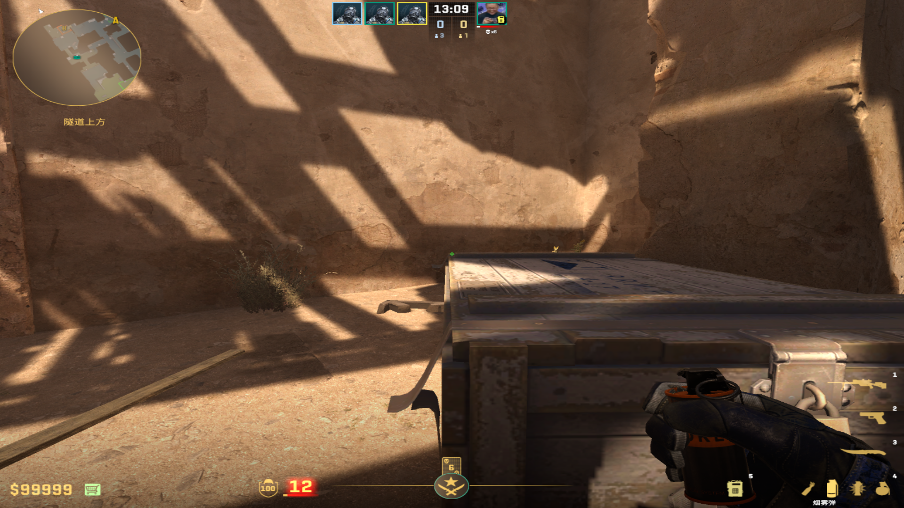
		- 描点：大污渍左上角
		- 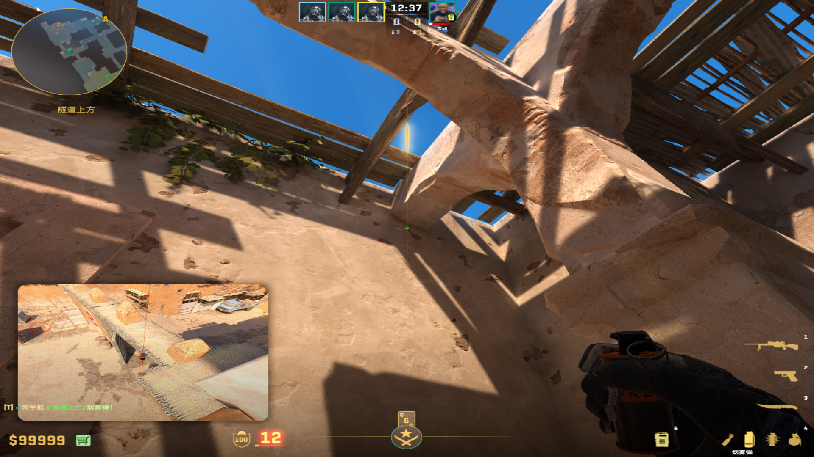
	-
	- ## Jame烟（可加组合闪）
		- 投掷：直接丢
		- 站位：贴近柱子中间
		- 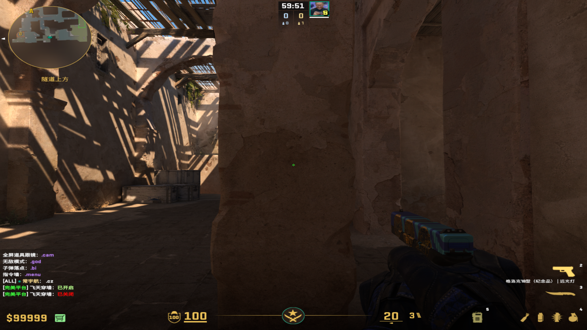
		- 描点：右上角空隙，污渍平移到下端夹角
		- 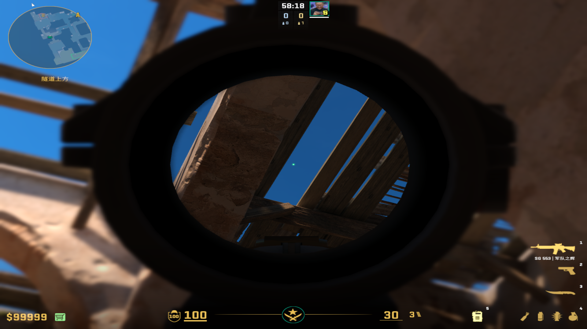
		- 闪光描点：
		- 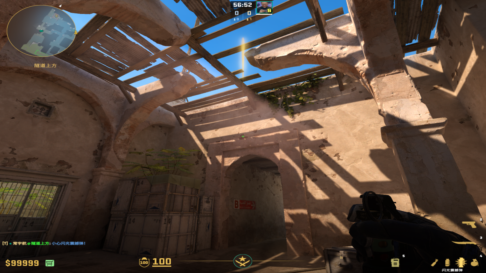
	-
	- ## Maka烟 （比Jame烟更快，但是站位慢一点）
		- 投掷：W+双键出手
		- 站位：贴近柱子右侧，与之平齐
		- 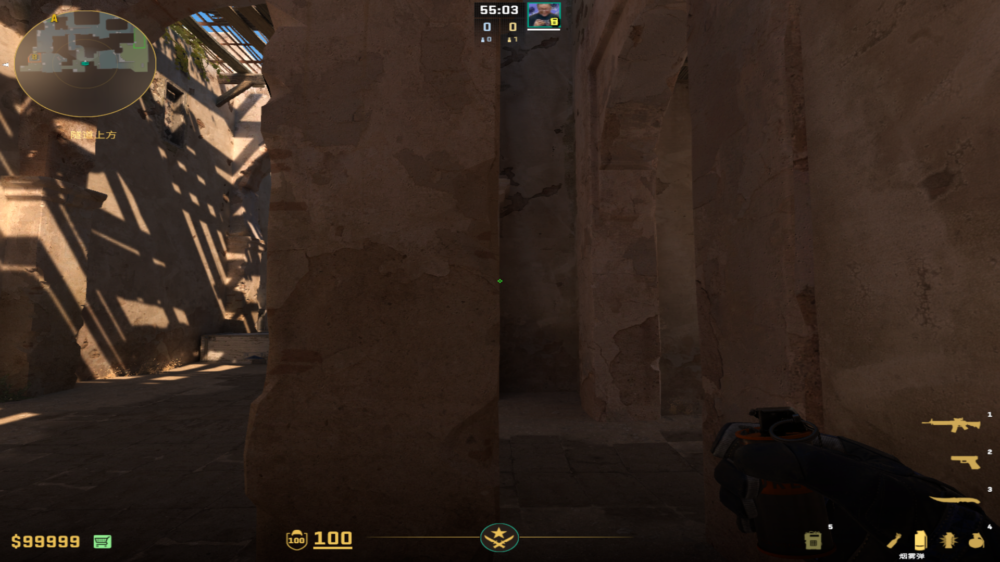
		- 描点：横条光斑左侧
		- 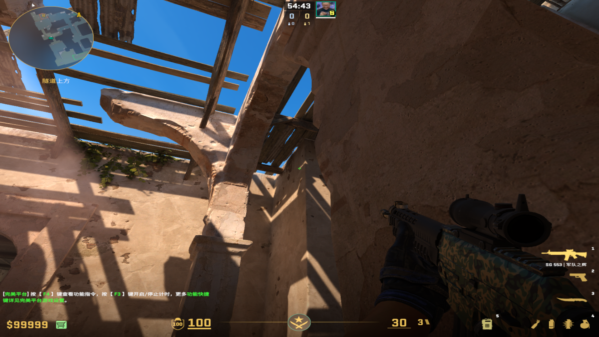
	-
-
-
- # 狗洞烟
	- ## RW——B区进攻
		- 投掷：瞄准后，蹲下跳投
		- 站位：Apex闪光的柱子，中间污渍处
		- 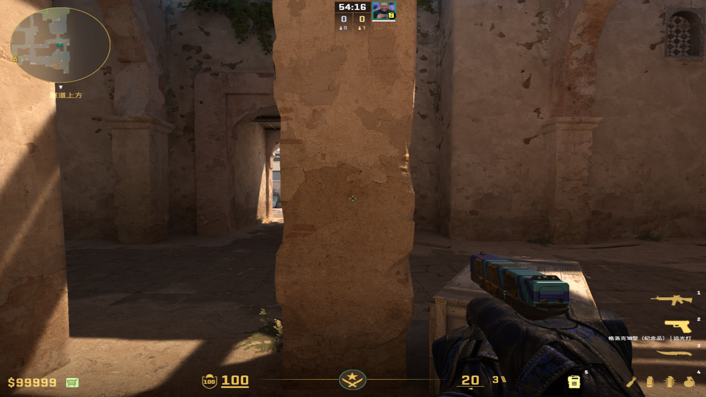
		- 描点：-1y的左侧横线左侧瞄准污渍后蹲下跳投
		- 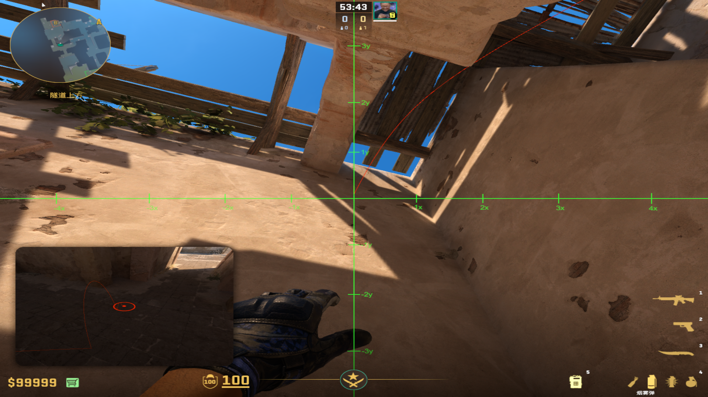{:height 331, :width 574}
		- 衔接Apex闪光：空隙右下角，下拉到污渍下面一点（别超过和下面污渍的中间)
		- 投掷：跳投
		- 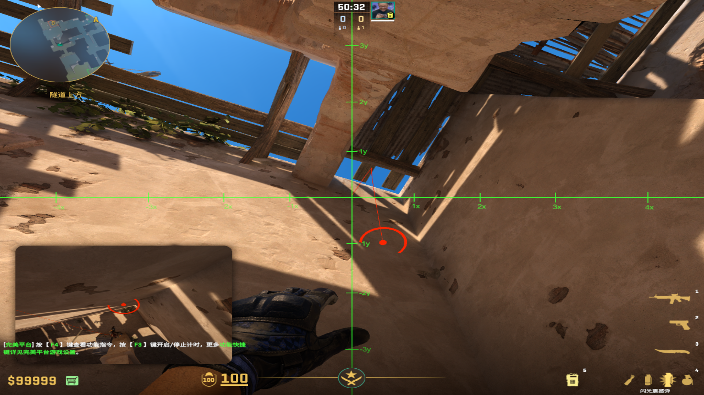
		-
-
-