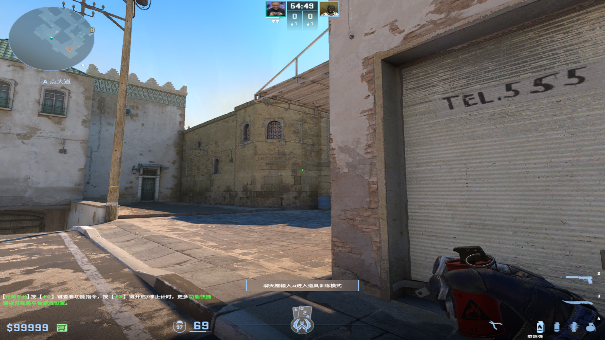
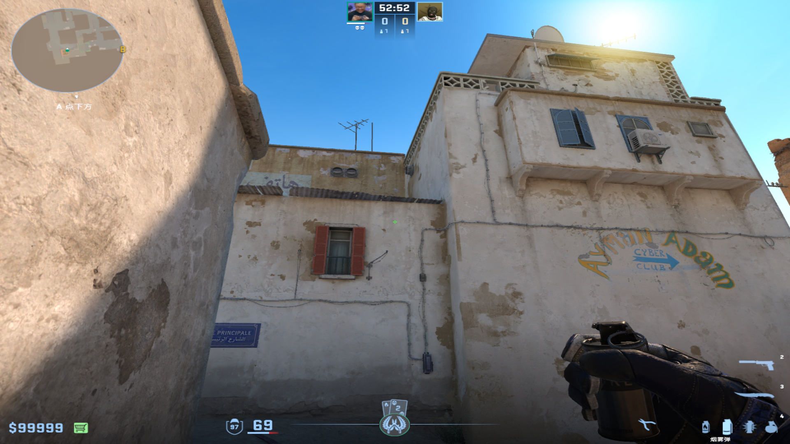
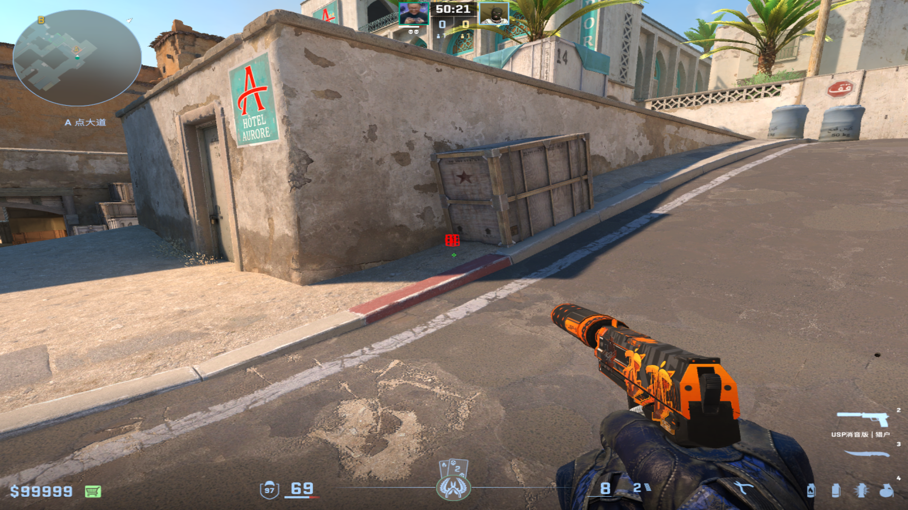
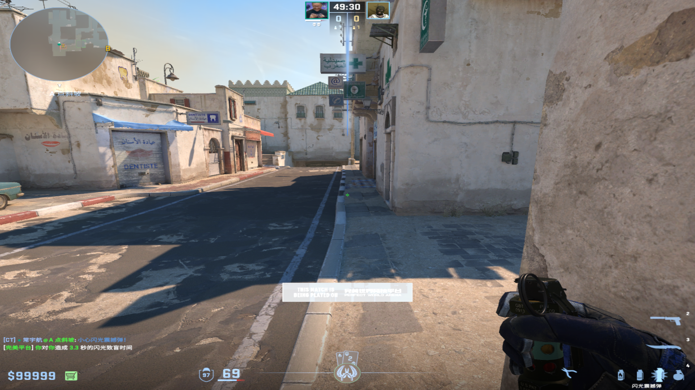
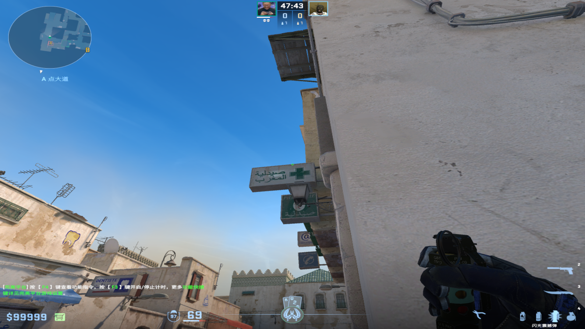
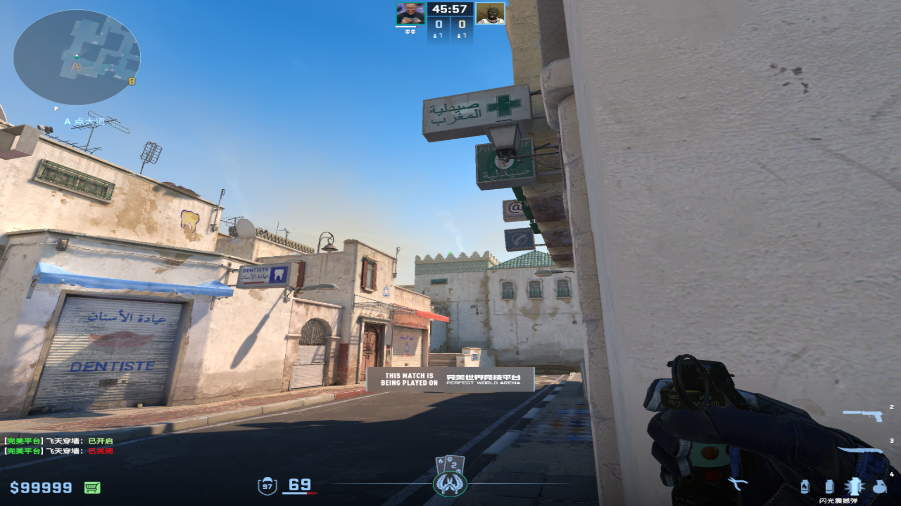
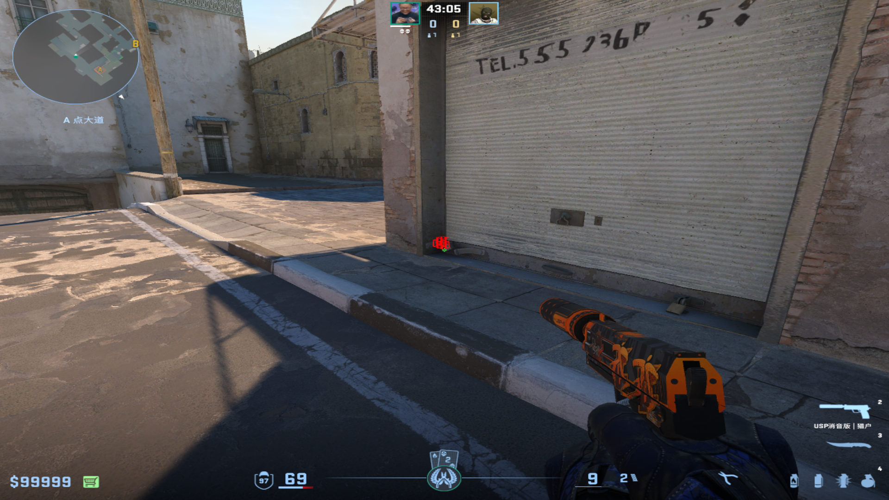
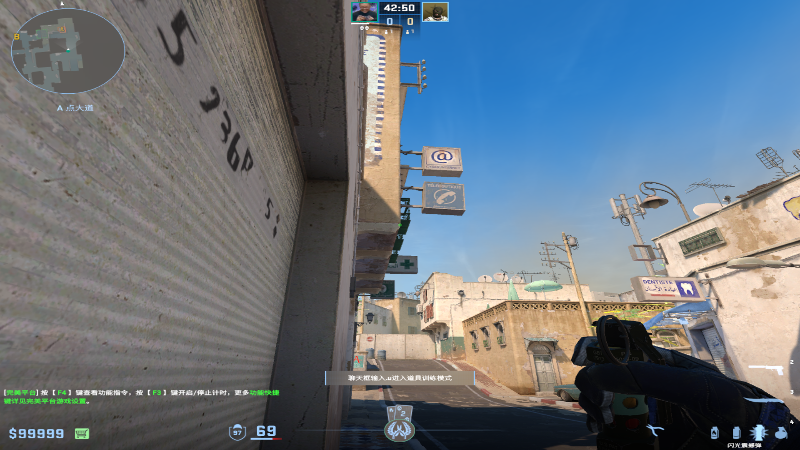

# 燃烧弹/手雷
	- ## 蓝箱火
	  collapsed:: true
		- 投掷：拉满地速跑着左键丢
		- 站位：不漏出A门视野
		- 描点：竖线下均可
		  collapsed:: true
			- 
			-
-
- # 烟雾弹
	- ## A门烟
	  collapsed:: true
		- 投掷：蹲着跳投
		- 站位：A包下电梯位
		- 描点：蹲着瞄准污渍右上角
			- 
			-
-
- # 闪光弹
	- ## 黑豹闪光（提醒背闪）
		- 投掷：W+跳投
		- 站位：A大斜坡箱子前
		  collapsed:: true
			- 
			-
		- 描点：地板最前面黑砖的右下角，往右偏一点
		  collapsed:: true
			- 
			-
	-
	- ## 灯牌闪（白门）
	  collapsed:: true
		- 投掷：左键直接丢
		- 站位：A大拐角
		- 描点：灯牌十字左上角
		  collapsed:: true
			- 
			-
	-
	- ## 身后闪光（白前点）
	  collapsed:: true
		- 投掷：左键直接丢
		- 站位：A大拐角
		- 描点：左上角第四个尖尖
		  collapsed:: true
			- 
			-
	-
	- ## 抢A大自助闪
		- 投掷：左键直接丢
		- 站位：A大卷帘门贴死前点
		  collapsed:: true
			- 
			-
		- 描点：墙壁白色交界处
		  collapsed:: true
			- 
			-