# 中门烟
	- ## 暗道
	  collapsed:: true
		- 投掷：左键跳投
		- 站位：暗道抵住左下角的拐角
		- 描点：两个污渍中间
			- 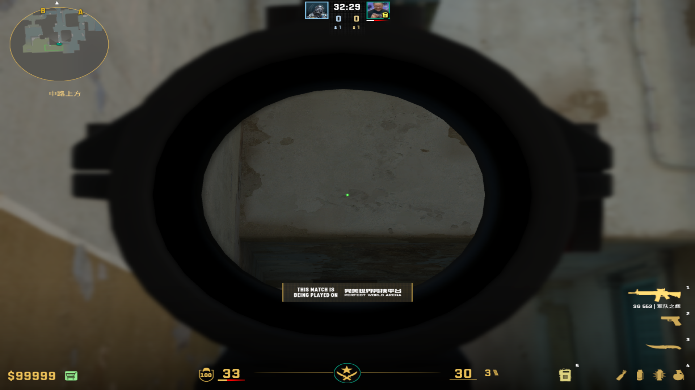
			-
	-
	- ## 中路油桶
	  collapsed:: true
		- 投掷：左键跳投
		- 站位：右侧墙壁与第二个窗户的右侧平齐
		- 描点：墙壁白线
			- 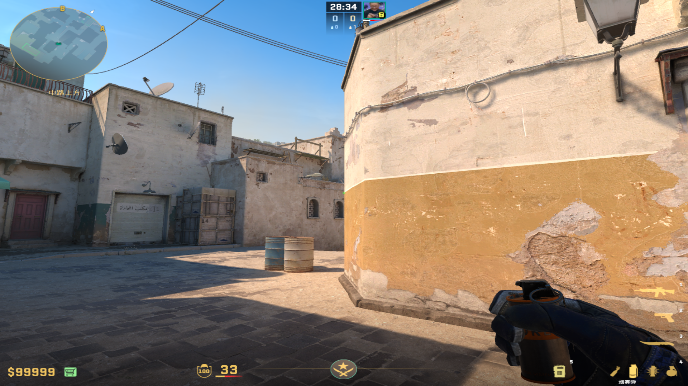
			-
	-
	- ## L位
	  collapsed:: true
		- 投掷：蹲着左键直接丢
		- 站位：L位卷帘门后端
		- 描点：蹲着描垂直线的底端右侧
			- 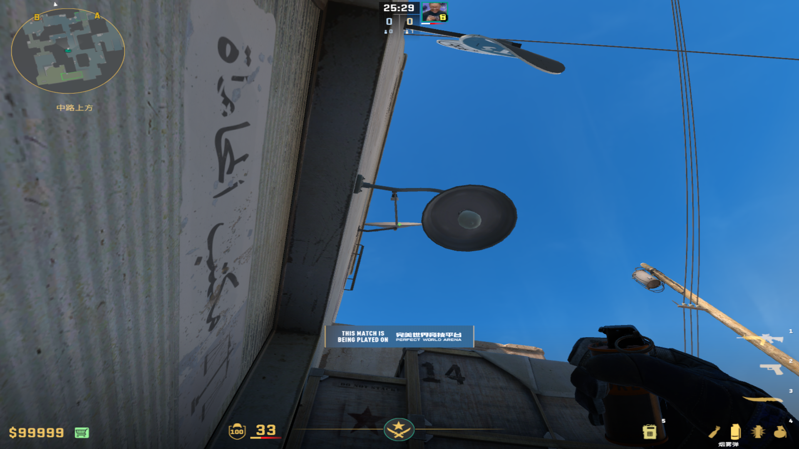
			-
-
- # 瀑布烟
	- ## 龙哥瀑布烟
	  collapsed:: true
		- 投掷：蹲着瞄准后，蹲着左键跳投
		- 站位：轮胎上方，跳的时候顶死右前方
		- 描点：铁栏夹角
			- 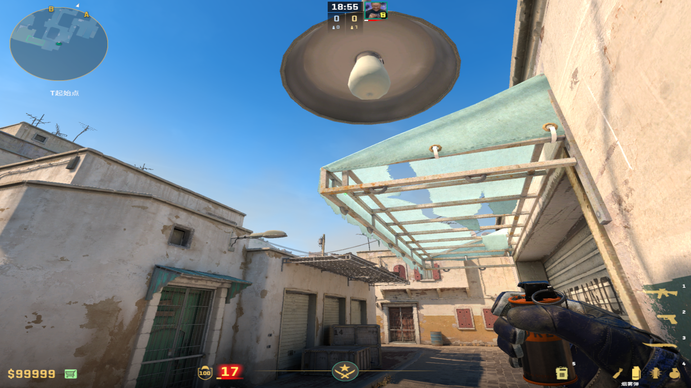
			-
	-
	- ## 马西西瀑布烟
	  collapsed:: true
		- 投掷：蹲着左键跳投
		- 站位：轮胎前站立瞄准，后移动到卷帘门前侧
		  collapsed:: true
			- 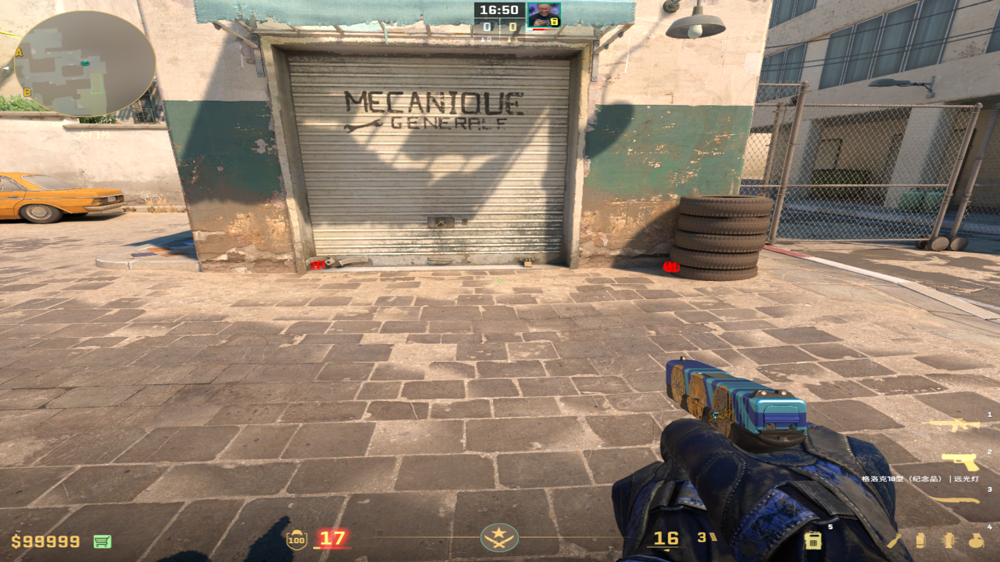
			-
		- 描点：棚子右上角拐角
		  collapsed:: true
			- 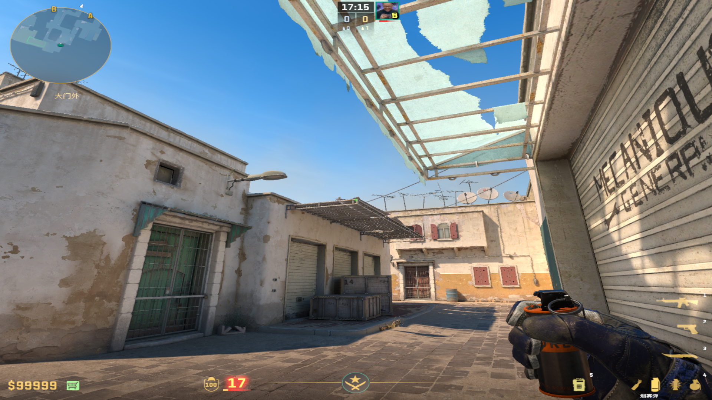
			-
	-
	- ## 载物瀑布烟
	  collapsed:: true
		- 投掷：蹲着瞄准，站起来左键跳投
		- 站位：黄车卷帘门的前面夹角
		  collapsed:: true
			- 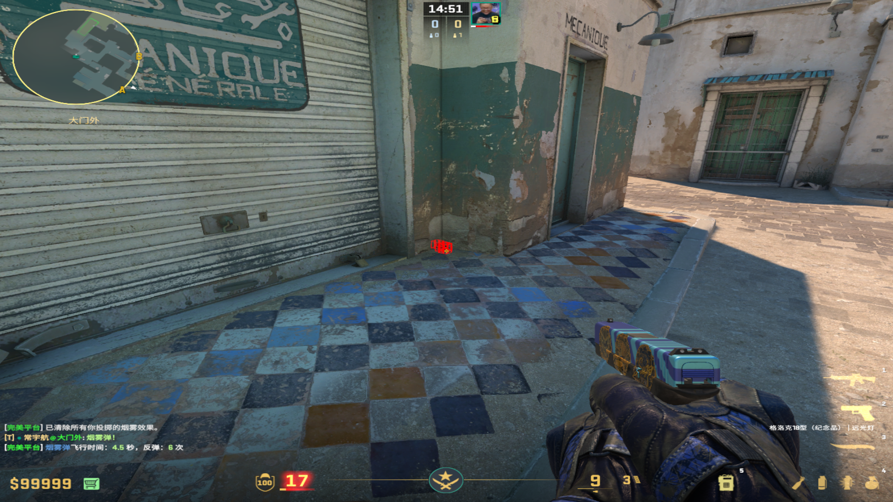
		- 描点：蹲着瞄准电线与墙壁的中间偏右，站立投掷
		  collapsed:: true
			- 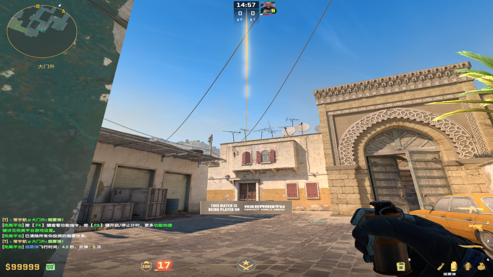
			-
	-
	- ## L位挂门烟
	  collapsed:: true
		- 投掷：蹲着瞄准，蹲着双键跳投
		- 站位：L位卷帘门后侧
		- 描点：L位箱子单词中间线，偏上一点
		  collapsed:: true
			- 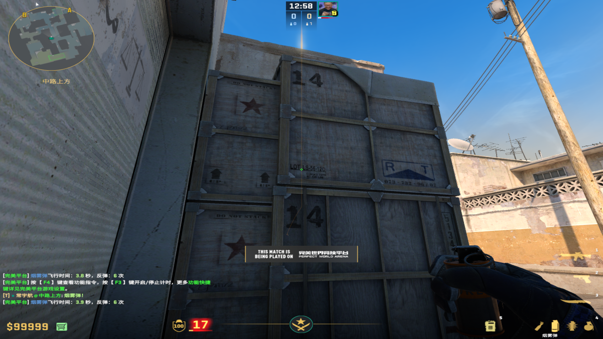
			-
	-
	- ## 暗道瀑布烟
	  collapsed:: true
		- 投掷：左键跳投
		- 站位：暗道死角
		- 描点：-2y的左侧线盖住数字4的横线部分（别太往左上和中下瞄）
		  collapsed:: true
			- 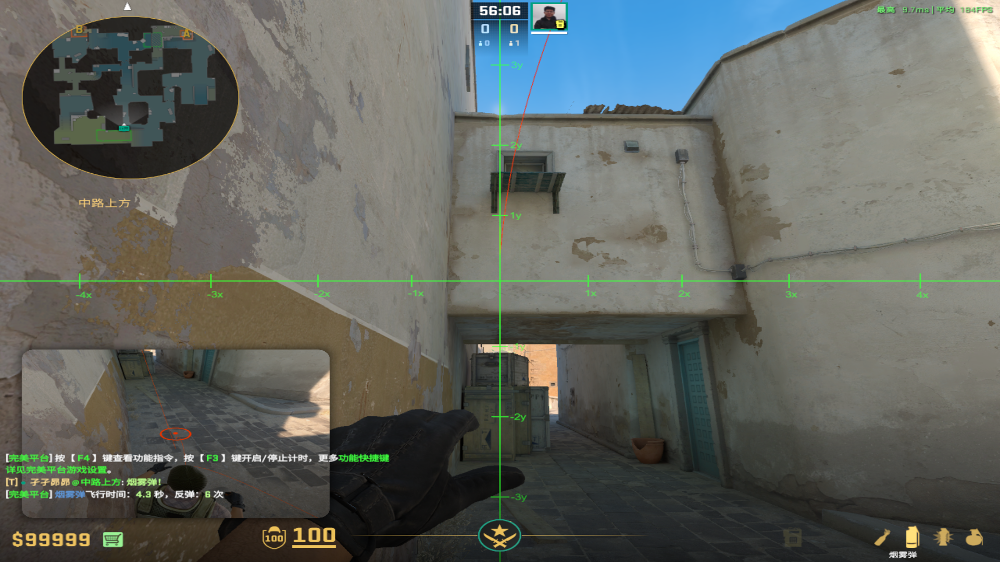
			-
- # X箱烟
	- ## 经典X箱烟
	  collapsed:: true
		- 投掷：蹲着瞄准，蹲着左键跳投
		- 站位：匪家角落
		- 描点：正对面房顶棱角
			- 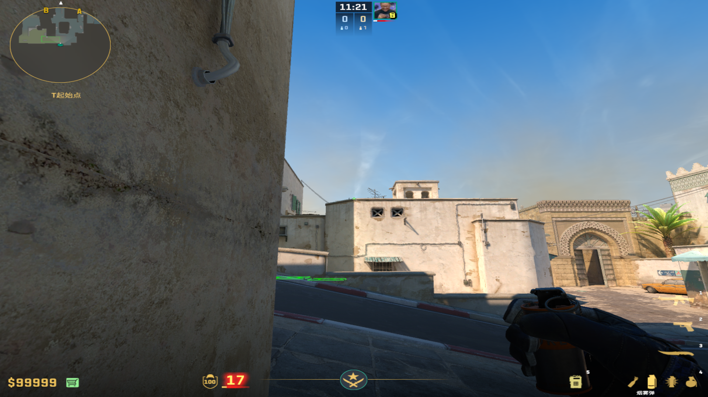
			-
	-
	- ## 油桶补X箱烟
	  collapsed:: true
		- 投掷：走两步投掷
		- 站位：油桶后污渍，不漏出
		  collapsed:: true
			- 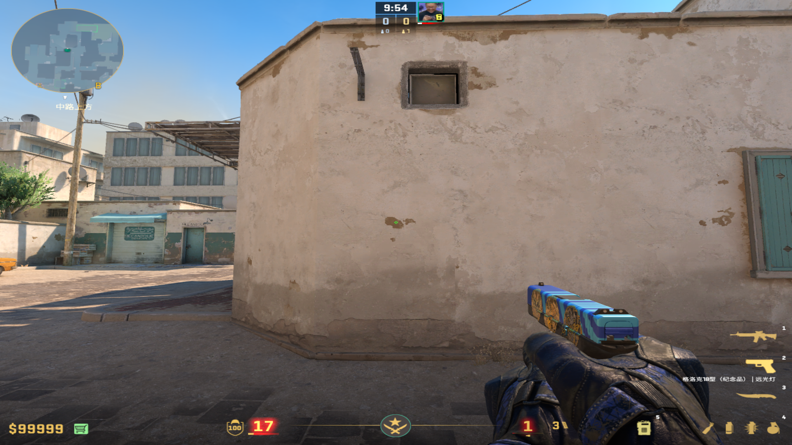
		- 描点：从上面污渍顶端，走到下面污渍中间出手
		  collapsed:: true
			- 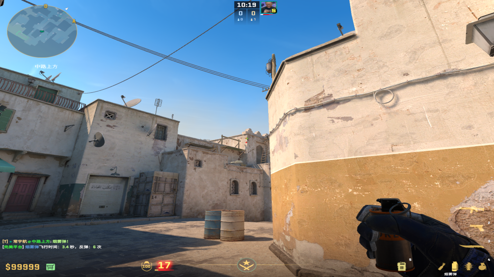
			-