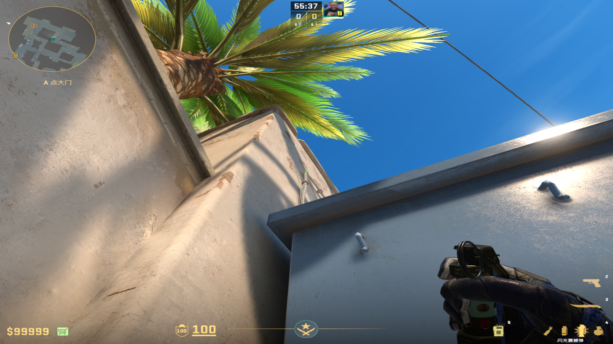
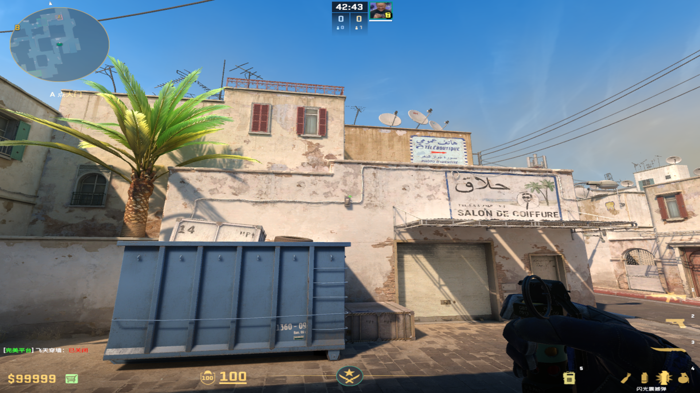
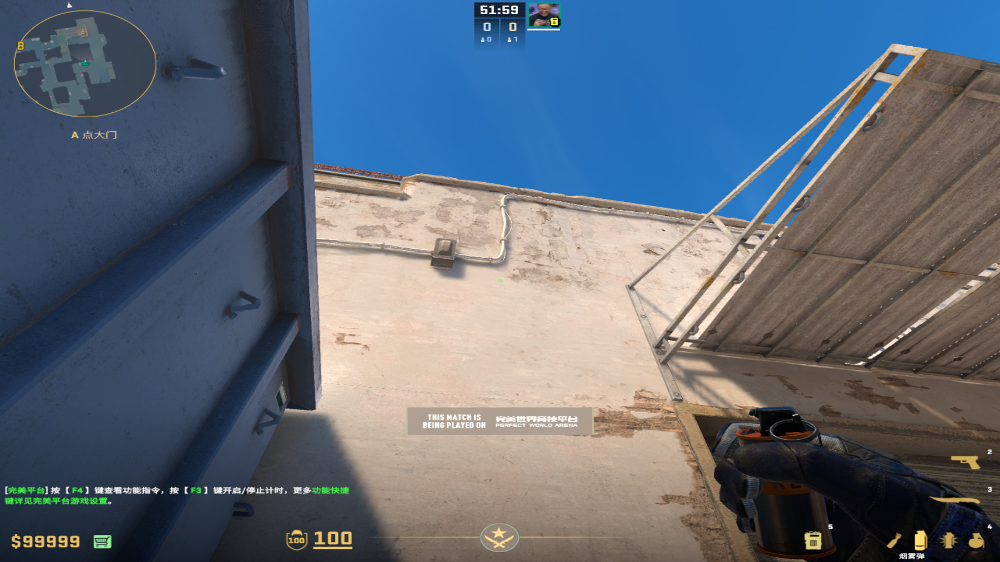
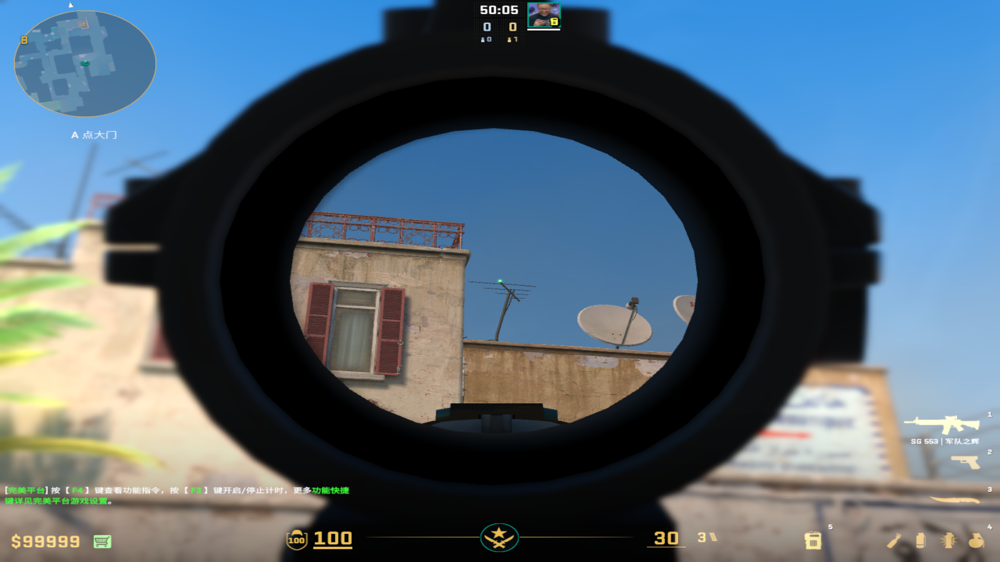
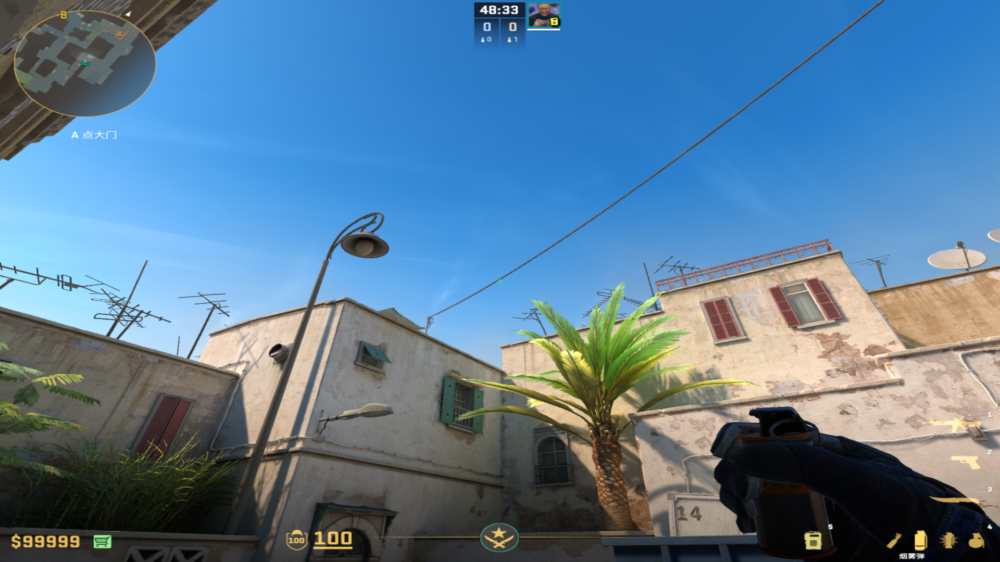
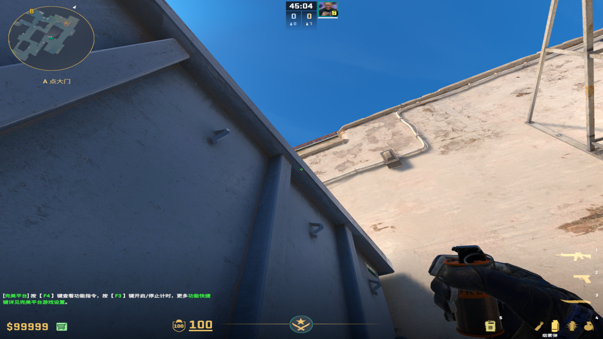
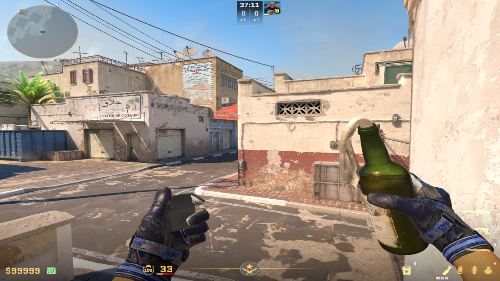
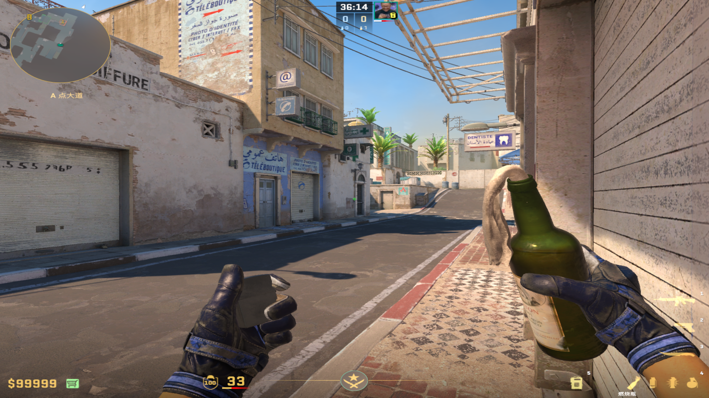

# 闪光弹
	- ## 蓝箱自助闪
	  collapsed:: true
		- 投掷：左键直接丢
		- 站位：蓝车死点
		- 描点：两个水管中间交界处
		  collapsed:: true
			- 
			-
	-
	- ## A大进攻闪
	  collapsed:: true
		- 投掷：W+左键跳投
		- 站位：油桶上（顶死最多丢三个）
		- 描点：白色方框右上角
			- 
			-
- # 烟雾弹
	- ## A大警家过点烟
	  collapsed:: true
		- ### 蓝箱丢（防顶）
			- 投掷：双键跳投
			- 站位：蓝箱与旁边小箱子夹角
			- 描点：垂直水管和左边方框的影子的交界处
			  collapsed:: true
				- 
				-
		- 我
		- ### 油桶丢（速度较慢，其余道具配合较好）
			- 投掷：W+双键跳投
			- 站位：油桶上面，一定要贴死
			- 描点：上方天线的顶端中间
				- 
				-
	-
	- ## A小隔段烟
	  collapsed:: true
		- #### 油桶丢
		  collapsed:: true
			- 投掷：左键直接丢
			- 站位：油桶上，也需要顶死
			- 描点：房檐向上到电线交界处
			  collapsed:: true
				- 
				-
		- #### 蓝箱丢
		  collapsed:: true
			- 投掷：双键跳投
			- 站位：蓝箱和旁边小箱子的夹角
			- 描点：蓝箱上端缝隙的黑色线条顶端
				- 
				-
- # 燃烧弹
	- ## 包点火
		- ### 厕所丢
		  collapsed:: true
			- 投掷：W走一步左键跳投
			- 站位：厕所台阶最上面
			- 描点：污渍左侧
				- 
				-
		-
		- ### 咖啡火
		  collapsed:: true
			- 投掷：左键跳投
			- 站位：A大咖啡卷帘门
			- 描点：黑色方块右上角
				- 
				-
-