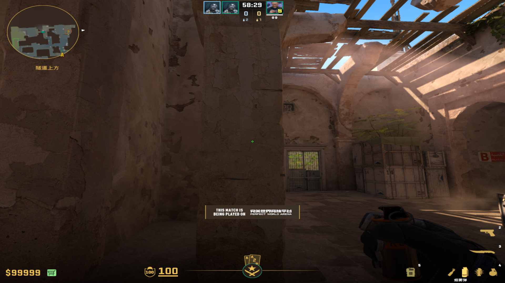
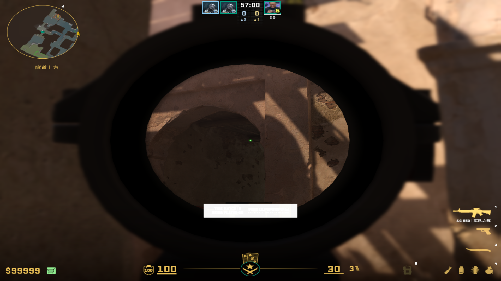
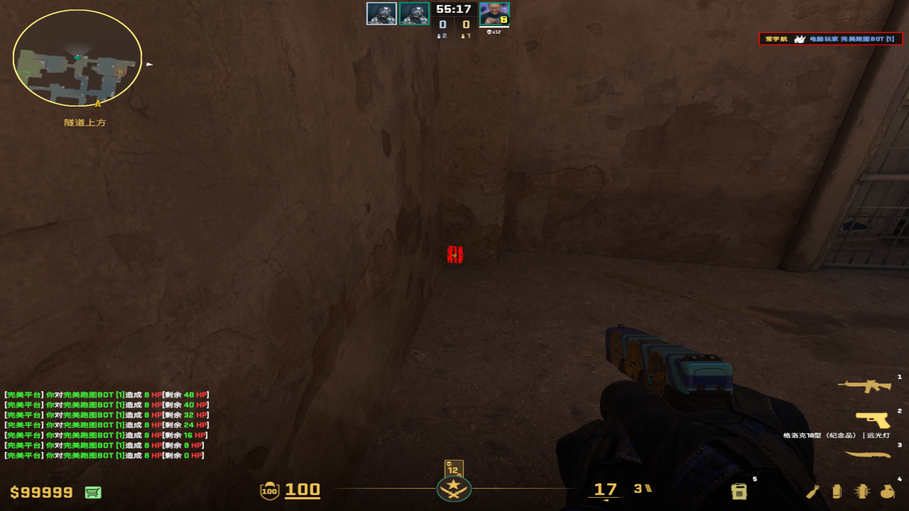
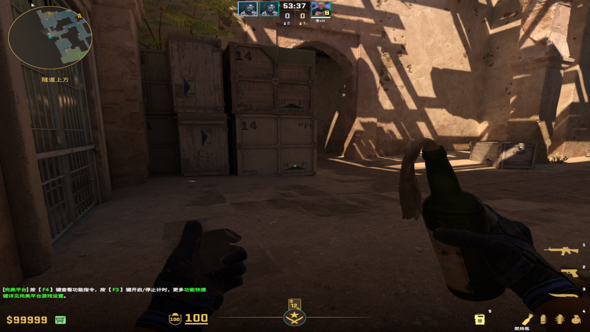
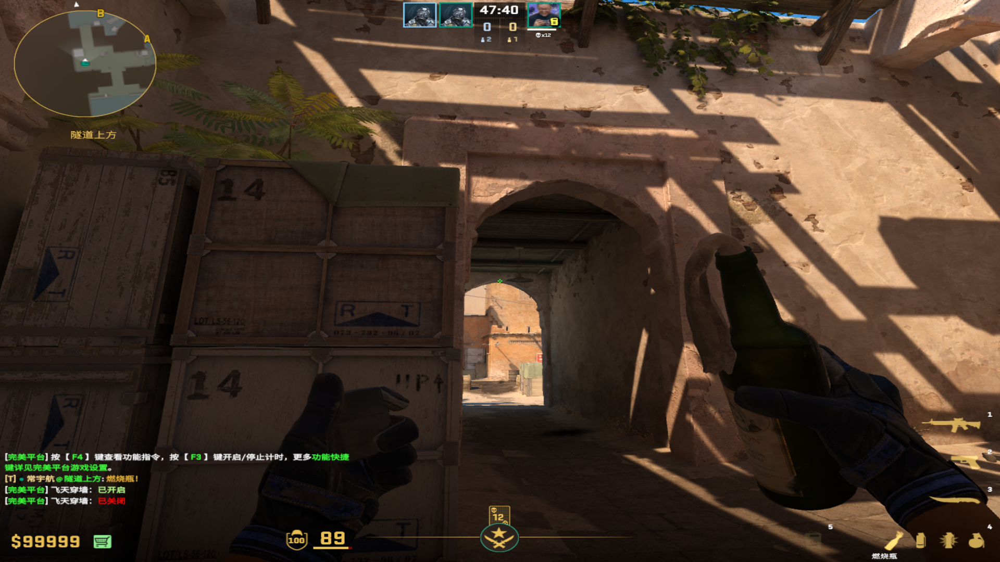
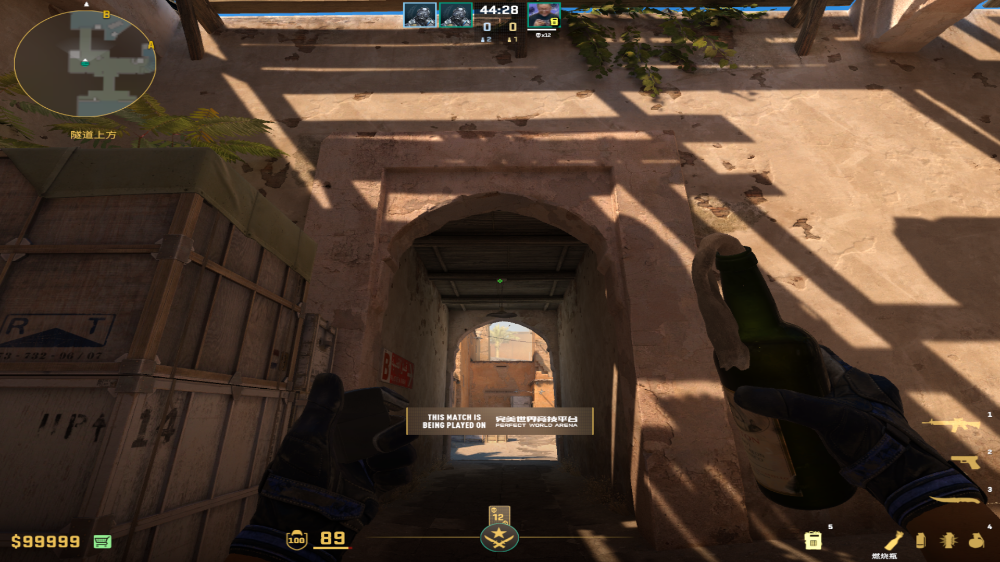
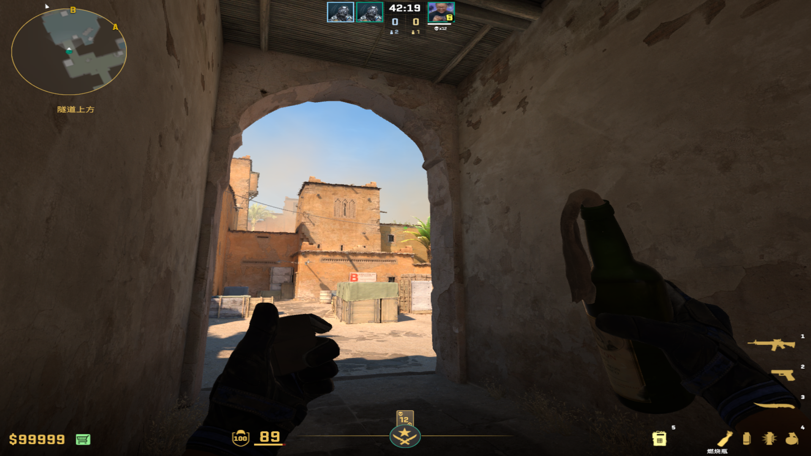
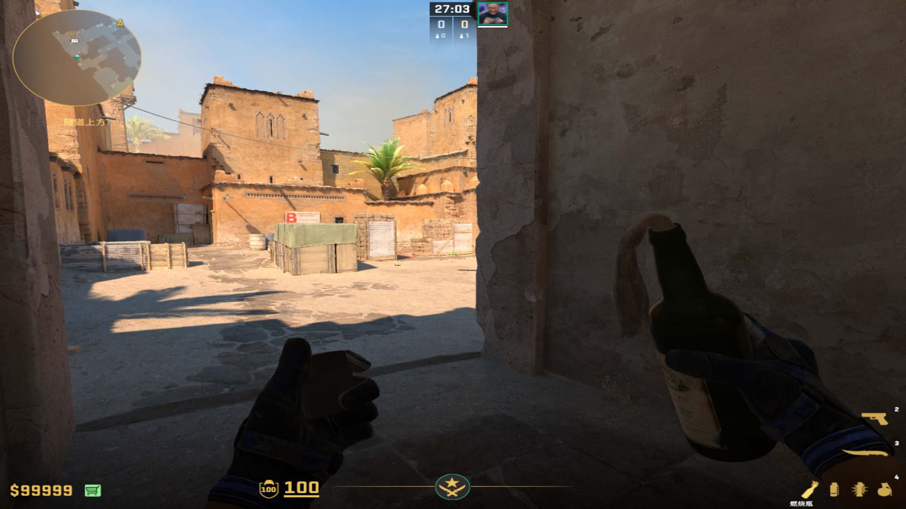

# 烟雾弹
	- ## Ropz展开烟（完美中间，左右均可混）
	  collapsed:: true
		- 投掷：直接丢
		- 站位：柱子中间
			- 
		- 描点：第二根木棍左侧
			- 
			-
-
- # 燃烧弹
	- ## 近点+假门双烧火
	  collapsed:: true
		- 投掷：蹲着描点，后走半步投掷（差不多到中间）
		- 站位：左侧死点，但是是在外凸的右侧
			- 
		- 描点：RT三角形的上侧尖尖
			- 
			-
	-
	- ## 大箱火
	  collapsed:: true
		- 投掷：静步走一步直接丢，也是看跟箱子的距离
		- 站位：和左侧箱子有段距离，但是不要看到侧边
		- 描点：拱门尖尖/扁灯左侧
		  collapsed:: true
			- 
		-
	-
	- ## 狙位火
	  collapsed:: true
		- 投掷：跑丢，可以多跑几步
		- 站位：B通大马路上
		- 描点：灯泡与房梁连接的白色方框
		  collapsed:: true
			- 
	-
	- ## 包点死点火
	  collapsed:: true
		- 投掷：跑着丢
		- 站位：B通大马路，少漏点右手
		- 描点：高箱左侧上移到2个绿色树叶
			- 
	-
	- ## 狗洞火
	  collapsed:: true
		- 投掷：左键跳投
		- 站位：B通，不漏出
		- 描点：狗洞两个箱子底端交界处
			- 
			-