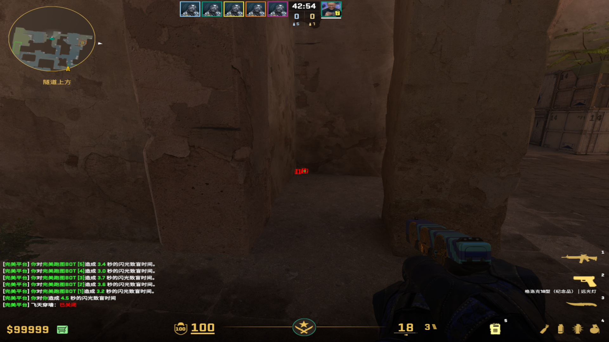
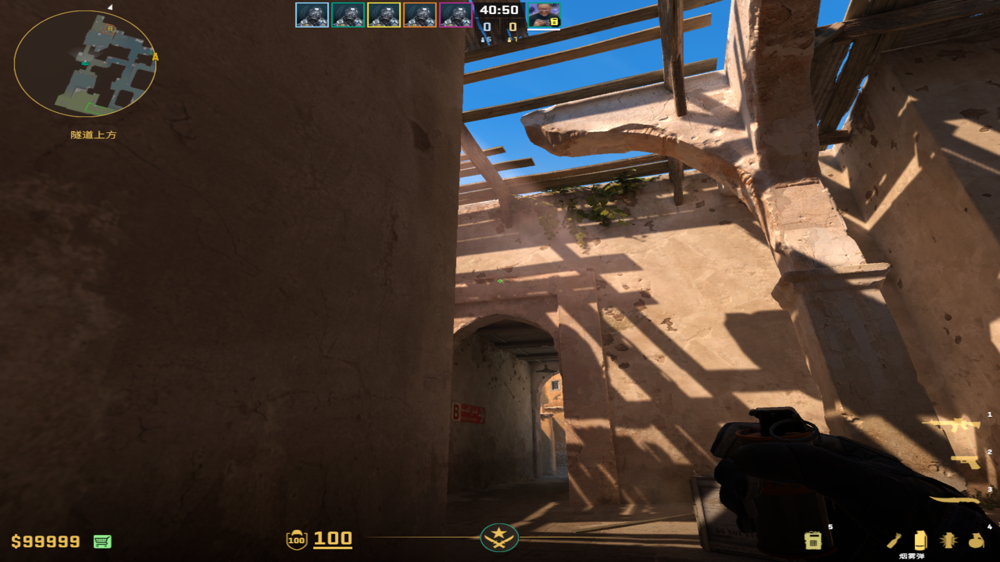
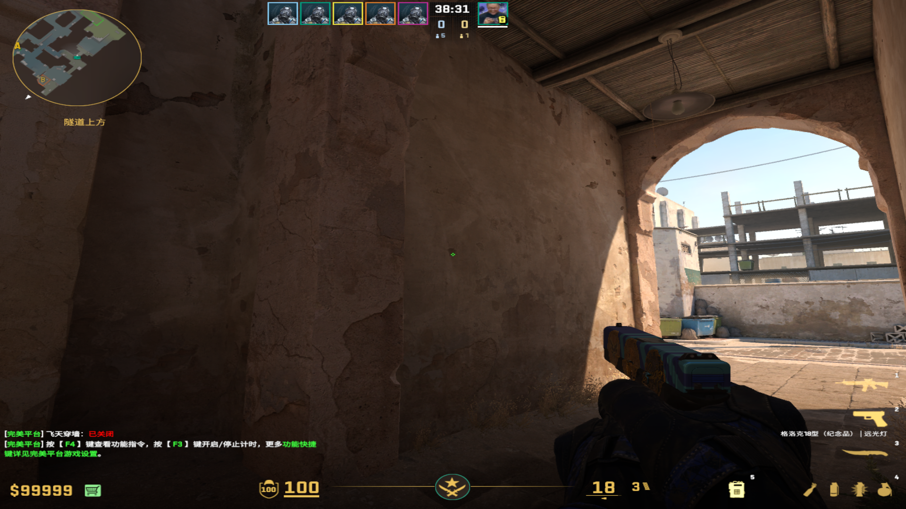
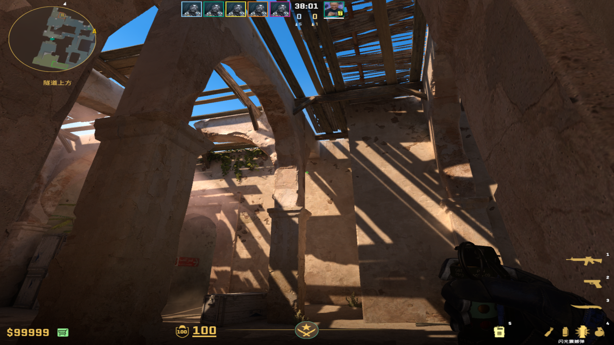
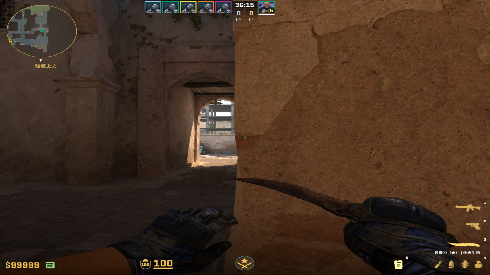
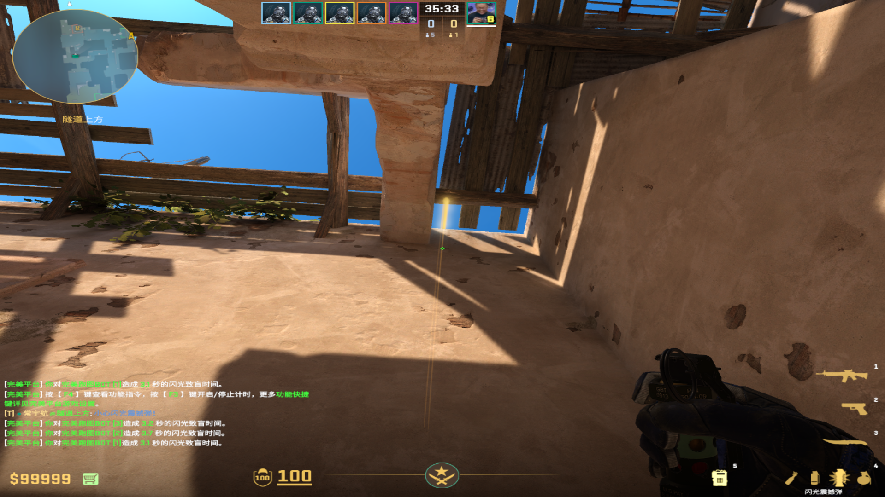
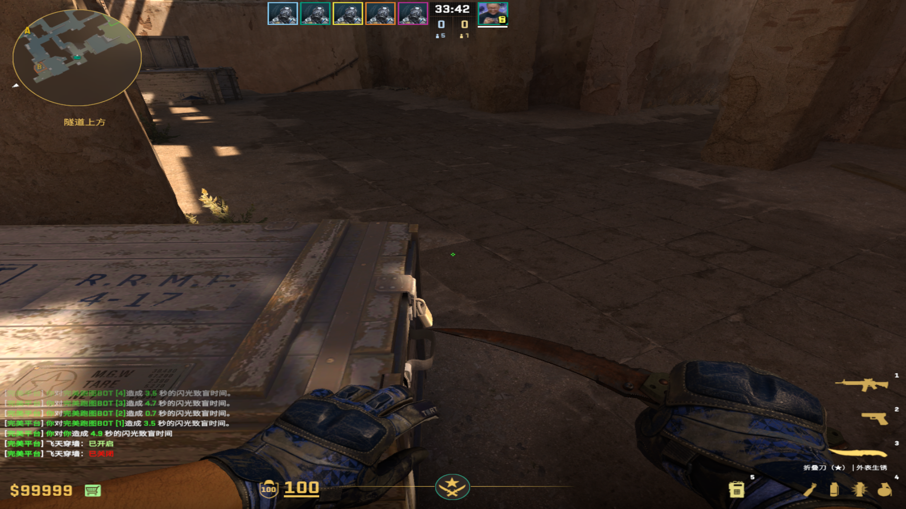
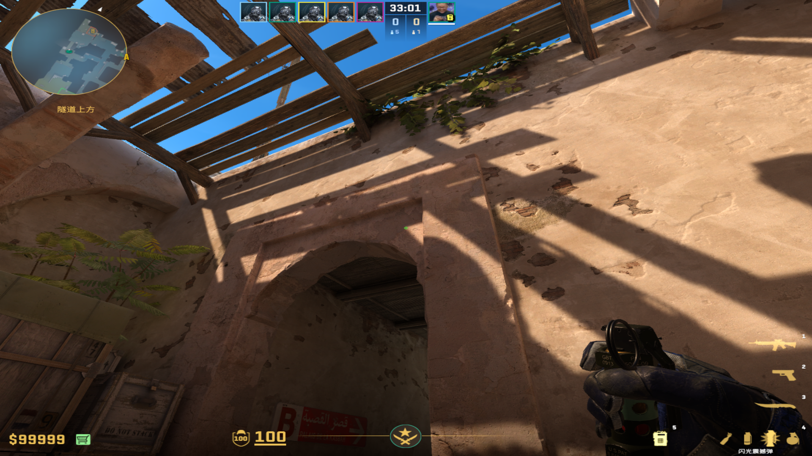

## 左侧高闪（综合效果可以，会漏一点身位）
collapsed:: true
	- 投掷：蹲着跳投
	- 站位：贴紧左侧凹槽
	  collapsed:: true
		- 
	- 描点：长条光斑最左端
		- 
	-
- ## 中间高闪（效果不如上面，但是安全）
  collapsed:: true
	- 投掷：跳投，第二个可以W+跳投
	- 站位：B通这个黑污渍
	  collapsed:: true
		- 
	- 描点：光斑右上角
	  collapsed:: true
		- 
	-
- ## Apex高闪 （白车大箱效果极好，描点慢）
  collapsed:: true
	- 投掷：跳投
	- 站位：视角贴近柱子左侧
	  collapsed:: true
		- 
	- 描点：这个横着的污渍，容错很高
	  collapsed:: true
		- 
		-
- ## BC教练自助闪（自助里面容错高，偏向壮胆）
  collapsed:: true
	- 投掷：走一步直接丢，偏向于少走点
	- 站位：小箱子右侧一点
		- 
	- 描点：光斑左上角
	  collapsed:: true
		- 
		-