public:: true

- # 烟雾弹
  collapsed:: true
	- ## 大坑补A门烟
	  collapsed:: true
		- 投掷：W走几步+左键投掷
		- 站位：看见描点都行，最好不漏蓝箱
		- 描点：红色窗户和墙角的中间
		  collapsed:: true
			- 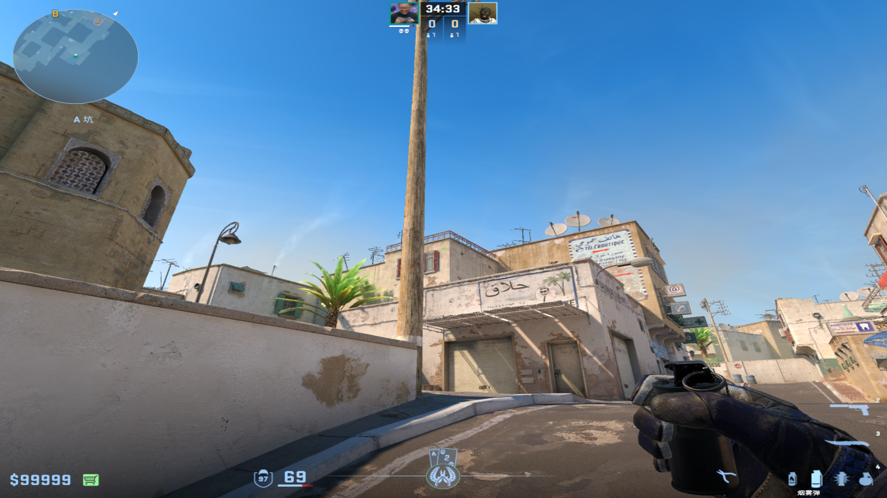
			-
	-
	- ## A大隔断烟
		- ### A包点下大路上
		  collapsed:: true
			- 投掷：左键直接丢
			- 站位：如图污渍
			  collapsed:: true
				- 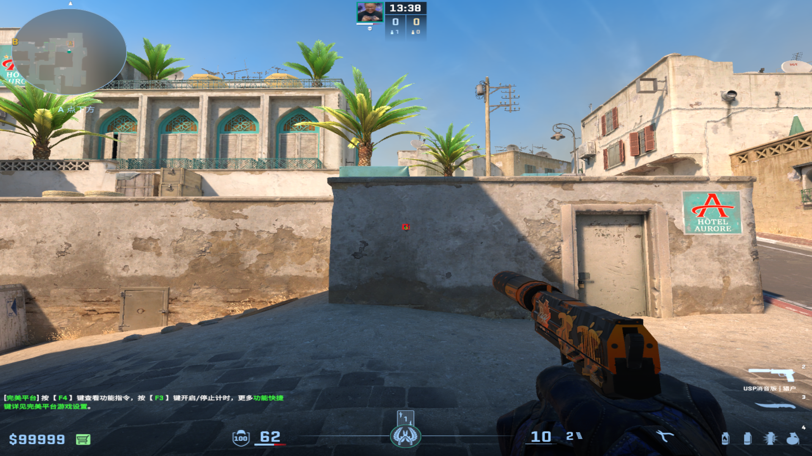
			- 描点：卫星锅右面黑点
			  collapsed:: true
				- 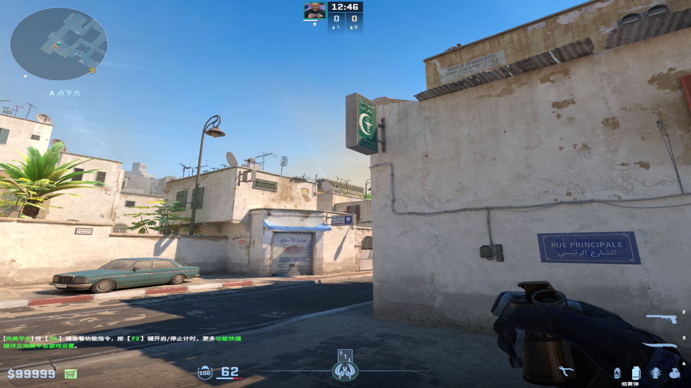
				-
		-
		- ### L位
		  collapsed:: true
			- 投掷：左键直接丢
			- 站位：视角与垂直面平齐
			  collapsed:: true
				- 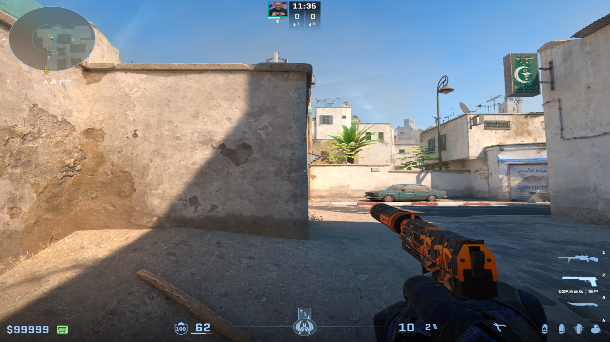
				-
			- 描点：左面卫星锅下面
			  collapsed:: true
				- 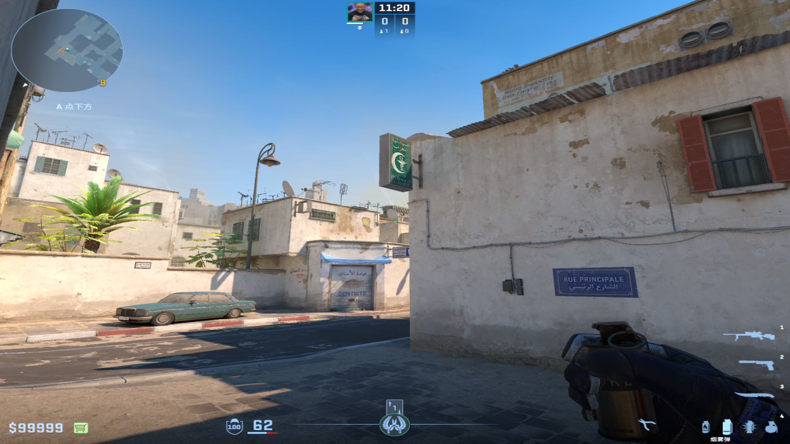
				-
		-
		- ### 二箱箱子后
		  collapsed:: true
			- 投掷：W+左键跳投
			- 描点：卷帘门下面黑块的上面边的中间
				- 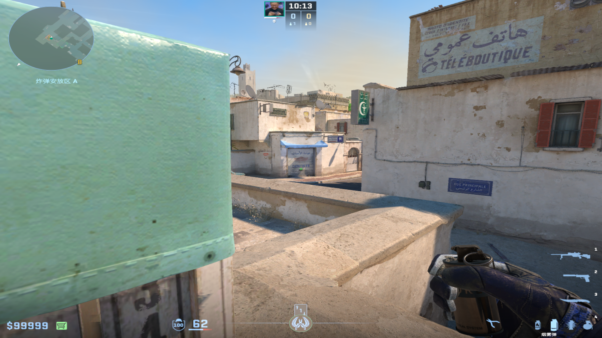{:height 291, :width 503}
				-
		-
		- ### 忍者位后
		  collapsed:: true
			- 投掷：左键跳投
			- 站位：如图草墩右端
			  collapsed:: true
				- 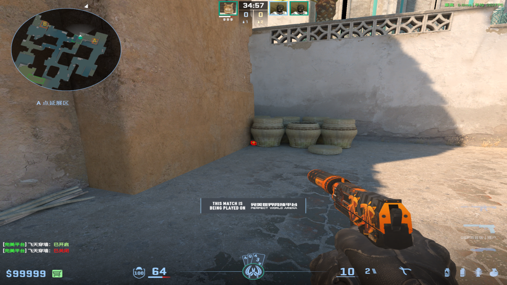
			- 描点：竖着的短电线中间
			  collapsed:: true
				- 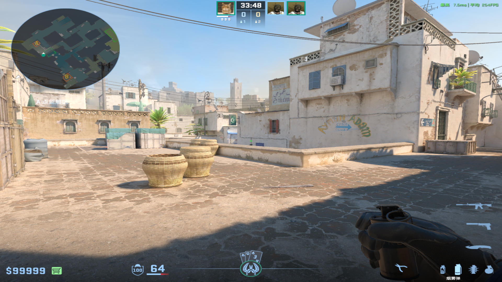
				-
		-
		- ### A小（较慢）
		  collapsed:: true
			- 投掷：双键跳投
			- 站位：如图夹角
			  collapsed:: true
				- 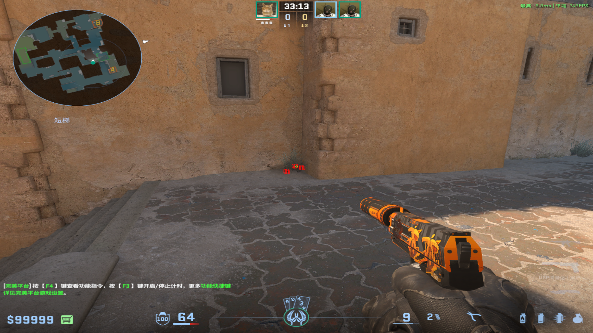
			- 描点：房顶两个污渍中间
			  collapsed:: true
				- 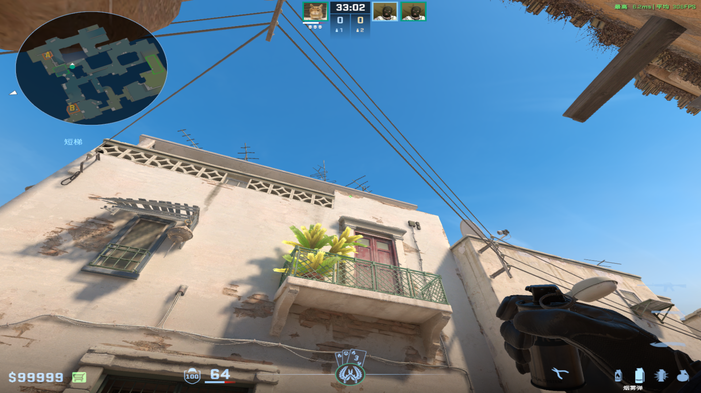
				-
-
- # 闪光弹
  collapsed:: true
	- ## 大坑自助保命闪
	  collapsed:: true
		- 投掷：W走一步左键投掷
		- 站位：大坑贴A门一侧
		- 描点：污渍上端
		  collapsed:: true
			- 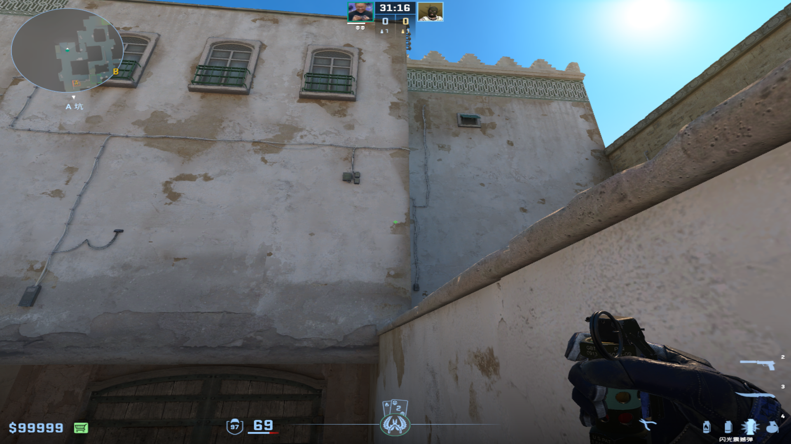
			-
	-
	- ## 前压A门自助闪
	  collapsed:: true
		- 投掷：左键直接丢
		- 站位：A门外死角
		- 描点：墙壁与天空夹角
			- 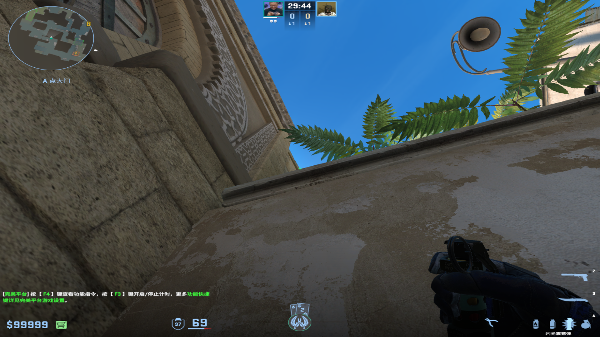
			-
	-
	- ## 蓝车头老六自助闪（抓背闪/先等队友闪光）
	  collapsed:: true
		- 投掷：蹲着右键直接丢
		- 站位：蓝车头躲死
		- 描点：面前卷帘门右上角
			- 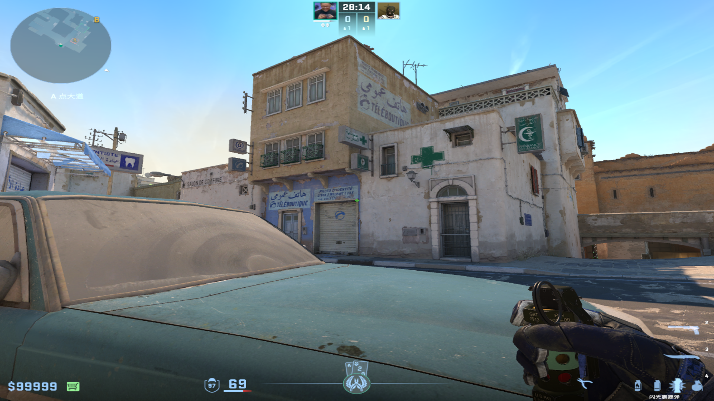
			-
	-
	- ## L位自助闪
	  collapsed:: true
		- 投掷：左键跳投
		- 站位：A包下电梯位
		- 描点：小虫子似的污渍右端
		  collapsed:: true
			- 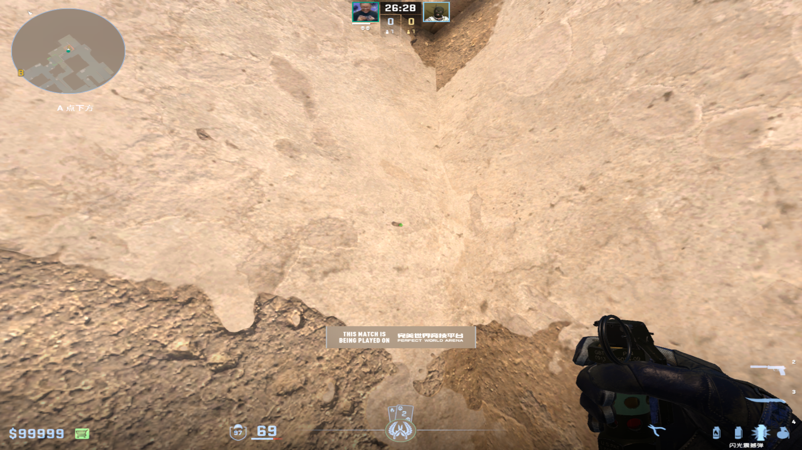
			-
	-
	- ## Zywoo平台自助闪
	  collapsed:: true
		- 投掷：双键跳投
		- 站位：二箱后的死角
		- 描点：墙壁电线的结点
		  collapsed:: true
			- 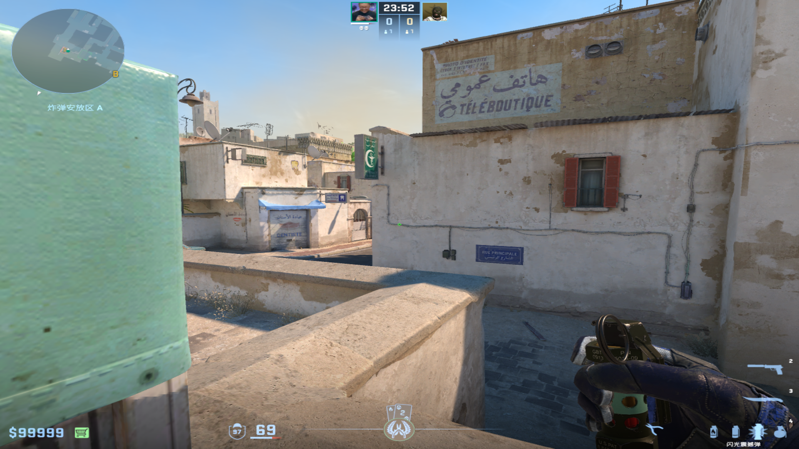
			-
-