# 燃烧弹/手雷
	- ## B1火
	  collapsed:: true
		- 投掷：W跑着左键投掷
		- 站位：拐角到凹槽
		  collapsed:: true
			- 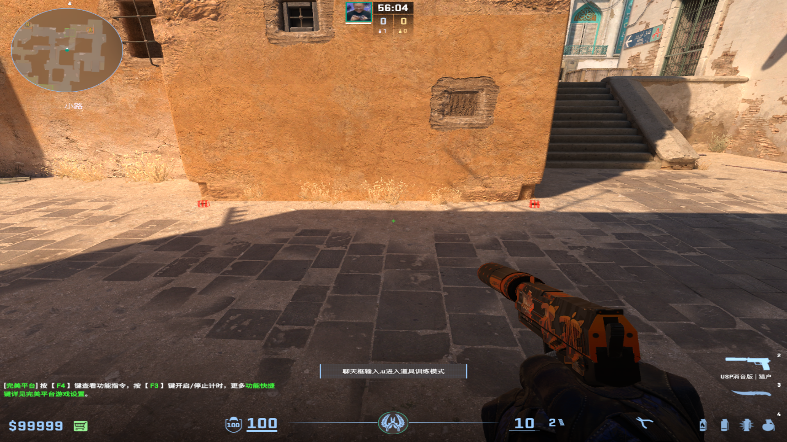
		- 描点：前面台阶从下面跑到上面出手
		  collapsed:: true
			- 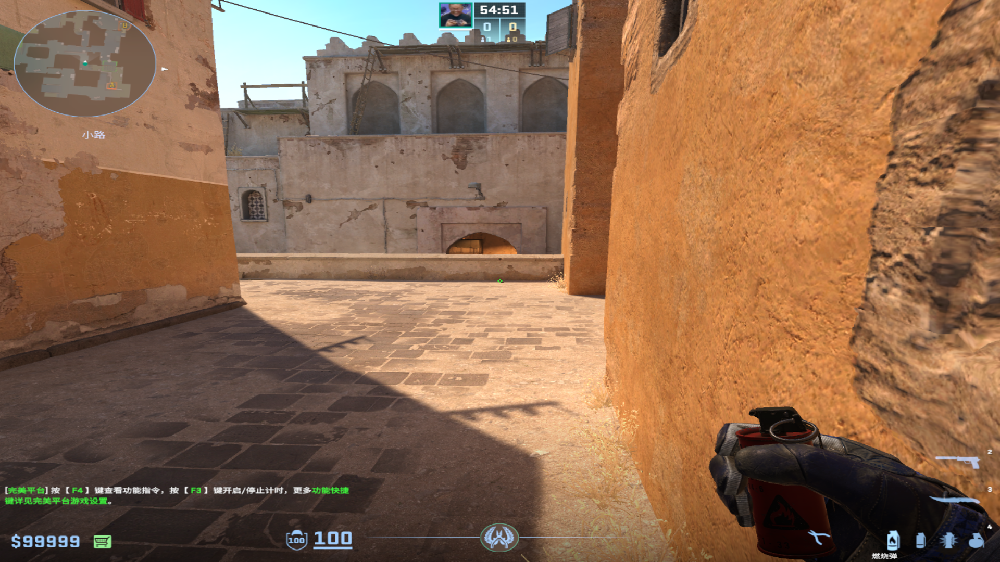
			- 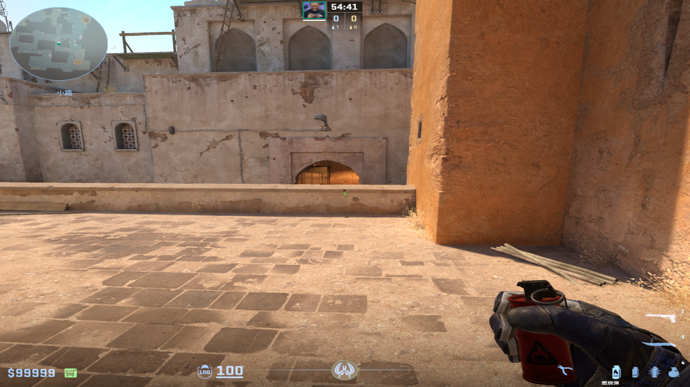
	-
	- ## L位火
	  collapsed:: true
		- 投掷：W+左键跳投
		- 站位：A小楼梯拐角跳一下，之后对准台阶一个大跳上去卡住
		  collapsed:: true
			- 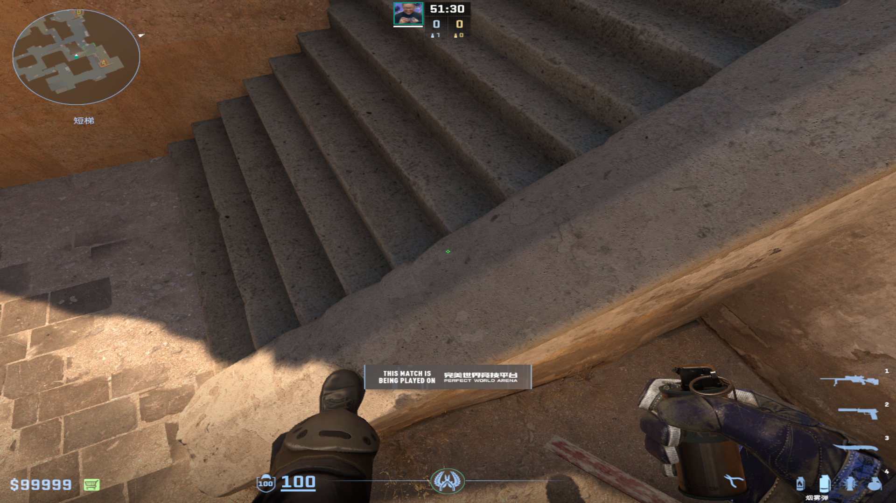
		- 描点：绿色棚子下面第一个污渍的下面
		  collapsed:: true
			- 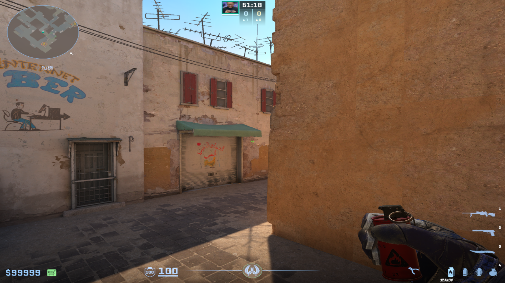
			-
- # 闪光弹
	- ## 清中路
		- ### Apex闪
			- 投掷：左键直接丢
			- 站位：沙地大车尾部
				- 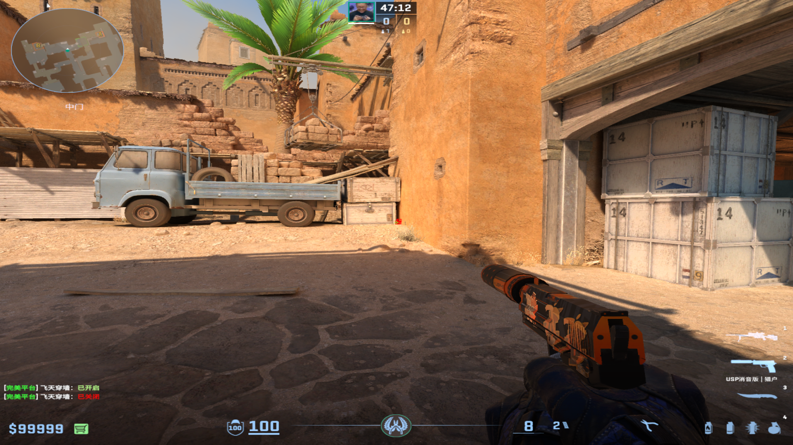
			- 描点：最粗的小横杆往上一点点点
				- 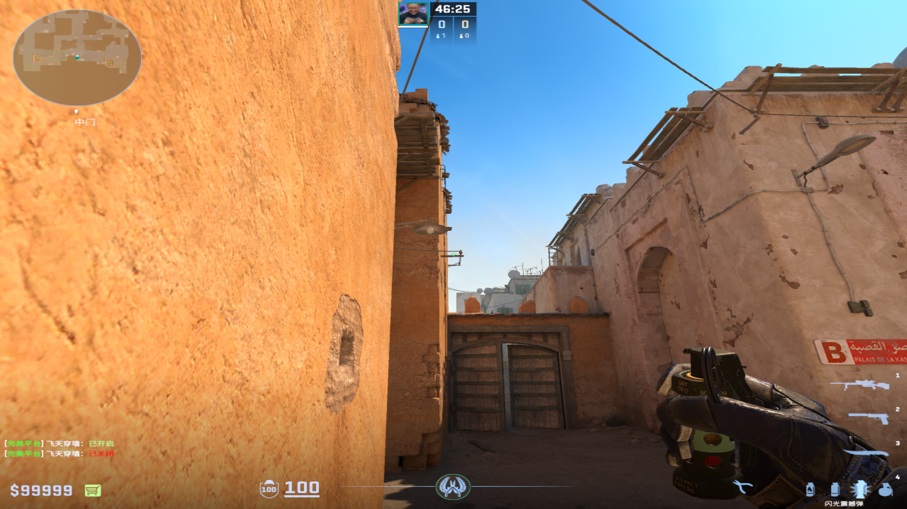
				-
		-
		- ### 可以补枪的Apex闪爆点
			- 投掷：双键投掷
			- 站位：中路与ct的墙角边缘
				- 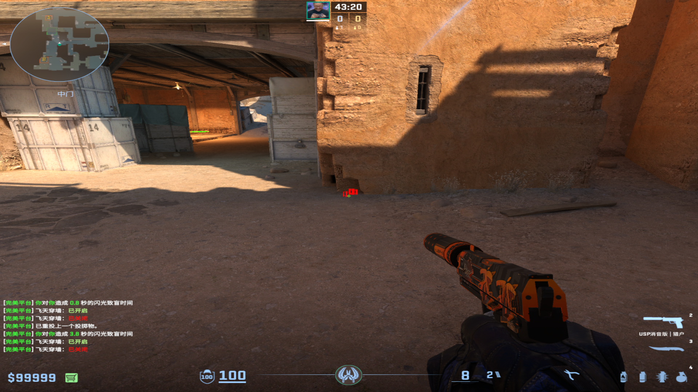
				-
			- 描点：草棚从下往上最突出的一块向右拉一点
				- 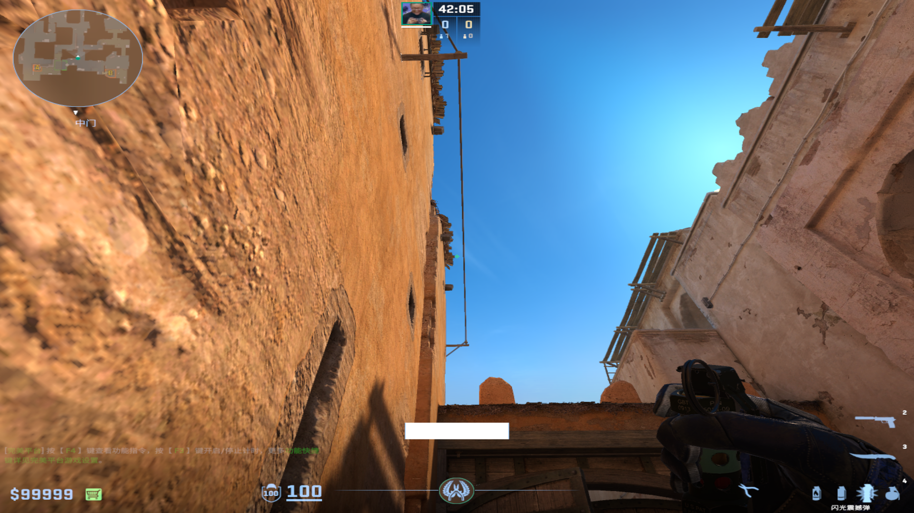
				-
		-
		- ### B8反清闪
			- 投掷：左键直接丢
			- 站位：A小箱子外侧
				- 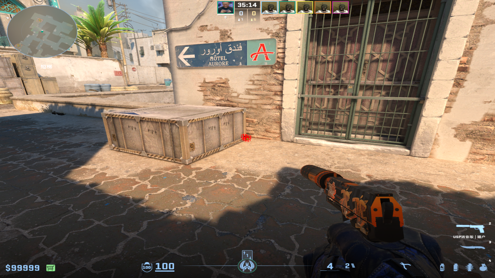
			- 描点：左侧时候和下面草棚的延长
				- 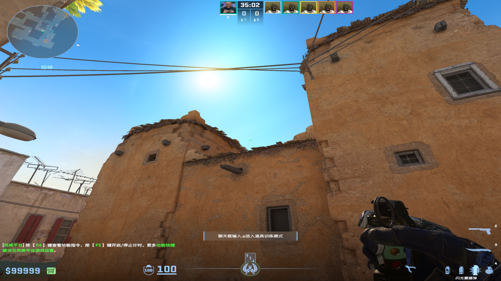
				-
		-
		- ## 垃圾自助闪（没人配合自己顶A小玩）
			- ### 双键投掷
				- 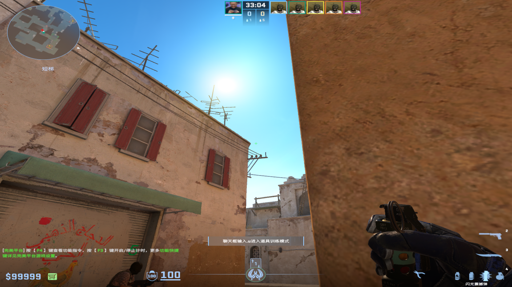
				- 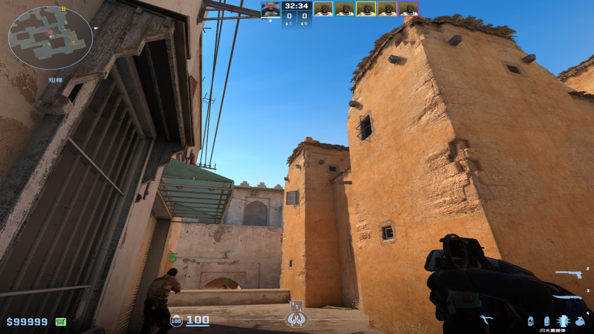
				-
			- ### 蹲着左键跳投
				- 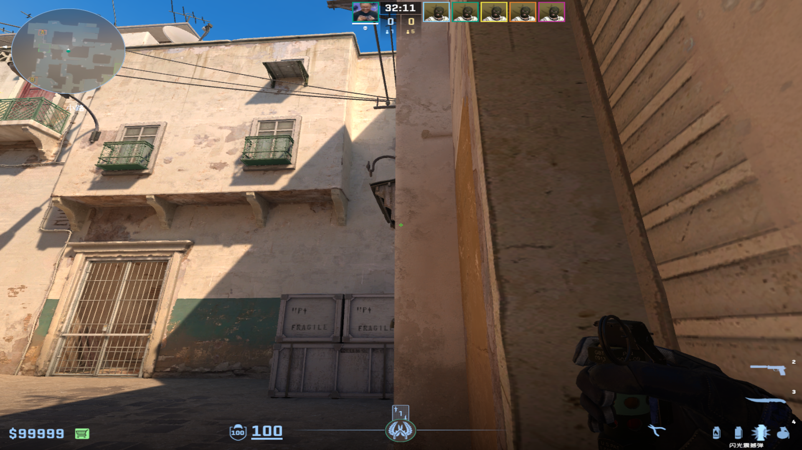
				-
	-
	- ## 清A小拐角
	  collapsed:: true
		- ### 空调自助闪
			- 投掷：双键投掷
			- 站位：空调位尽量往里走
			- 描点：左侧白色和墙角的延长
				- 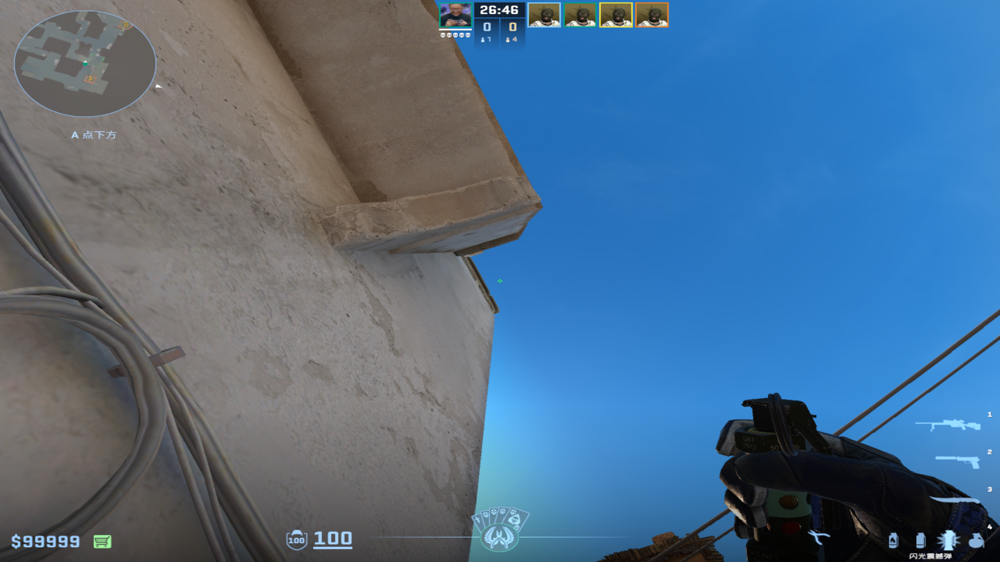
				-
		-
		- ### 草墩闪
			- 投掷：左键直接丢
			- 站位：A平台草墩外侧
				- 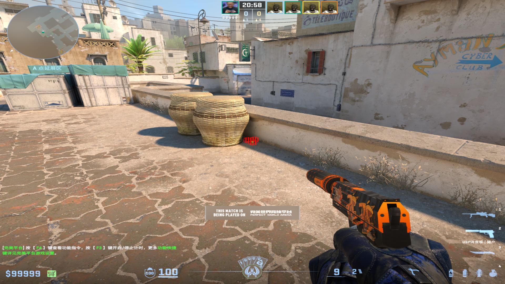
				-
			- 描点：右墙上黑木条向左拉一点
				- 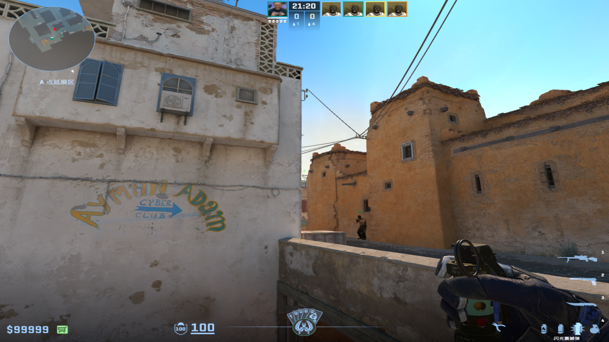
				-
				-
-