# 闪光弹
	- ## 还没过空调
		- ### G2反清闪
		  collapsed:: true
			- 投掷：左键直接丢
			- 站位：A平台一箱角落
			  collapsed:: true
				- 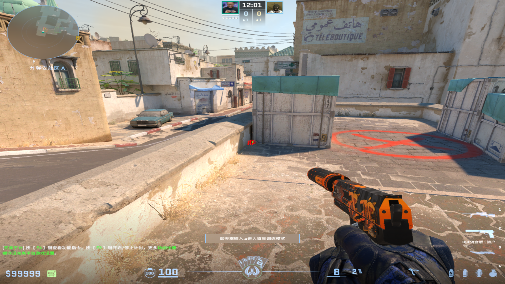
			- 描点：最高房檐向右平移到和黄色墙壁的中间
			  collapsed:: true
				- 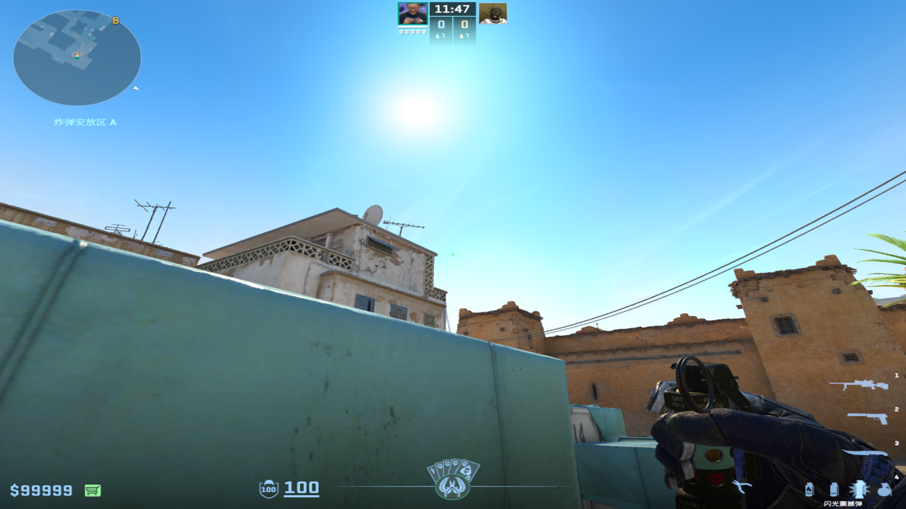
				-
			-
			-
		-
		- ### 轨迹不顺站位顺
		  collapsed:: true
			- 投掷：左键直接丢
			- 站位：A平台二箱角落
			  collapsed:: true
				- 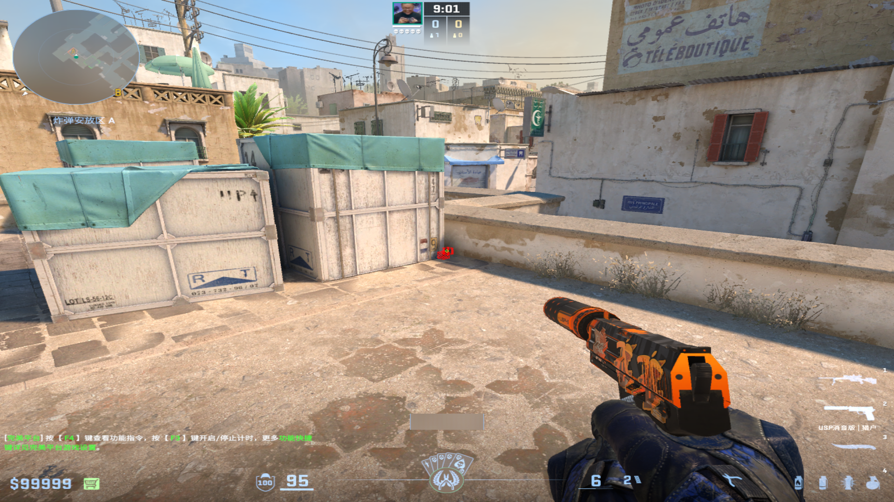
			- 描点：头顶太阳
			  collapsed:: true
				- 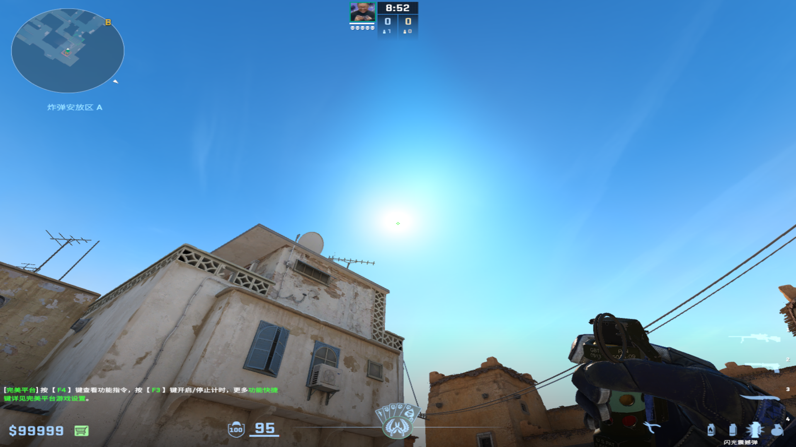
				-
	-
	- ## 过了空调要上平台
		- ### 椰树闪
		  collapsed:: true
			- 投掷：双键投掷
			- 站位：Goose位
			- 描点：椰树凹进去的那个树叶顶端（越往上秒越隐蔽但是越不白）
				- 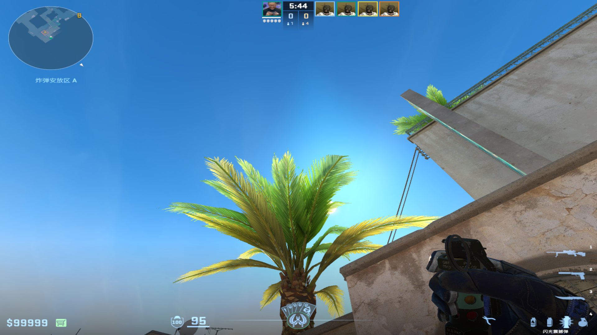
				-
		-
		- ### 斜坡单向闪白远点
		  collapsed:: true
			- 投掷：左键直接丢
			- 站位：斜坡瞄准一箱右侧
			  collapsed:: true
				- 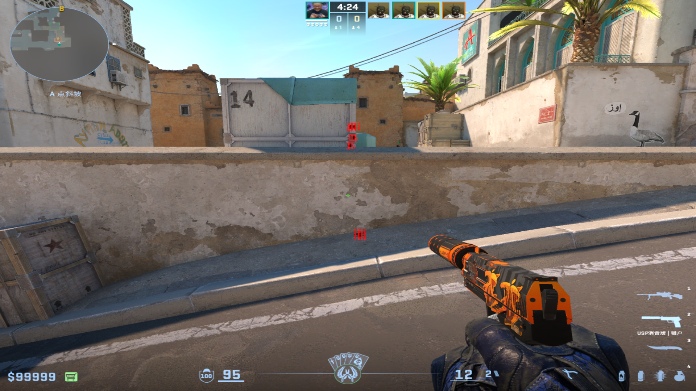
				-
			- 描点：忍者位面前的大箱子的左上角
			  collapsed:: true
				- 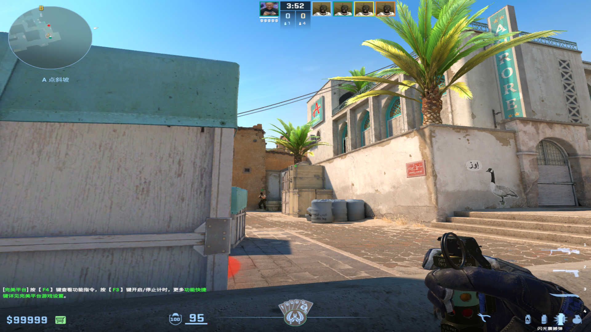
				-
		-
		- ### 一二箱中间自助闪
		  collapsed:: true
			- 投掷：右键直接丢
			- 站位：别离一箱太近，也别离二箱太近
			- 描点：太阳（越靠近二箱，描点越往上，不建议往一箱走，会白到自己）
			  collapsed:: true
				- 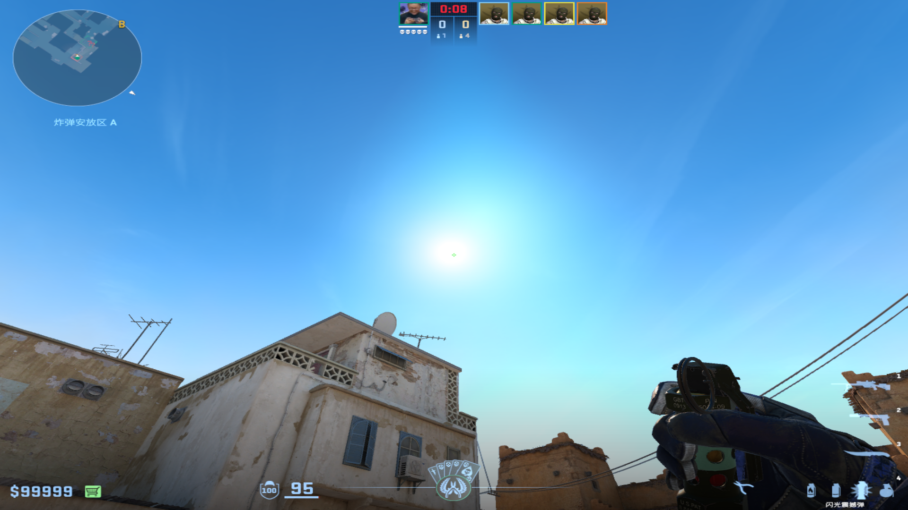
				-
			- 另一种丢法：（半淘汰）
			  collapsed:: true
				- 站在二箱的小箱子，蹲着瞄准一箱右半部分的绿色&白色的交界处的右半部分，左键投掷
				  collapsed:: true
					- 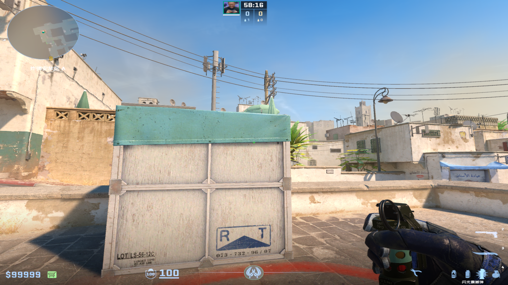
					-
		-
		- ### 斜坡单向闪白包点
		  collapsed:: true
			- 投掷：左键直接丢
			- 站位：斜坡箱子的里侧
			  collapsed:: true
				- 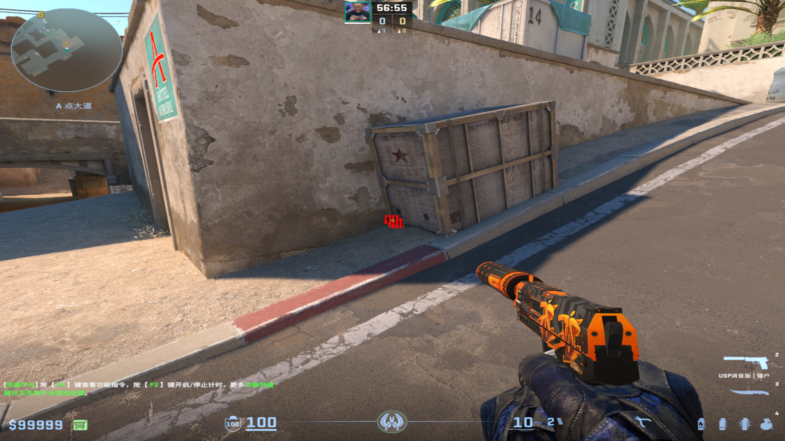
			- 描点：箱子上字母S平移到最上面的线
			  collapsed:: true
				- 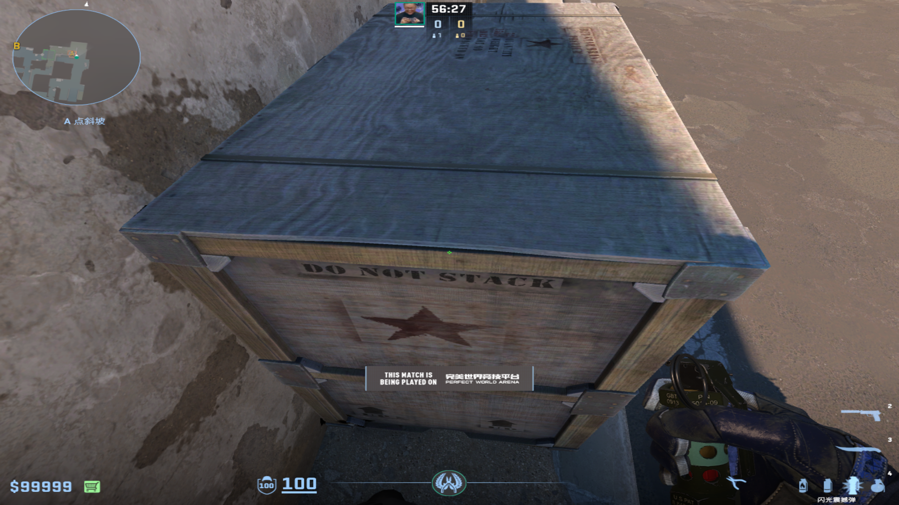
				-
		-
		- ### A大白二箱之前
		  collapsed:: true
			- 投掷：右键跳投
			- 站位：A大别太往蓝车方向走，贴近一点墙壁
			  collapsed:: true
				- 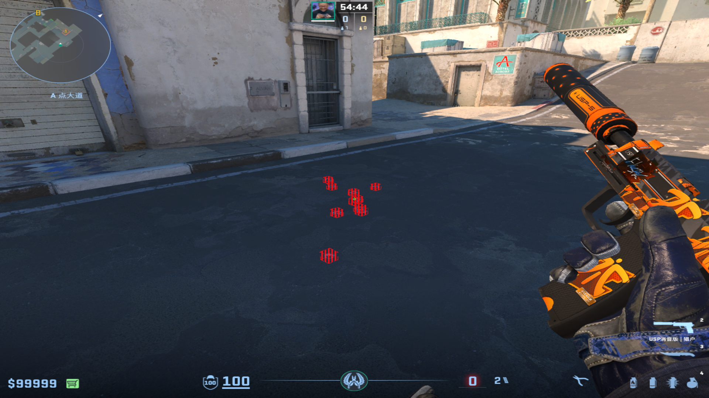
				-
			- 描点：小拱门中间右上角
			  collapsed:: true
				- 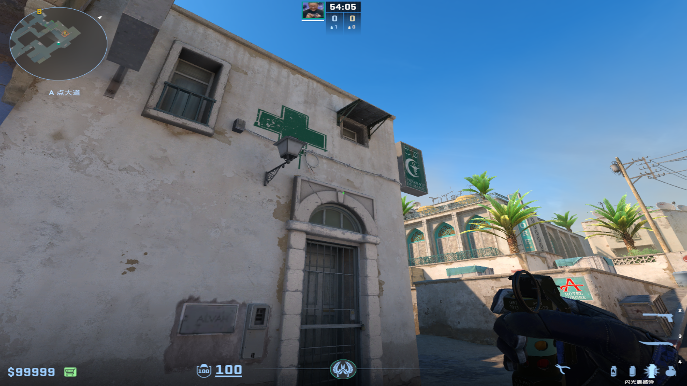
				-