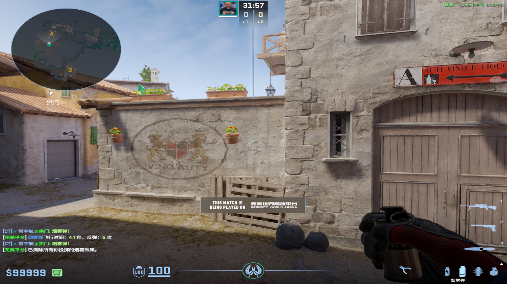
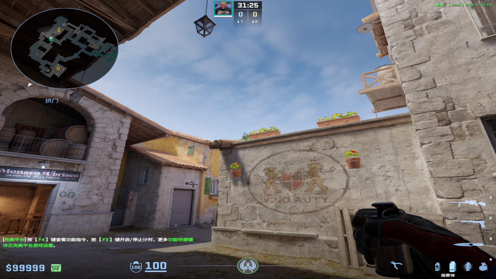
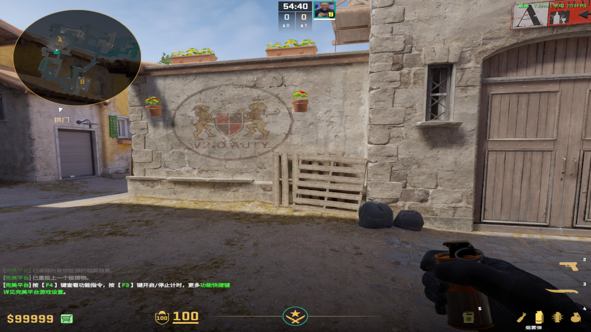
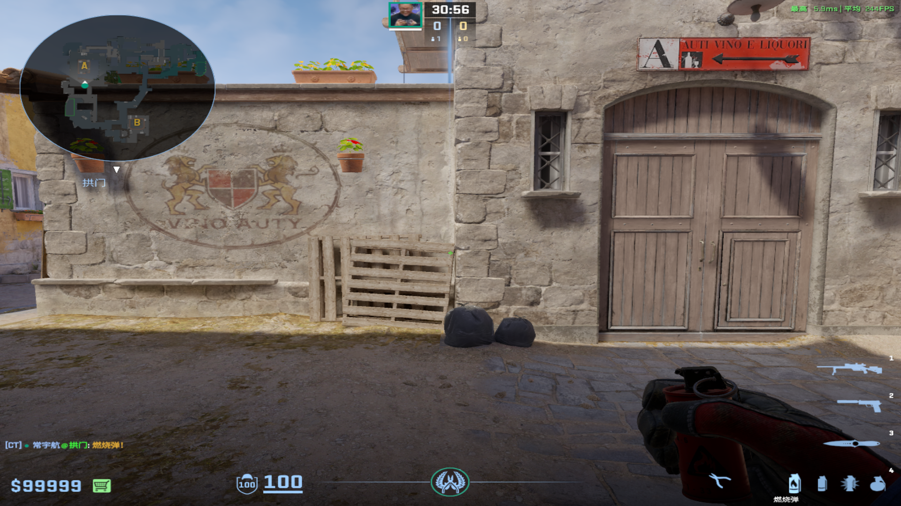
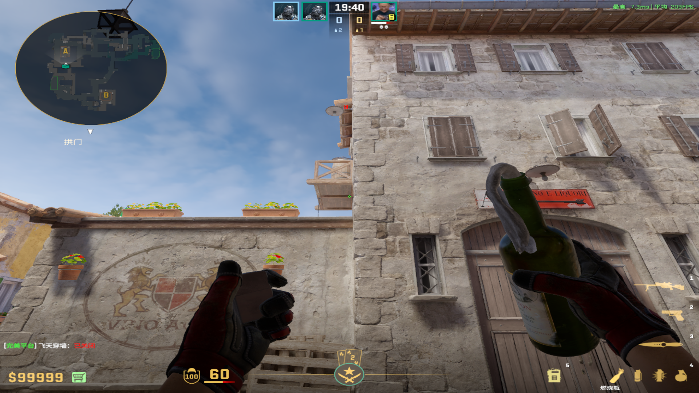
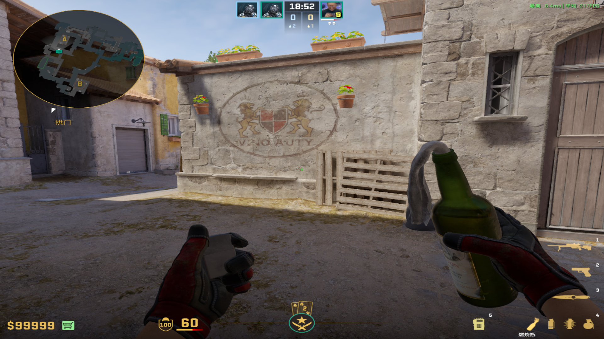
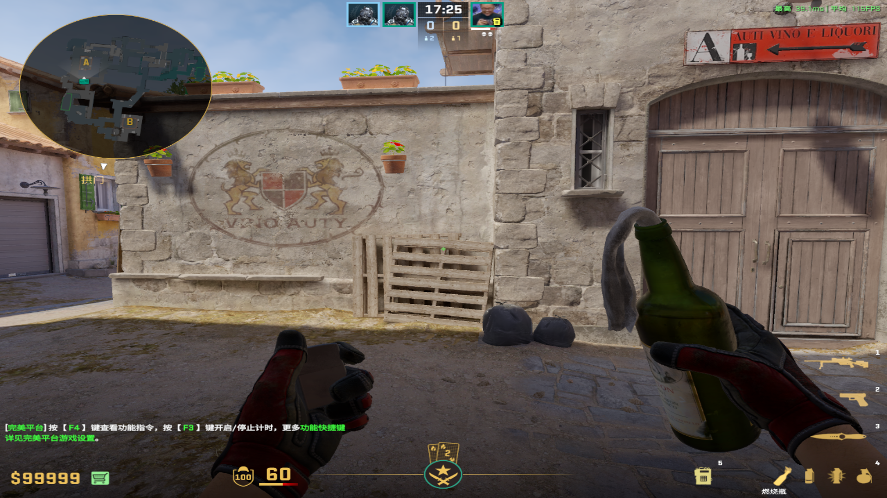
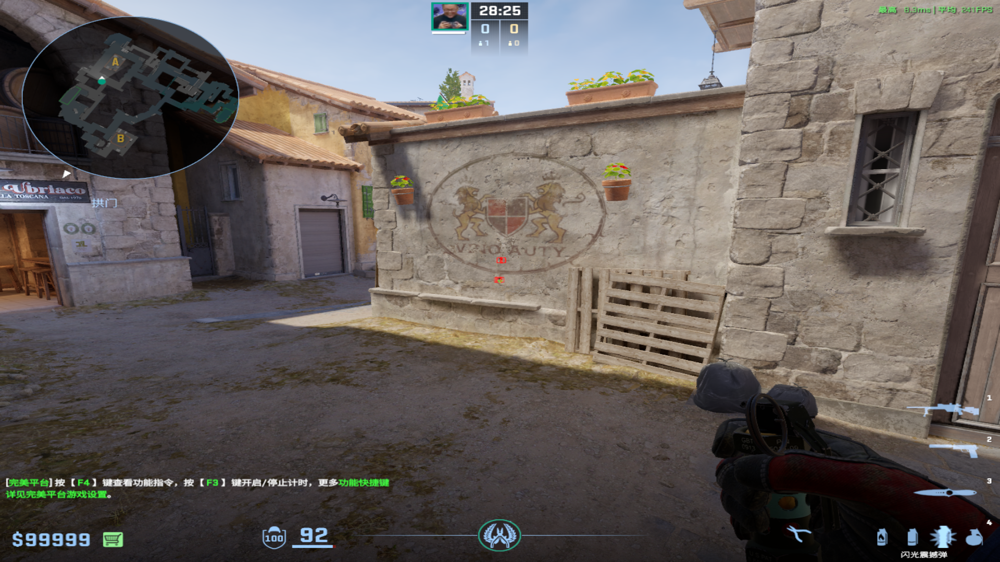
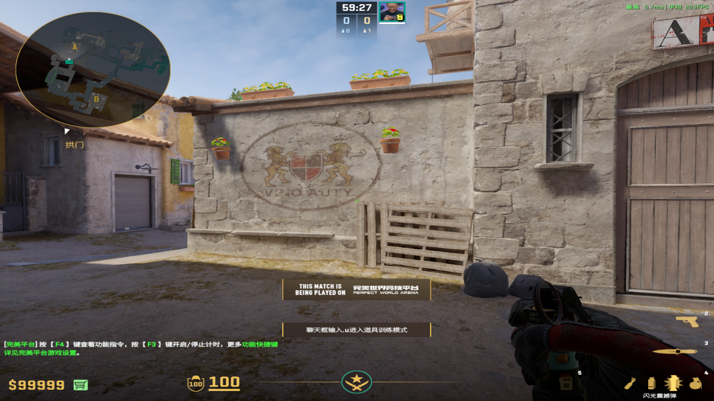

# 烟雾弹
	- ## 大小坑隔段烟
	  collapsed:: true
		- ### 红信箱上丢PV
		  collapsed:: true
			- 投掷：双键跳投
			- 描点：小长污渍中间偏左上
			  collapsed:: true
				- 
				-
		-
		- ### 红信箱下丢（小心混烟）
		  collapsed:: true
			- 投掷：左键直接丢
			- 描点：左边花盆左下角
				- 
				-
		-
		- ### 红信箱下丢PV烟
			- 投掷：双键跳投
			- 描点：木板竖条最右面，上半部分中间
				- 
-
- # 燃烧弹
	- ## 忍者位
	  collapsed:: true
		- 投掷：双键跳投
		- 站位：红信箱下
		- 描点：木板第一排右侧右上角落
		  collapsed:: true
			- 
			-
	-
	- ## 死点火（弱火小心）
	  collapsed:: true
		- 投掷：左键直接丢
		- 站位：红信箱下
		- 描点：两个都行
			- 
			-
		-
	-
	- ## 大坑火（弱火小心）
	  collapsed:: true
		- 投掷：左键跳投
		- 站位：红信箱下
		- 描点：尖尖污渍右下角（别太靠外）
		  collapsed:: true
			- 
			-
	-
	- ## 阳台上下火
	  collapsed:: true
		- 投掷：W+左键跳投
		- 站位：红信箱下
		- 描点：木板第一排中间
			- 
			-
	-
-
- # 闪光弹
	- ## 墓地单向闪
	  collapsed:: true
		- 投掷：蹲着描点后站起来左键跳投
		- 站位：红信箱上
		- 描点：O下面的污渍
			- 
			-
	-
	- ## 启动闪
		- 投掷：双键跳投
		- 站位：红信箱下
		- 描点：方形和圆形中间的月牙
			- 
			-