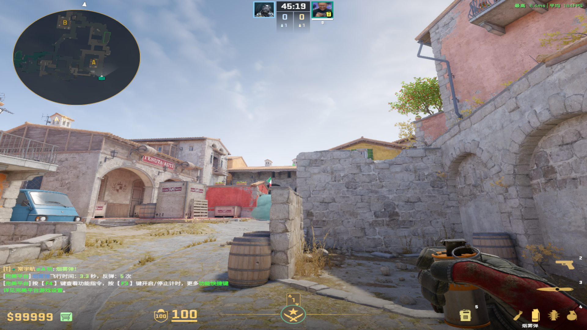
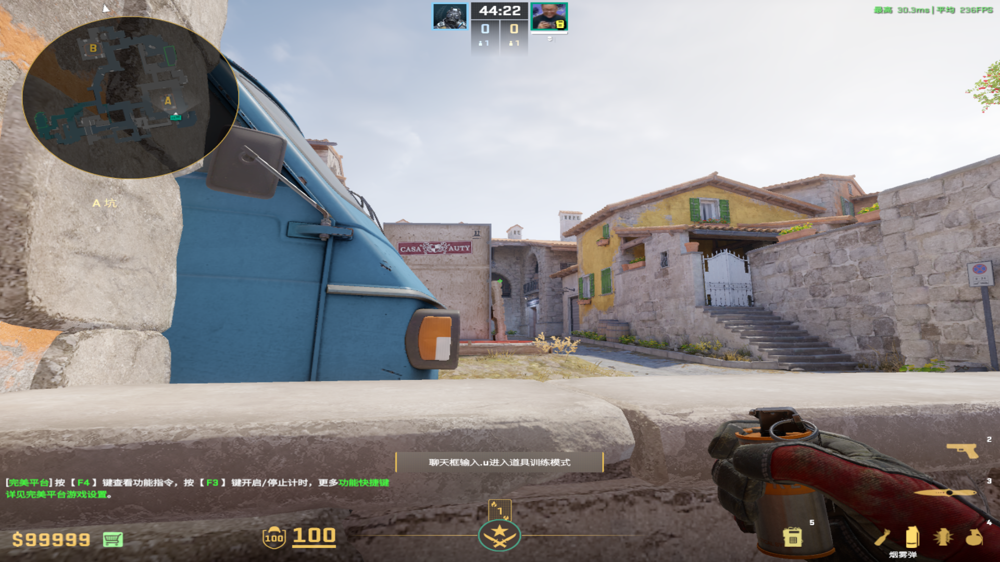
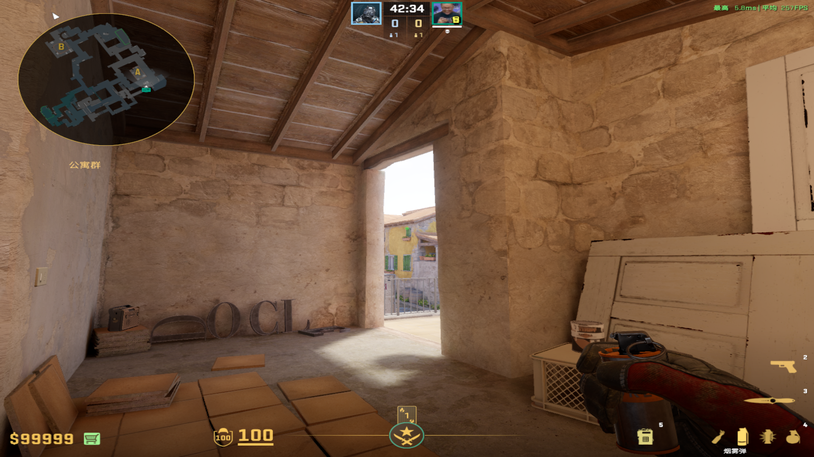

public:: true

- # 烟雾弹
	- ## 补摩托烟
	  collapsed:: true
		- ### 大坑
		  collapsed:: true
			- 投掷：左键直接丢
			- 描点：右侧小烟囱的左下角
				- 
				-
		-
		- ### 小坑死角
		  collapsed:: true
			- 投掷：左键直接丢
			- 描点：高箱双架位置的左上角
				- 
				-
		-
		- ### 草车附近
		  collapsed:: true
			- 投掷：左键直接丢
			- 描点：最高的左上角房檐
		-
		- ### 二楼
		  collapsed:: true
			- 投掷：W蹲着走着左键直接丢
			- 描点：小绿方框的左上角
				- 
				-