# 一箱一套
collapsed:: true
	- 站位：一箱右侧中间柱子空心
	  collapsed:: true
		- 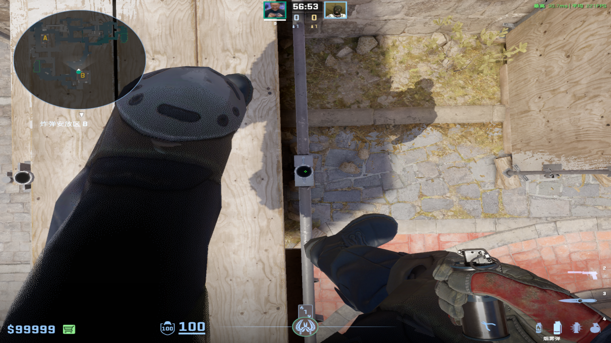
	- 石板烟：双键直接丢
	  collapsed:: true
		- 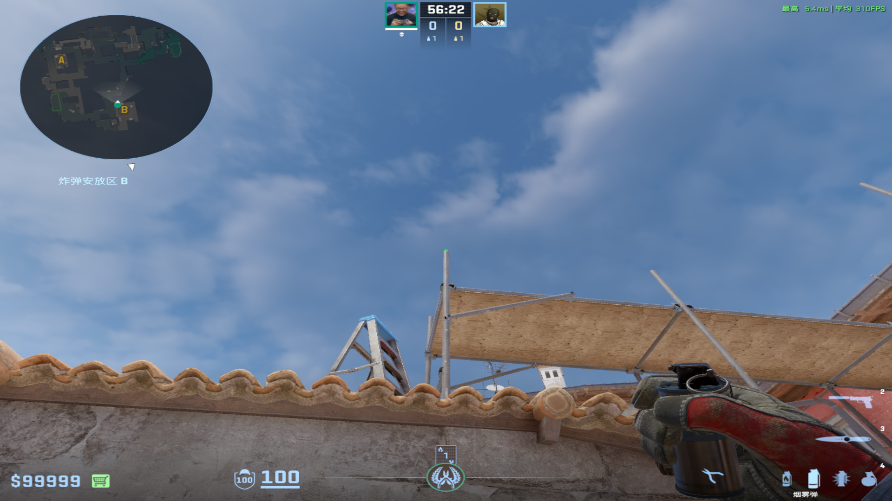
	- 木桶火：左键直接丢
	  collapsed:: true
		- 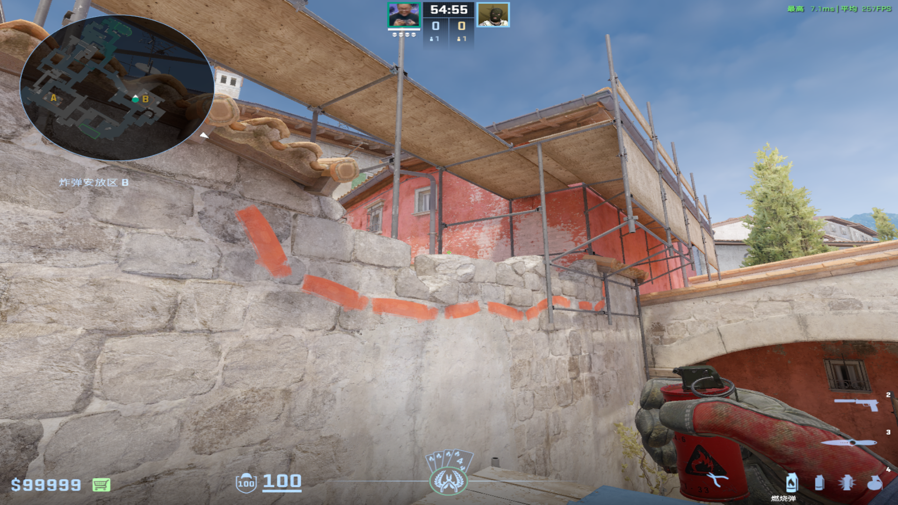
		-
	- 黄墙闪：左键直接丢
	  collapsed:: true
		- 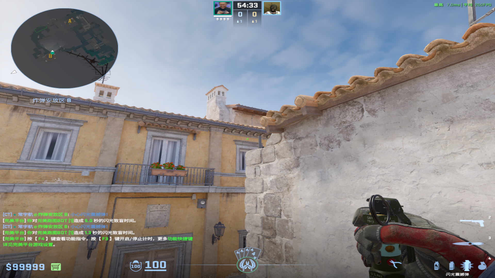
		-
-
- # 二箱一套
  collapsed:: true
	- 站位：二箱左下角柱子空心
	  collapsed:: true
		- 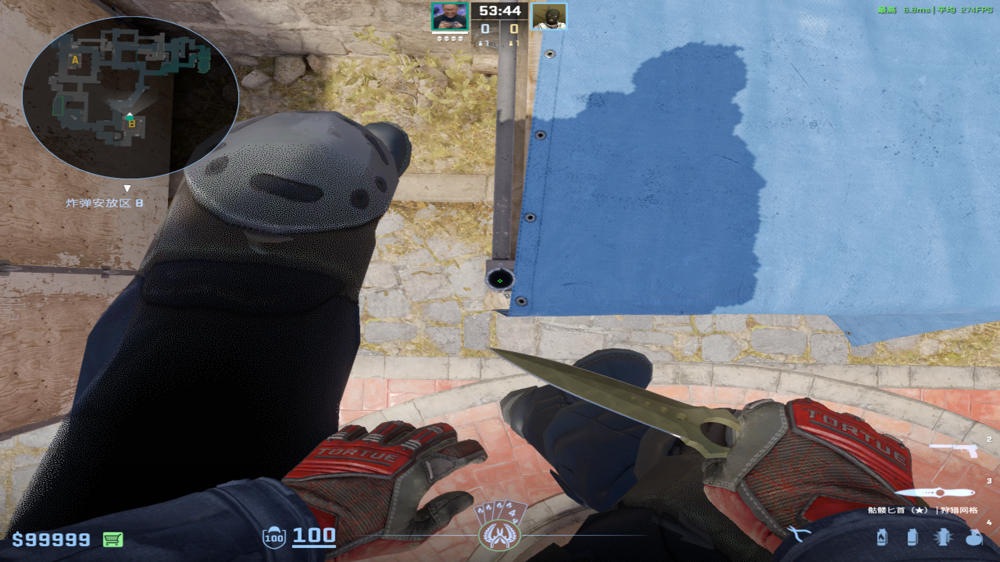
	- 石板烟：蹲着描后双键直接丢
	  collapsed:: true
		- 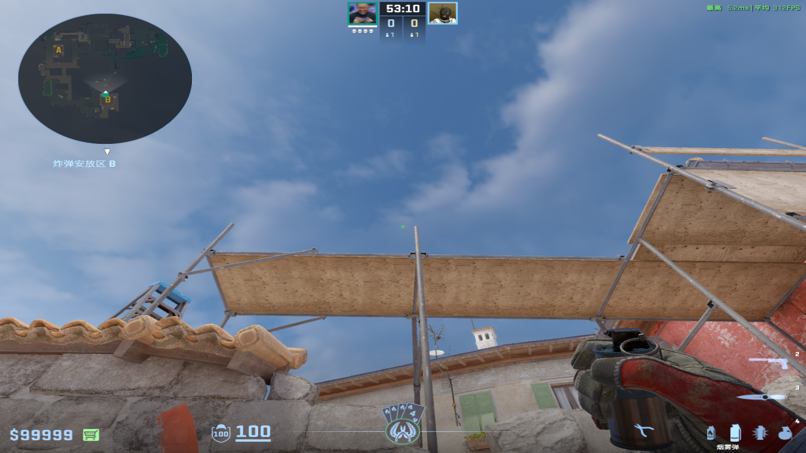
	- 木桶火：左键直接丢
	  collapsed:: true
		- 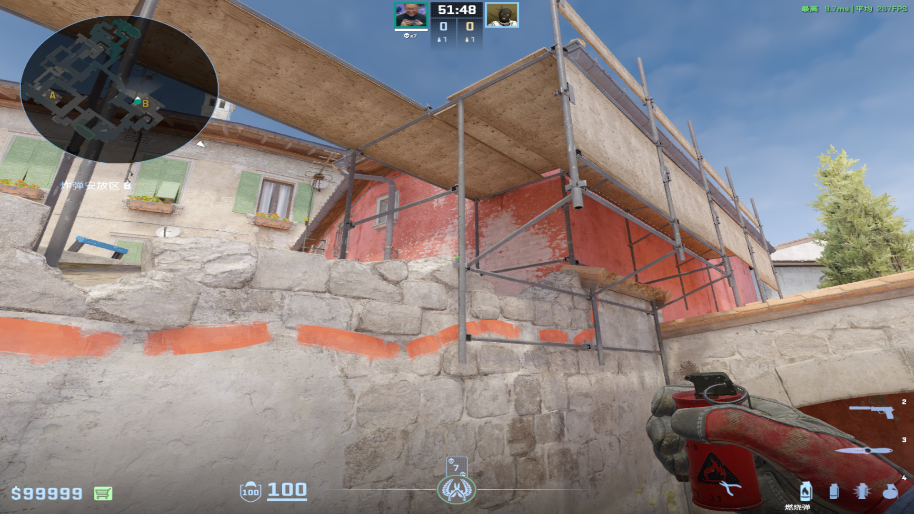
		-
	- 单向闪：左键直接丢
	  collapsed:: true
		- 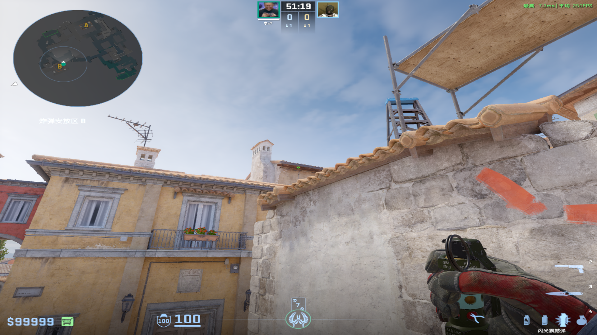
		-
-
- # CT反清一套
  collapsed:: true
	- 站位：裂纹中间，同时中间柱子和绿色窗户中间对齐
	  collapsed:: true
		- 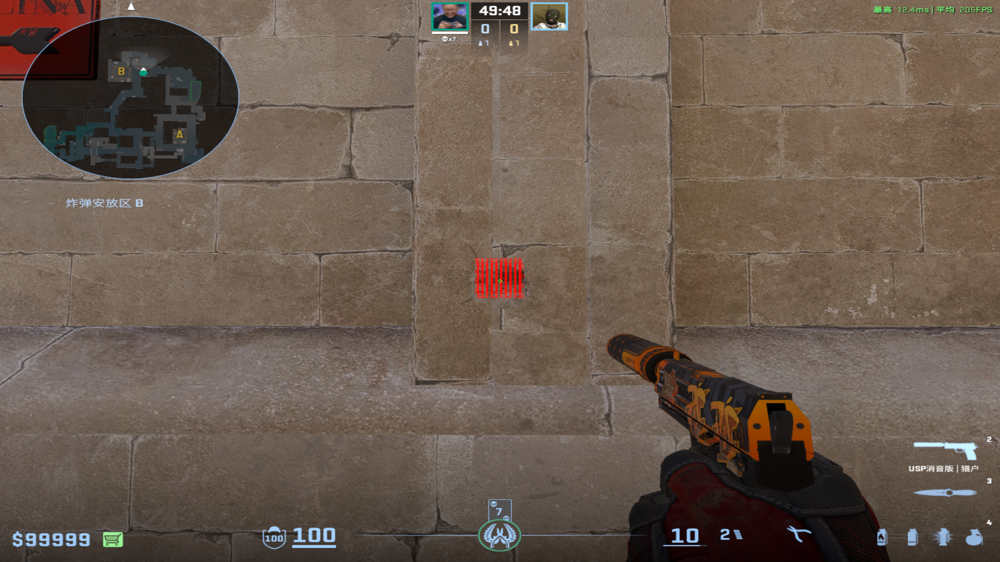
		-
	- 石板后烟雾：双键跳投
	  collapsed:: true
		- 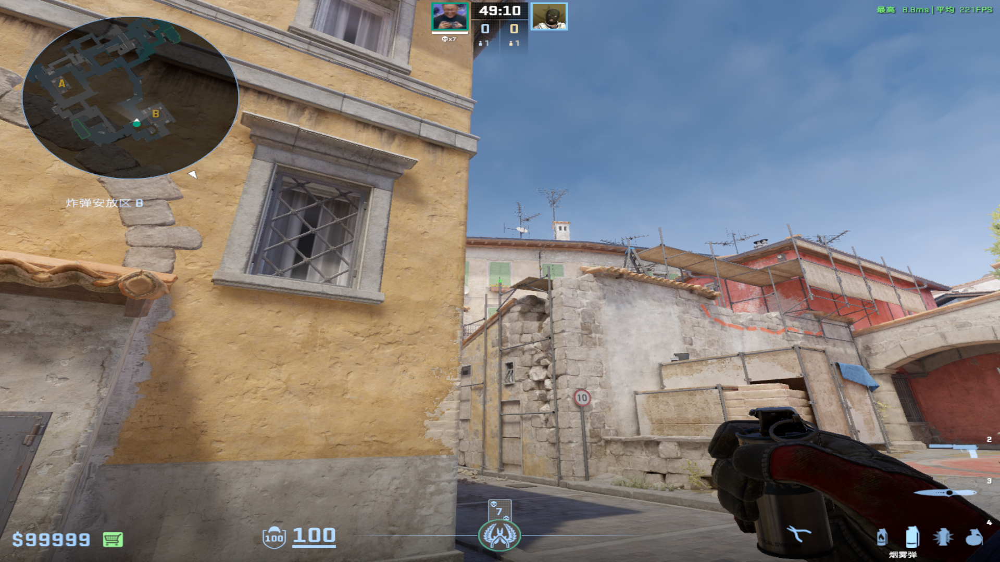
	- 石板后火：左键直接丢
	  collapsed:: true
		- 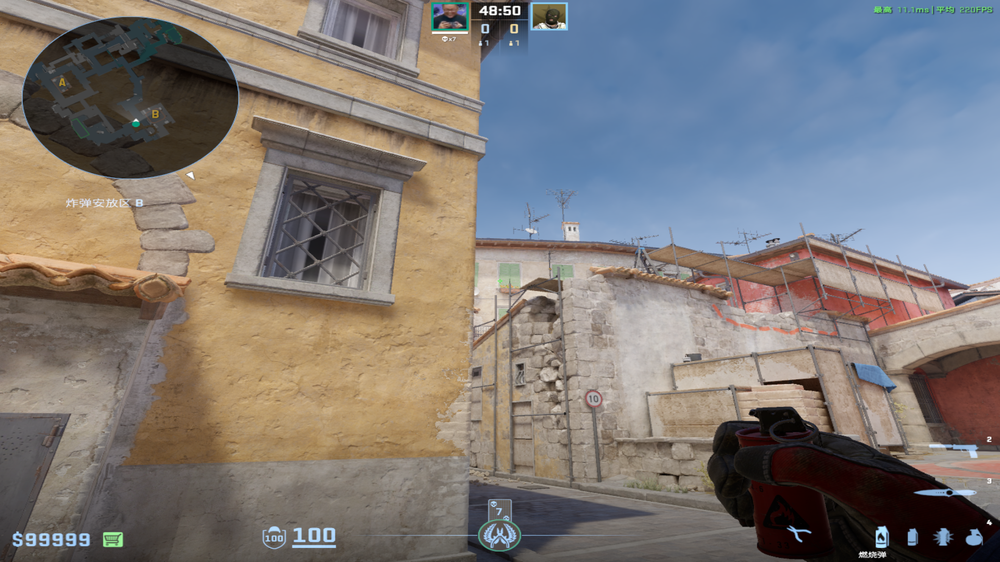
	- 黄墙闪：双键跳投
	  collapsed:: true
		- 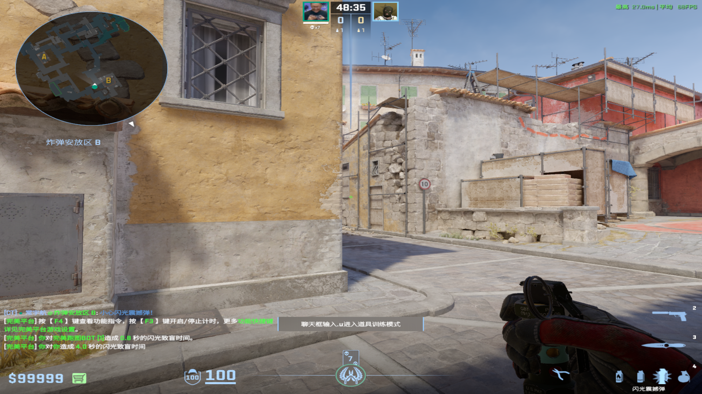
		-