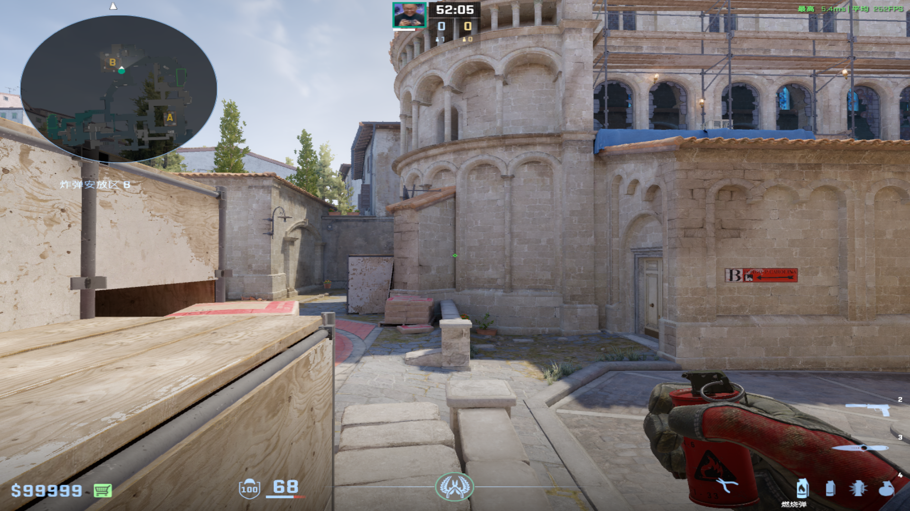
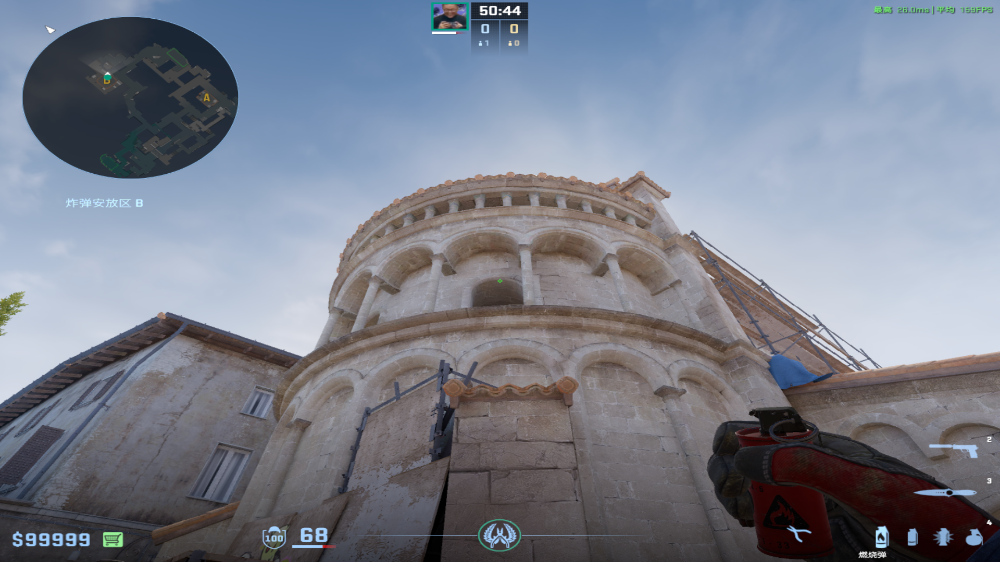
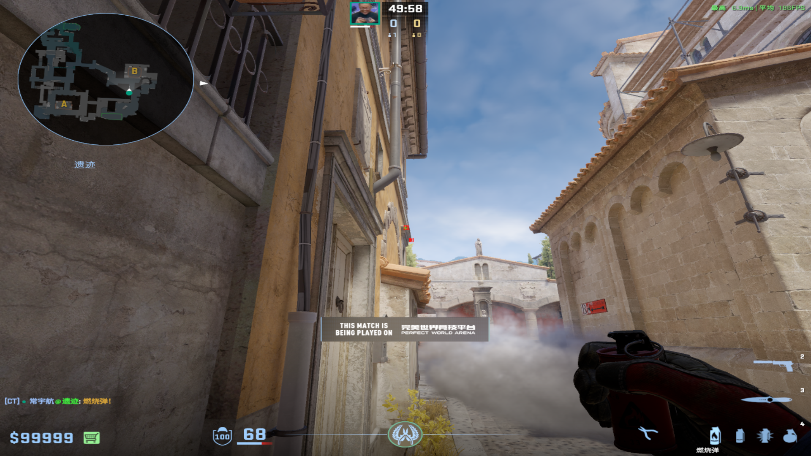
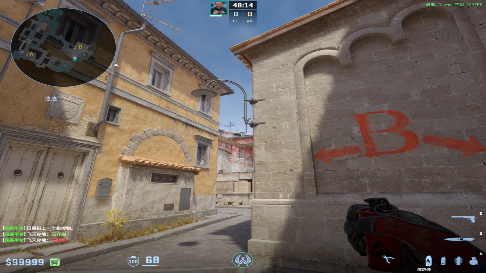
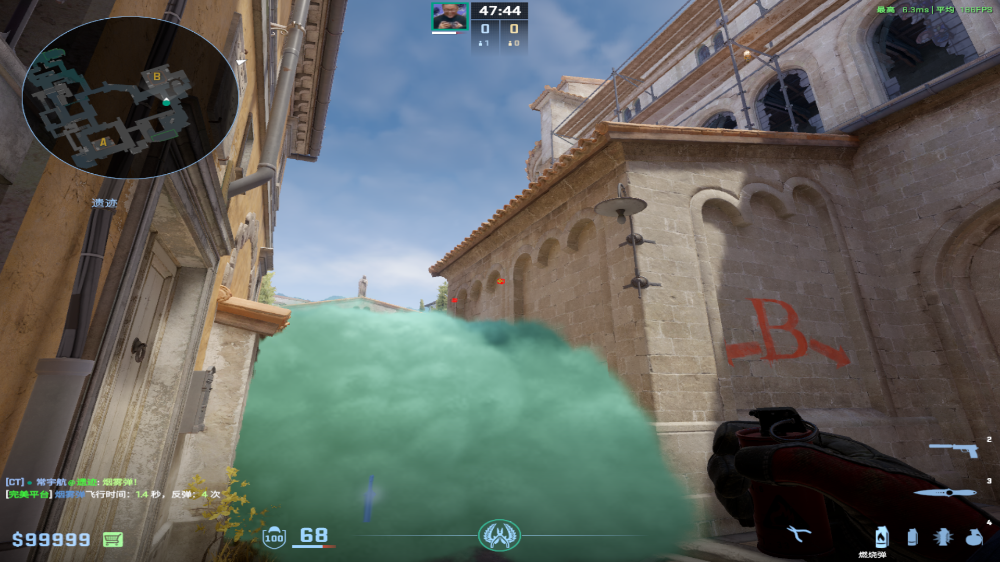
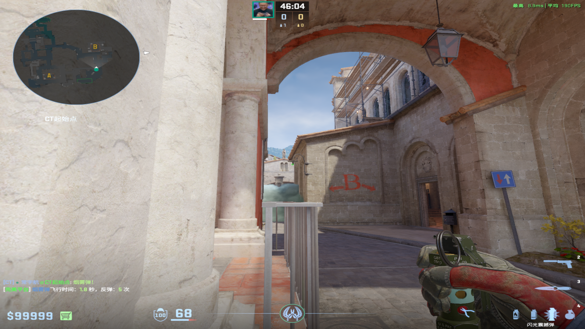
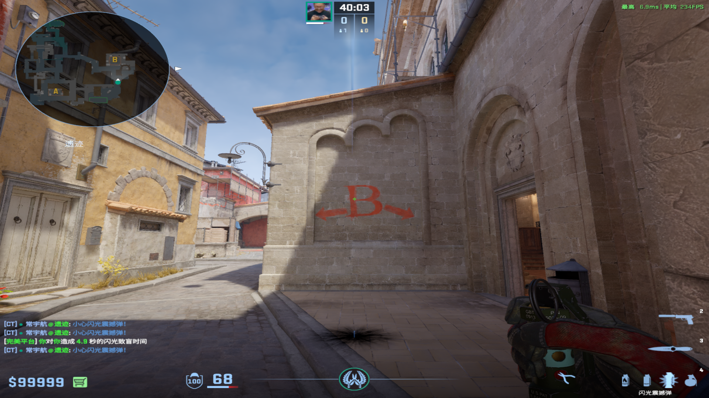
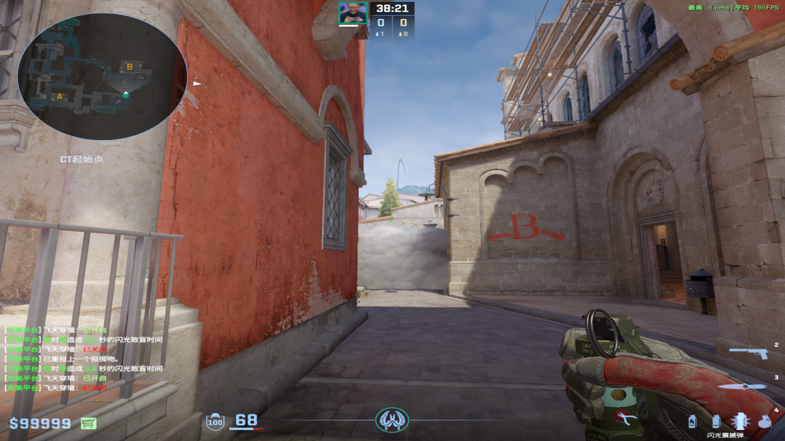

# 雷火
collapsed:: true
	- ## 不许教堂保枪
	  collapsed:: true
		- ### 一箱丢
		  collapsed:: true
			- 投掷：左键跳投
			- 站位：一箱台阶处
			- 描点：窗户下和深色线条旁的深色方块右下角
				- 
		- ### 喷泉丢
		  collapsed:: true
			- 投掷：左键直接丢
			- 站位：喷泉兼棺材一侧的外侧凹槽
			- 描点：窗户正上角落
				- 
	-
	- ## 三箱火
	  collapsed:: true
		- 投掷：W静步走着左键直接丢
		- 站位：警家花坛一侧最里面
		- 描点：花坛上面的白色横条从头走到尾
		  collapsed:: true
			- 
			-
		- 备注：在教堂一侧直接跑丢这个烟囱
		  collapsed:: true
			- 
			-
	-
	- ## 死点火
	  collapsed:: true
		- 投掷：W+A静步走着左键直接丢
		- 站位：警家花坛一侧最里面
		- 描点：右侧墙壁的左侧凹进去的拱门从头走到尾
			- 
			-
-
- # 闪光弹
  collapsed:: true
	- ## 台下闪
	  collapsed:: true
		- 投掷：左键直接丢
		- 站位：长廊最外侧
		- 描点：灯泡底端
			- 
			-
	-
	- ## 高闪
		- ### 台下的上空爆
		  collapsed:: true
			- 投掷：随缘瞄准
			- 站位：教堂一侧
			- 描点：整个字母B随缘瞄准
			  collapsed:: true
				- 
				-
			- 备注：不太急就扔近点，急就扔远点
		-
		- ### 底线上空爆
			- 投掷：W跑着左键跳投
			- 站位：随缘
			- 描点：和喷泉顶部平齐
			  collapsed:: true
				- 
				-