# 烟雾弹
	- ## 快Faze烟
	  collapsed:: true
		- 站位：如图所示
		  collapsed:: true
			- 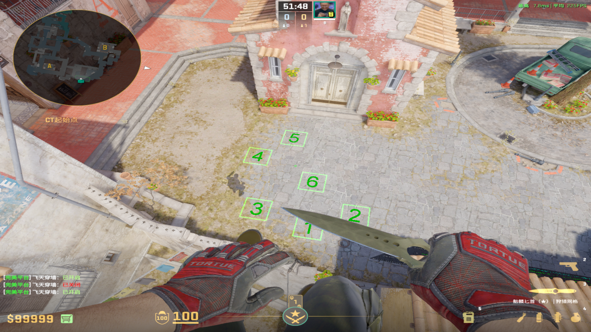
			-
		- ### 5号位
		  collapsed:: true
			- 投掷：左键跳投
			- 描点：房檐下小圆点
			  collapsed:: true
				- 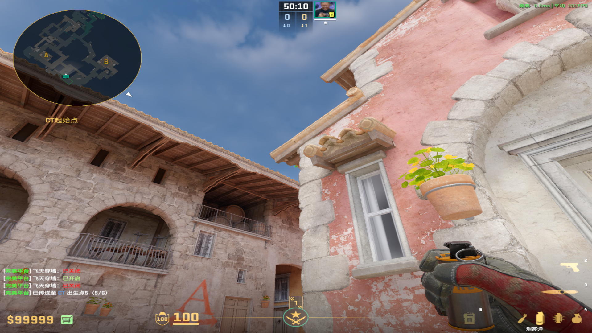
				-
		- ### 4号位
		  collapsed:: true
			- 投掷：左键跳投
			- 描点：三角形内侧的左上角
			  collapsed:: true
				- 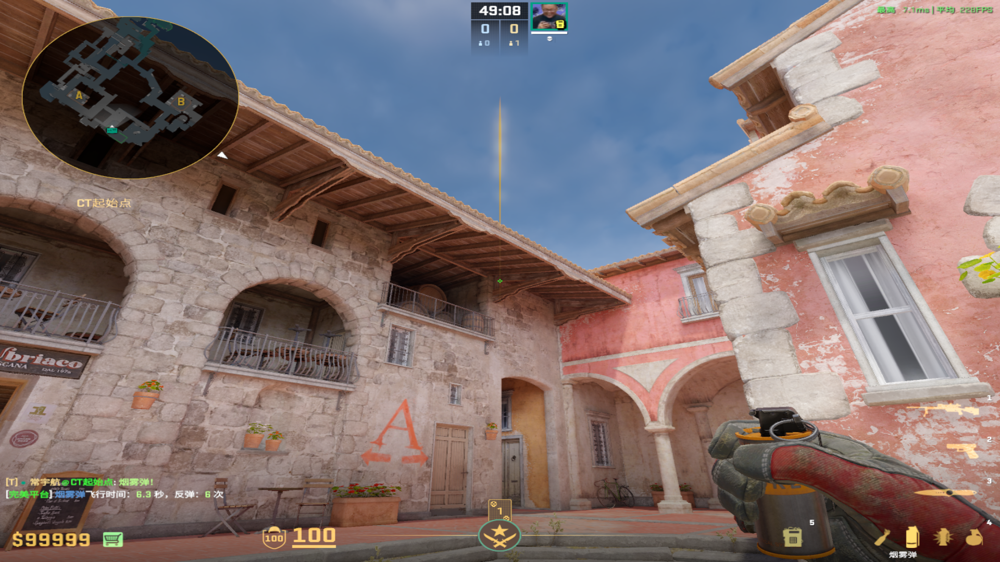
				-
		- ### 3号位
		  collapsed:: true
			- 投掷：W+左键跳投
			- 描点：第二和三砖块的交线左边
			  collapsed:: true
				- 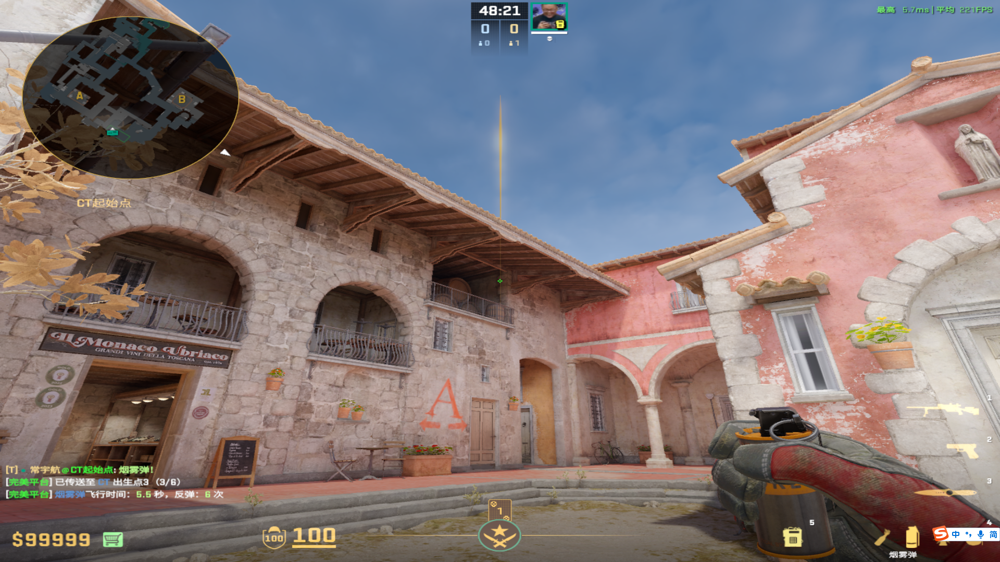
		- ### 6号位
		  collapsed:: true
			- 投掷：W+左键跳投
			- 描点：房檐左上角
			  collapsed:: true
				- 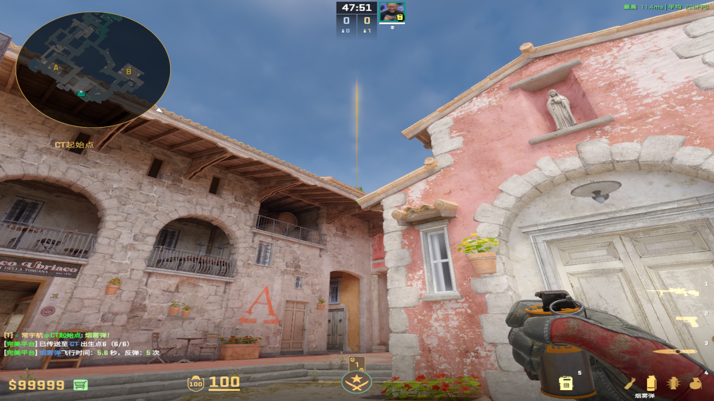
				-
		- ### 1号位
		  collapsed:: true
			- 投掷：W+左键跳投
			- 描点：房檐左端圆圈
			  collapsed:: true
				- 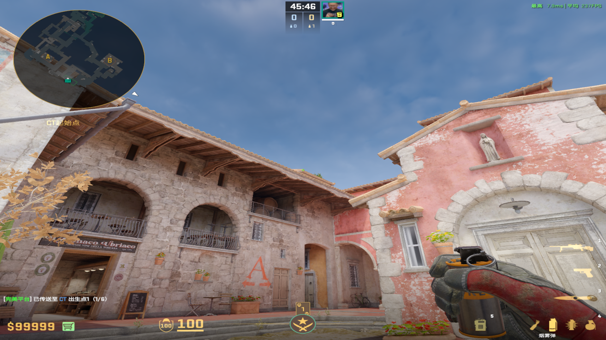
				-
		- ### 2号位
		  collapsed:: true
			- 投掷：左键跳投
			- 描点：两个房檐圆圈的中间
			  collapsed:: true
				- 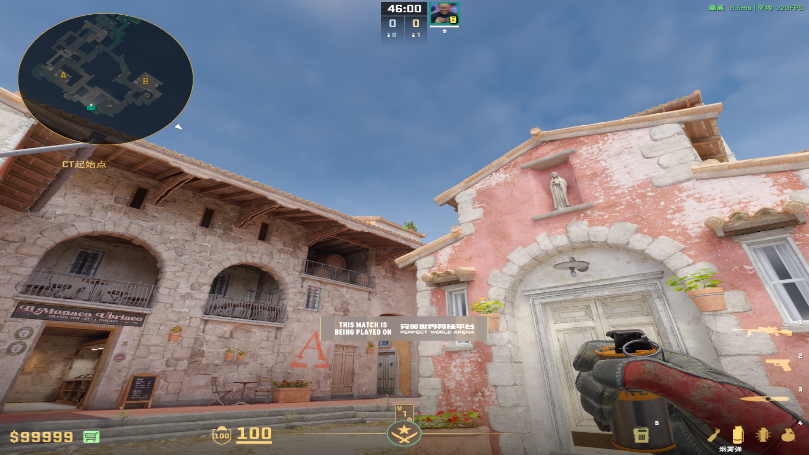
	-
	- ## 慢Faze烟
	  collapsed:: true
		- ## 中路丢
			- 投掷：双键跳投
			- 站位：链接第二个凹槽后面
			- 描点：最高的红花
				- 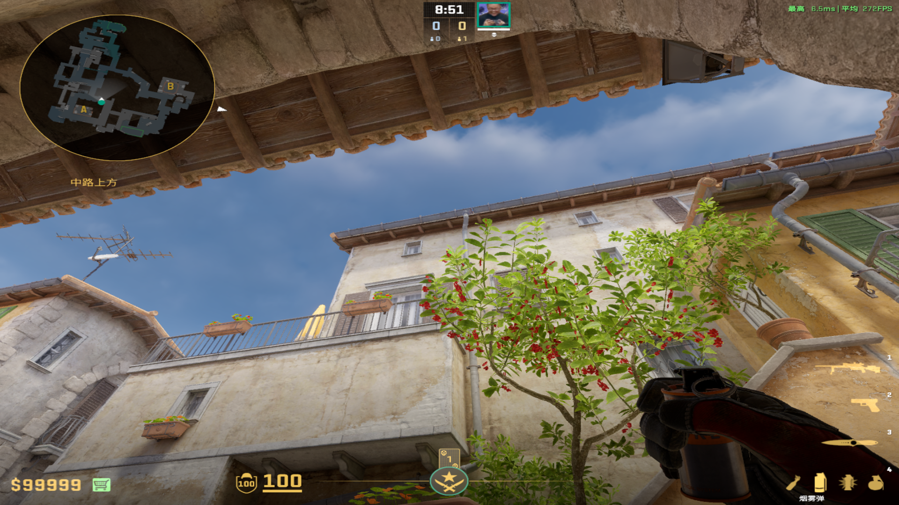
				-
- # 闪光弹
	- ## 中门闪
	  collapsed:: true
		- ### 顺闪
		  collapsed:: true
			- 投掷：左键直接丢
			- 站位：拱门门口
			- 描点：头顶深色房檐
			  collapsed:: true
				- 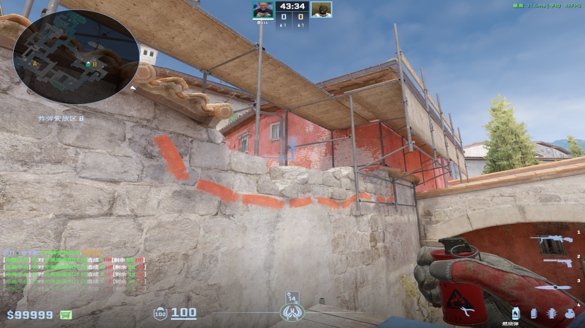
				-
		-
		- ### 侧道自助闪
		  collapsed:: true
			- 投掷：右键跳投
			- 站位：连接第一个凹槽前面
			- 描点：地板深色污渍
			  collapsed:: true
				- 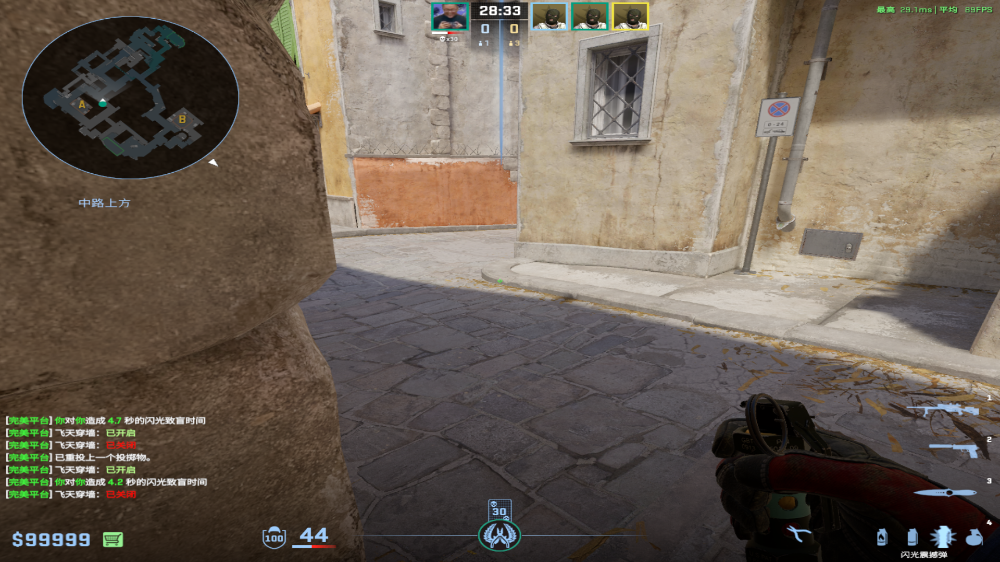
				-
		-
		- ### A1自助闪光
			- 投掷：左键直接丢
			- 站位：马棚前或者锅炉房口夹角
			- 描点：砖块拱门第二高的砖块右上角
				- 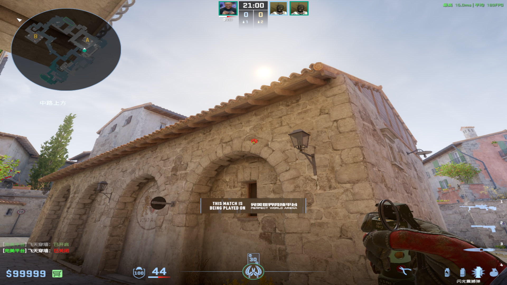
				-
	-
	- ## 侧道闪
	  collapsed:: true
		- 投掷：跑完整个花左键跳投
		- 站位：侧道广告牌和路灯中间
		  collapsed:: true
			- 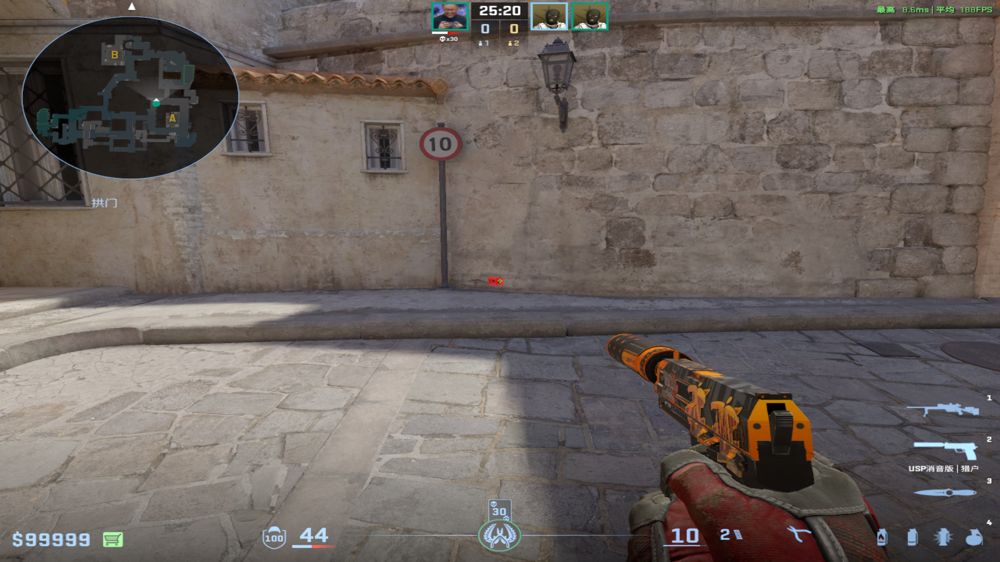
		- 描点：最左面的红花
		  collapsed:: true
			- 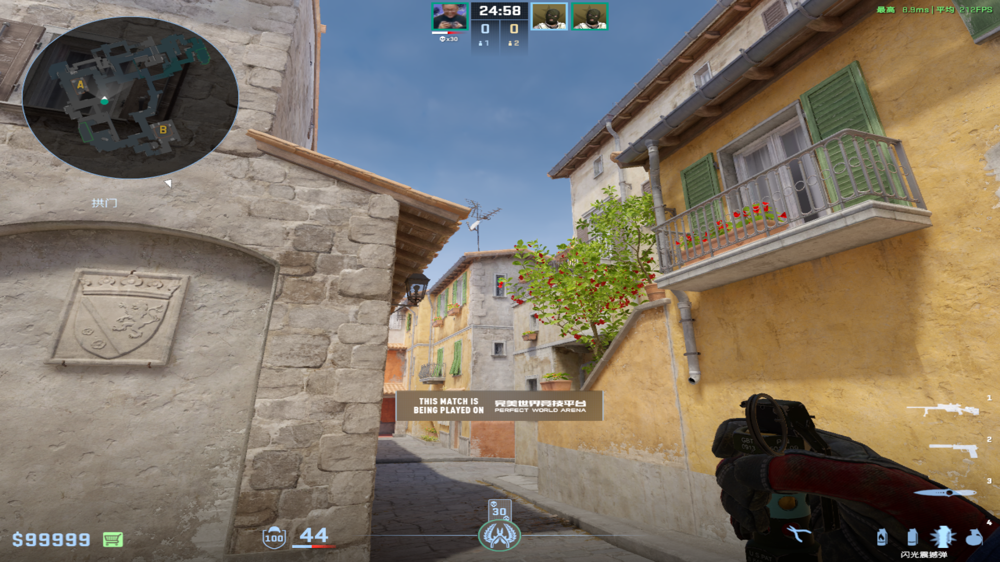
			-
	-
	- ## 锅炉房闪
	  collapsed:: true
		- 投掷：左键直接丢
		- 站位：锅炉房口夹角
		- 描点：路灯下的砖块右下角深色区域
			- 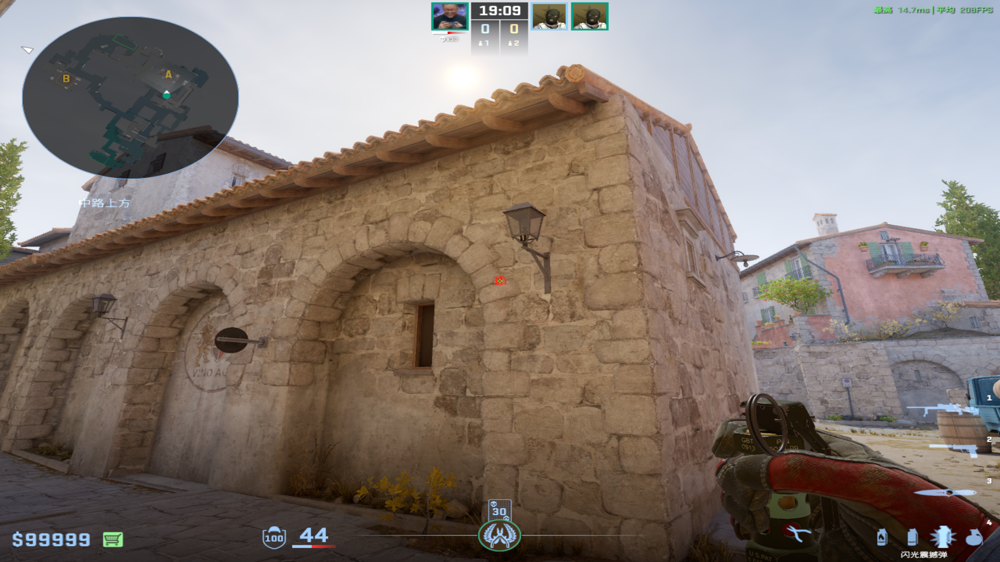
			-