# 烟雾弹
	- ## 匪口烟
	  collapsed:: true
		- ### 警家丢
		  collapsed:: true
			- 投掷：左键跳投
			- 站位：警家双椅前面
			- 描点：窗户最左面棕色和白色区域的下面
			  collapsed:: true
				- 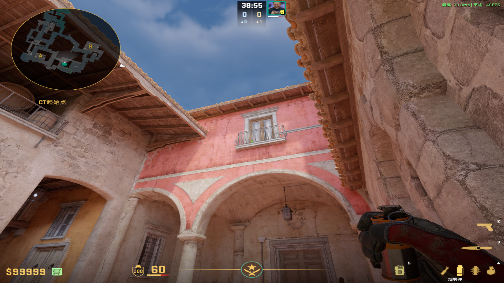
				-
		-
		- ### 顺手推
		  collapsed:: true
			- 投掷：W跑着左键直接丢
			- 站位：黄墙
			- 描点：窗户右下角
			  collapsed:: true
				- 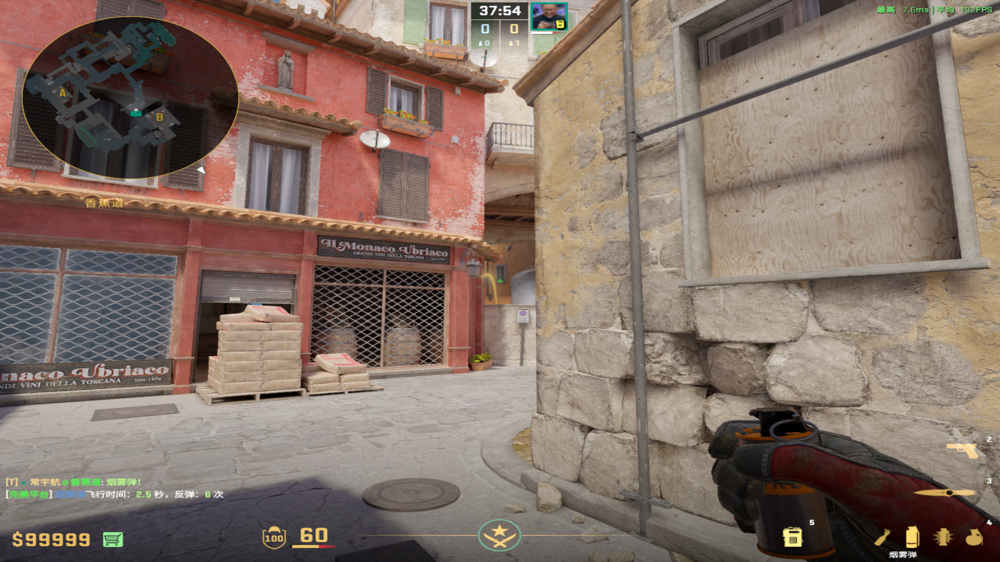
				-
	-
	- ## 三封烟
	  collapsed:: true
		- ### 警家丢
		  collapsed:: true
			- 投掷：A+左键跳投
			- 站位：警家双椅前面
			- 描点：白粽窗户左面最竖直的栏杆中间
			  collapsed:: true
				- 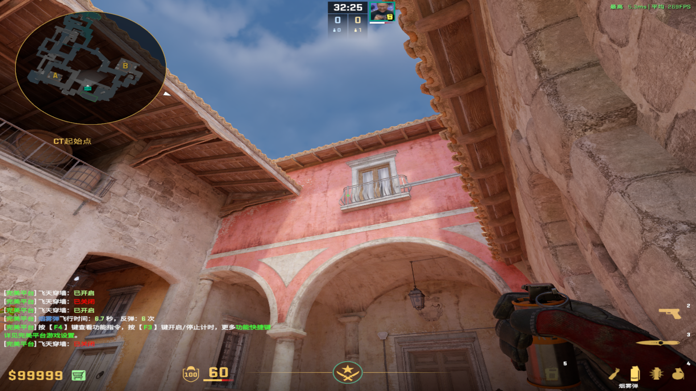
				-
		-
		- ### 树位丢
		  collapsed:: true
			- 投掷：双键直接丢
			- 描点：两个白色物件之间
			  collapsed:: true
				- 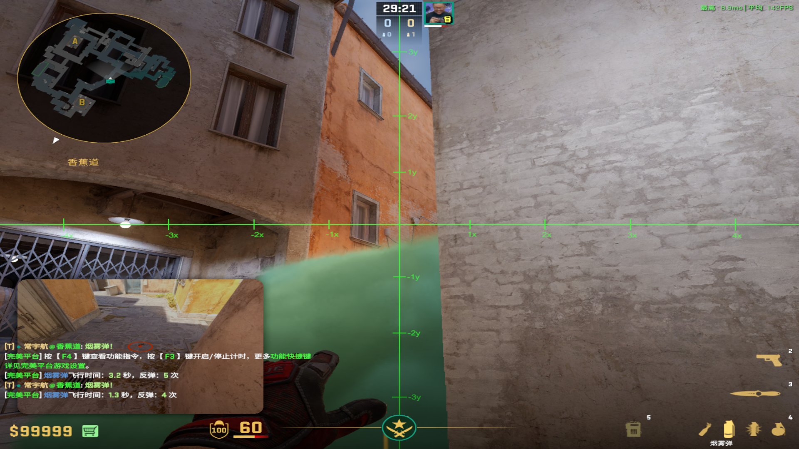
				-
		-
		- ### 凹槽丢
		  collapsed:: true
			- 投掷：左键直接丢
			- 描点：左下白痕迹中间
			  collapsed:: true
				- 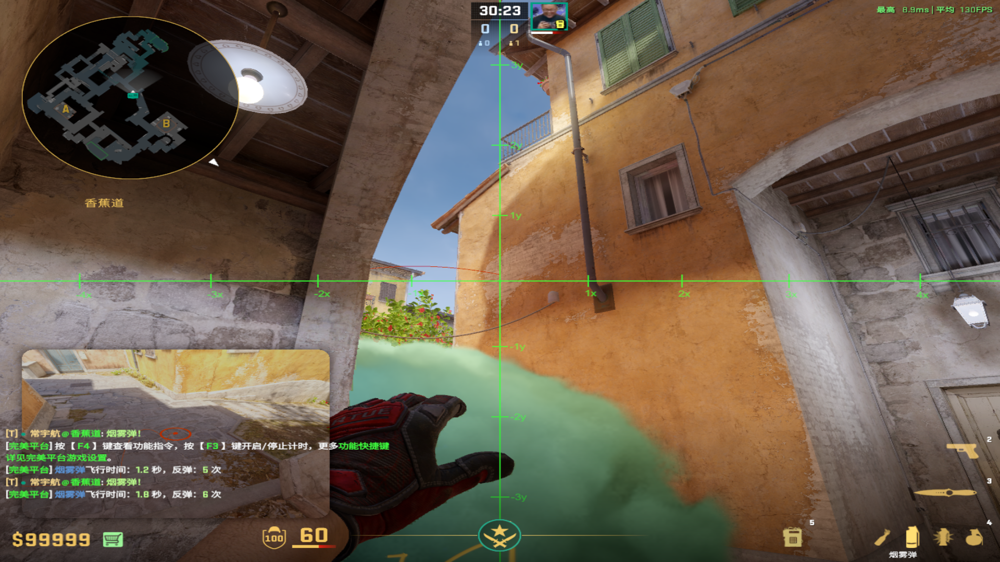
				-
	-
	- ## 灭火烟
	  collapsed:: true
		- 投掷：W跑着左键直接丢（如果玻璃坏了，就双键跑丢）
		- 描点：右侧玻璃水桶中间偏右
		  collapsed:: true
			- 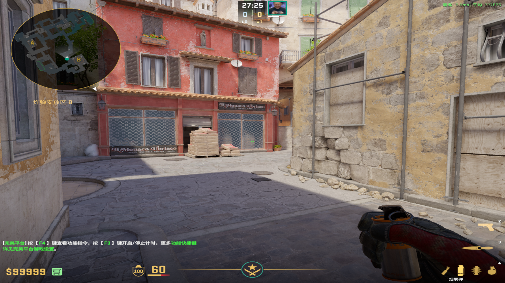
			-
- # 手雷&燃烧弹
	- ## 中段双键雷——JL气不气
	  collapsed:: true
		- 投掷：W跑着双键直接丢
		- 站位：不过黄墙
		- 描点：头顶拱门偏左一点
			- 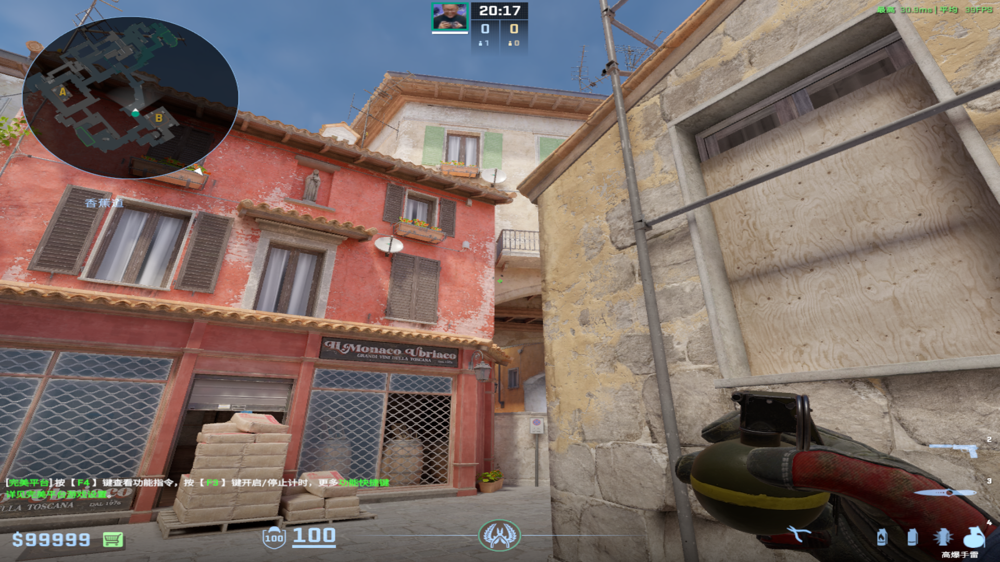
			-
	-
	- ## 防rush雷
	  collapsed:: true
		- 投掷：左键直接丢
		- 站位：水管在红墙和黄墙中间
		- 描点：水管最顶端
		  collapsed:: true
			- 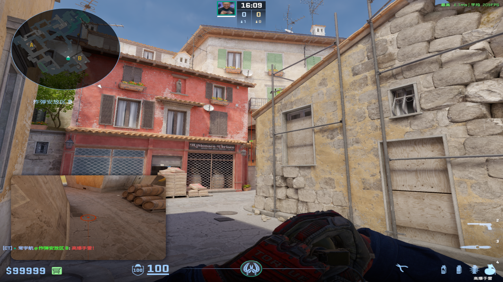
			-
	-
	- ## 凹槽雷火
	  collapsed:: true
		- 投掷：W跑着左键直接丢
		- 描点：树位上窗户左边
			- 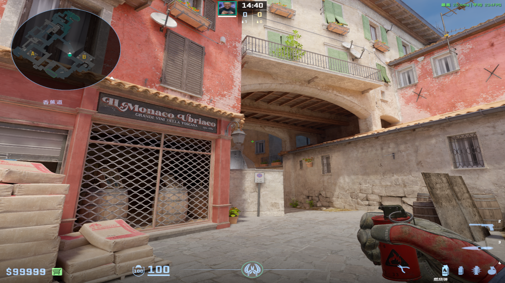
			-
	-
	- ## 近点火
	  collapsed:: true
		- 投掷：左键跳投（最好不要跑）
		- 描点：窗户和花盆中间
			- 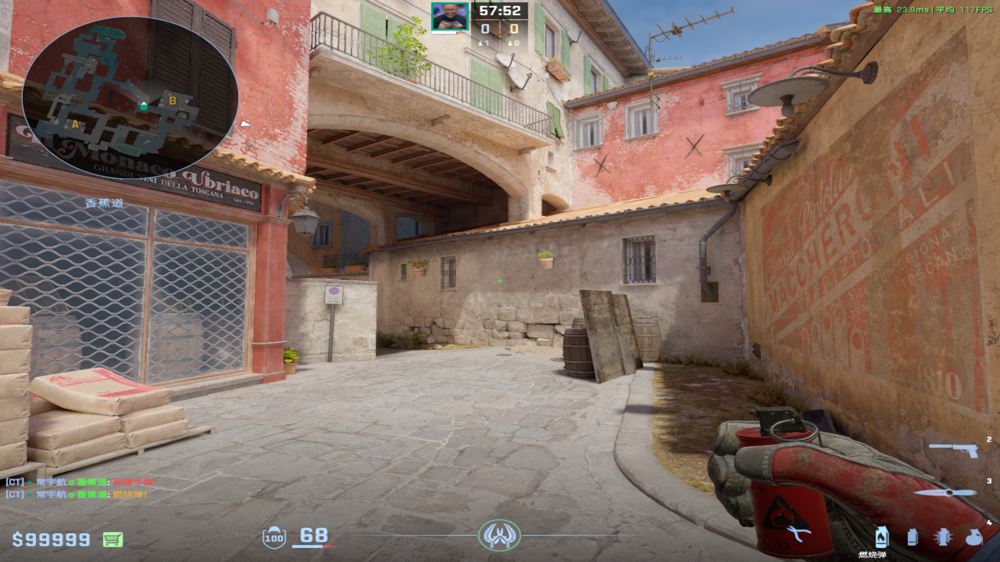
			-
- # 闪光弹
	- ## 匪口顺闪
	  collapsed:: true
		- 投掷：左键直接丢
		- 站位：垂直于石板
		- 描点：右下角窗户群的左上角
			- 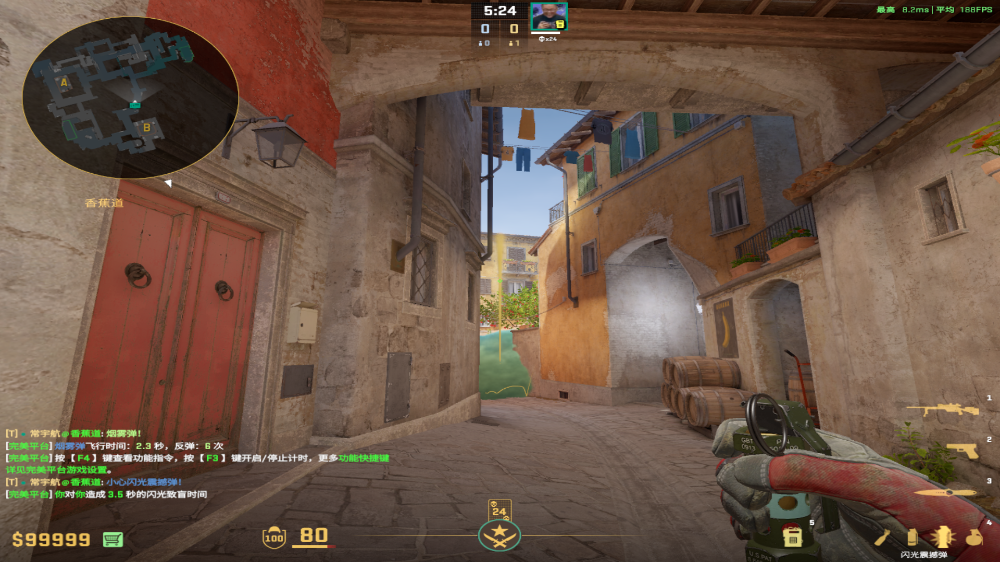
	-
	- ## 清理凹槽树位闪
	  collapsed:: true
		- 投掷：左键直接丢
		- 站位：黄墙角落
		- 描点：树位上窗户左上角和树位上拱门的连线中点
			- 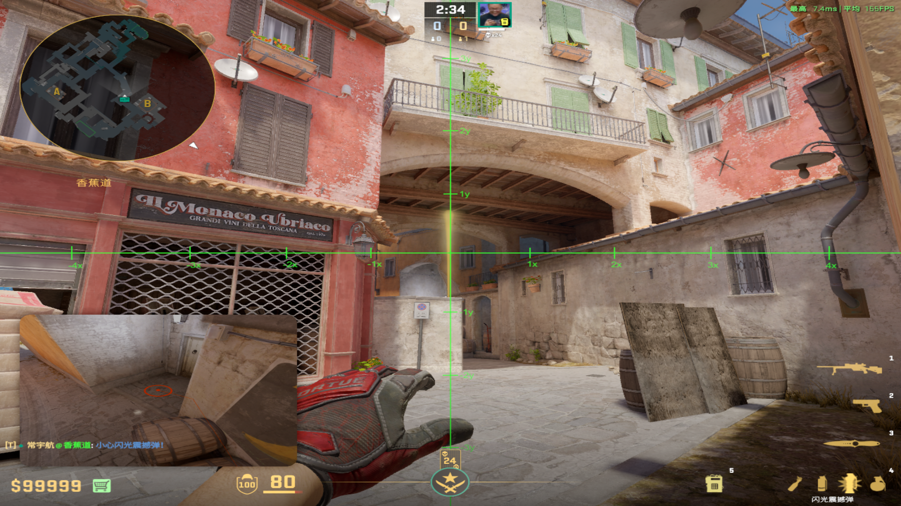
			-