# 烟雾弹
collapsed:: true
	- ## 小蜜蜂灭火（石板近点）烟
	  collapsed:: true
		- 投掷：W+左键跳投
		- 站位：匪家白色柱子
		- 描点：黄色衣服右下角
			- 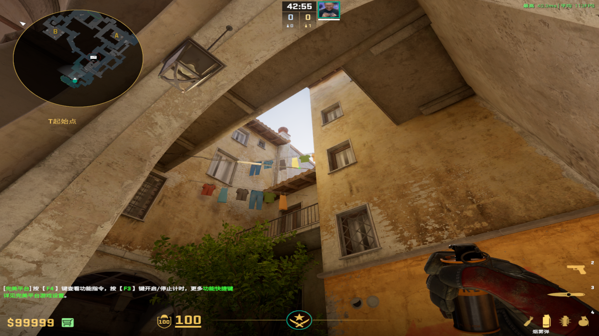
	-
	- ## 凹槽树位灭火烟
	  collapsed:: true
		- 投掷：右键直接丢
		- 站位：匪口
		- 描点：窗户和深色裂缝的中间
			- 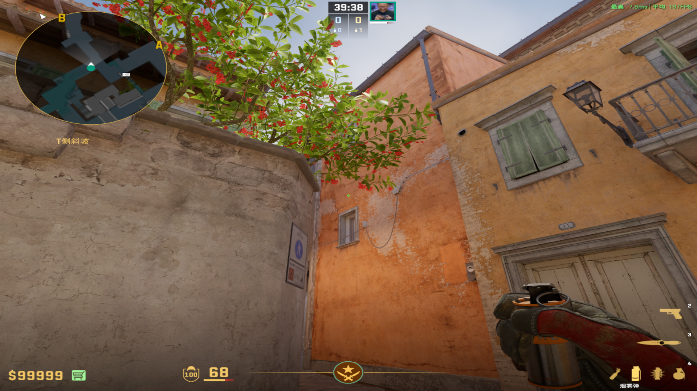
			-
-
- # 闪光弹
  collapsed:: true
	- ## 窗户闪
	  collapsed:: true
		- 投掷：双键跳投
		- 站位：匪口电瓶车一侧
			- 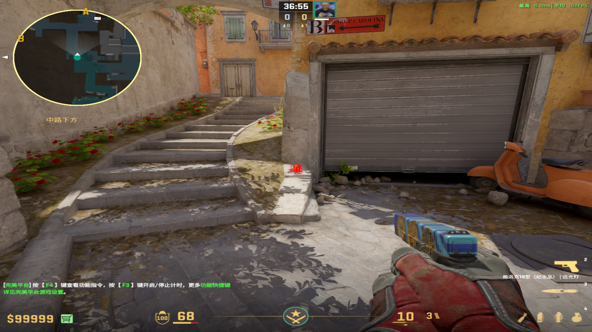
			-
		- 描点：从左上角数2×2的砖块右下角
			- 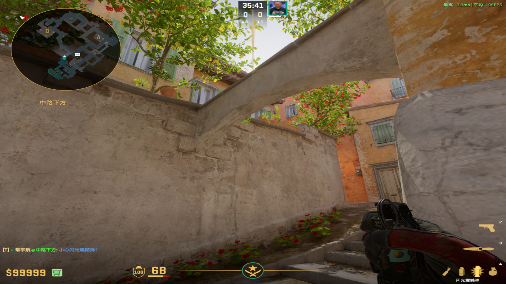
			-
	-
	- ## 石板闪
	  collapsed:: true
		- ### 左墙上爆（不用背）
		  collapsed:: true
			- 投掷：左键直接丢
			- 站位：抵死香蕉道口
				- 
			- 描点：蓝色窗户和栏杆中间
				- 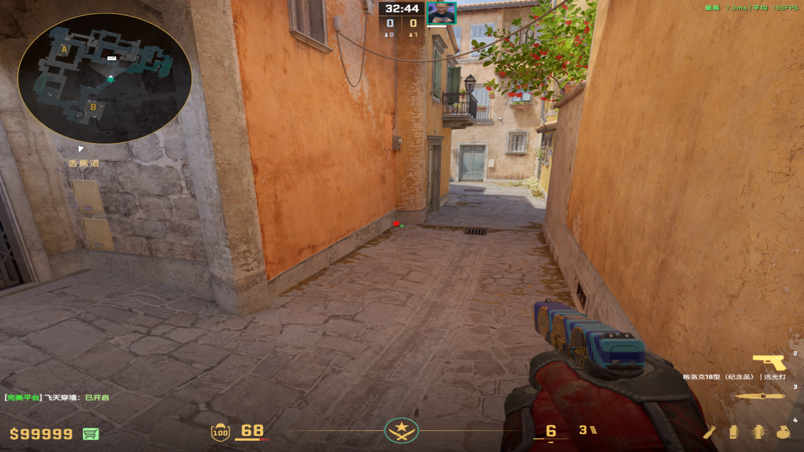
				-
		-
		- ### 石板爆（必须背）
		  collapsed:: true
			- 投掷：左键直接丢
			- 站位：香蕉道口左侧
				- 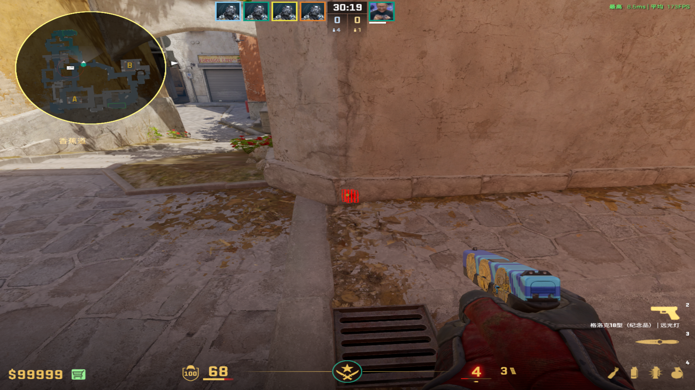
			- 描点：水管旁边柱子
				- 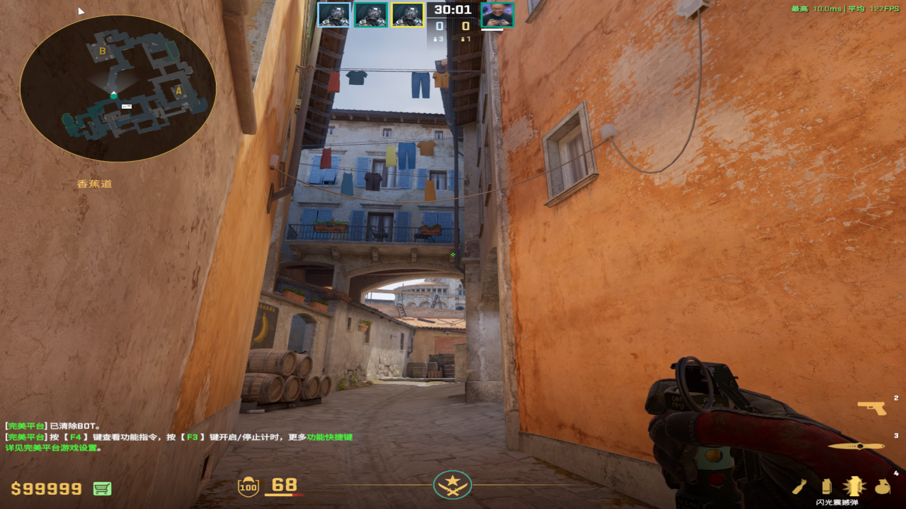
				-
		-
		- ### 自助石板闪
		  collapsed:: true
			- 投掷：蹲着双键直接丢
			- 站位：凹槽前面
			- 描点：头顶木板右面第二个竖条
				- 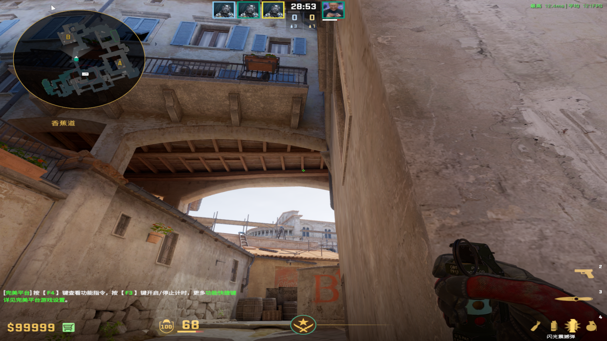
				-
	-
	- ## 自助自爆闪（防踩下来）
	  collapsed:: true
		- 投掷：左键直接丢
		- 站位：凹槽后面
		- 描点：树位上面墙壁和木头的交界处
			- 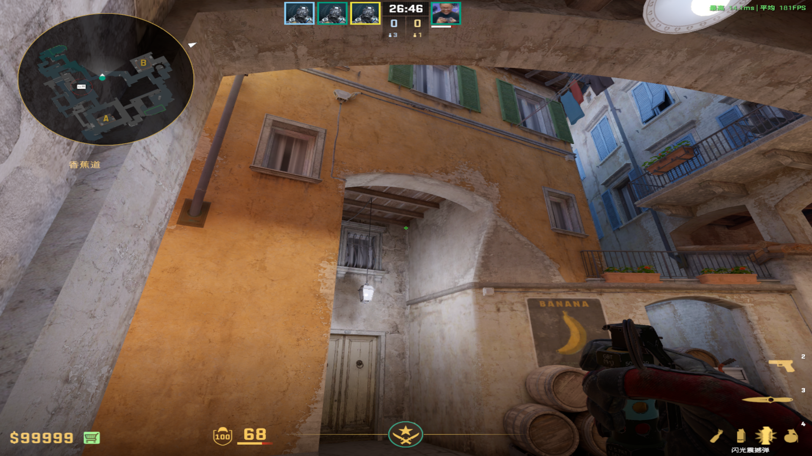
			-
	-
	- ## 重新控香蕉道（要有中路控制）
	  collapsed:: true
		- 投掷：左键直接丢
		- 站位：中路矮墙后侧
		- 描点：房檐第四个白色方块右端
			- 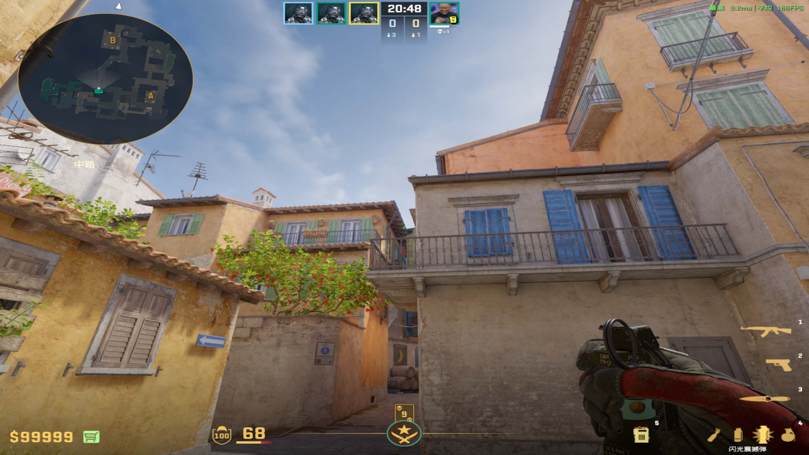
			-
-
- # 燃烧弹&手雷
	- ## 凹槽火
	  collapsed:: true
		- 投掷：W跑着左键直接丢（速度拉快）
		- 站位：石板后面贴近右墙
		- 描点：黄墙里侧
		  collapsed:: true
			- 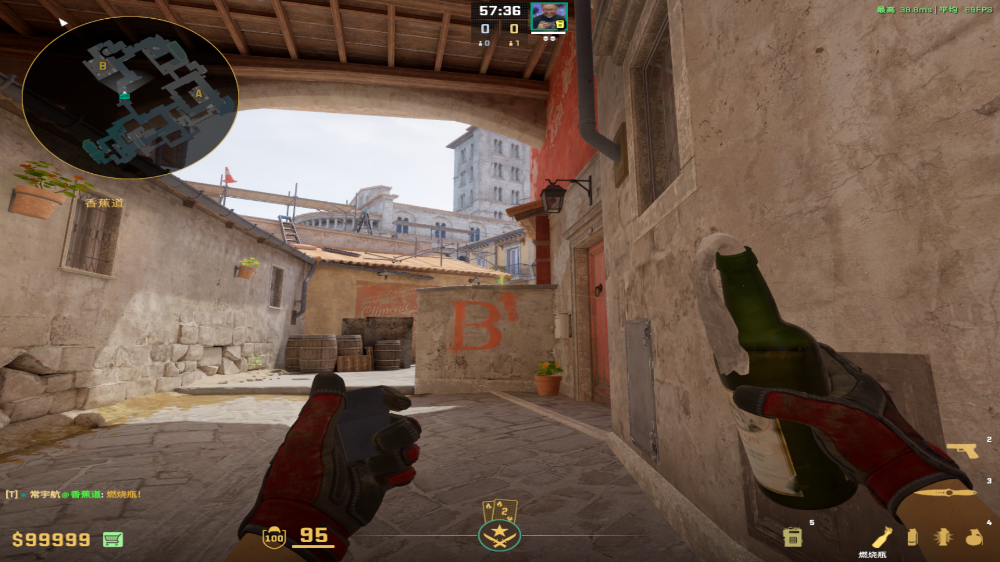
			-
	- ## 警家雷
	  collapsed:: true
		- 投掷：W跑到位置后左键跳投
		- 站位：石板后面的凹槽
		- 描点：先蹲着从下面的污渍往下一个准心，后站起来到上面污渍
			- 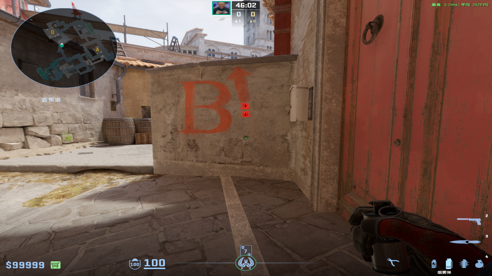
			-