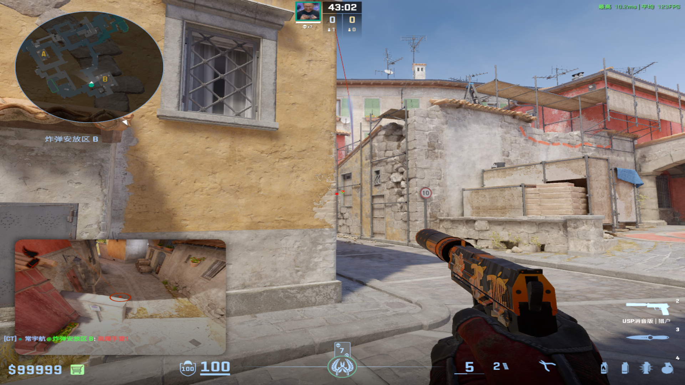
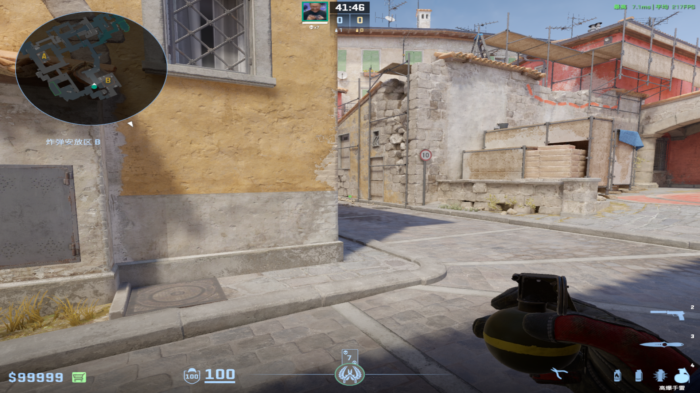
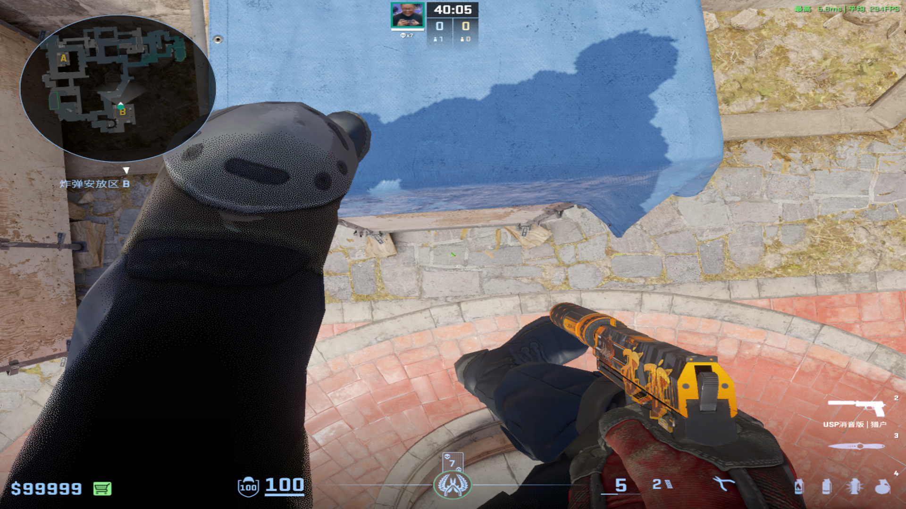
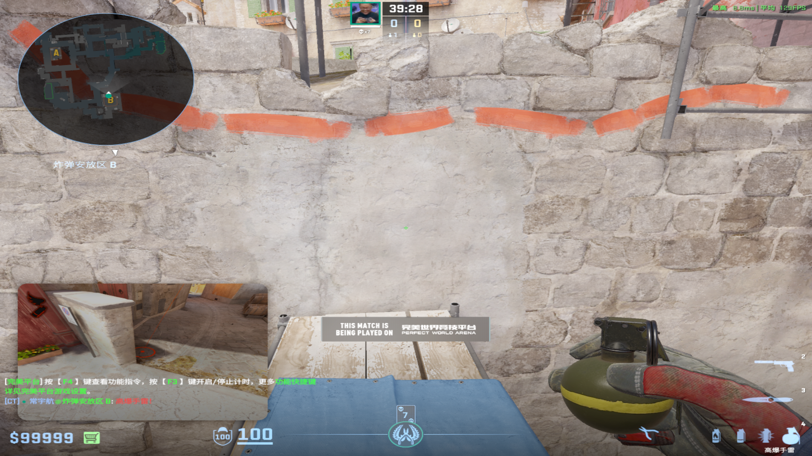
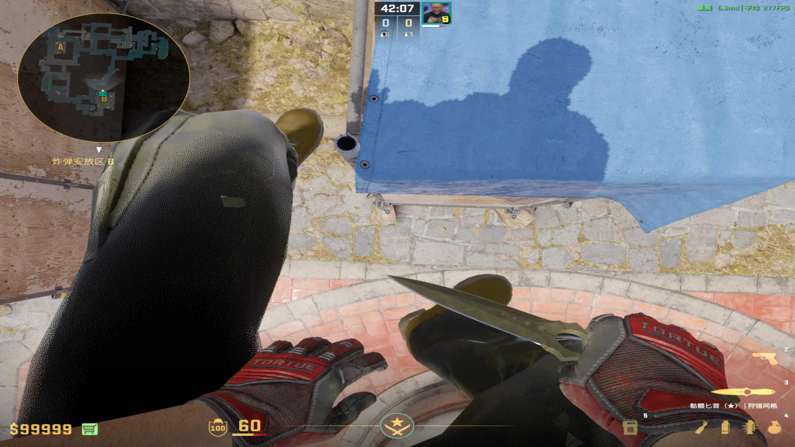
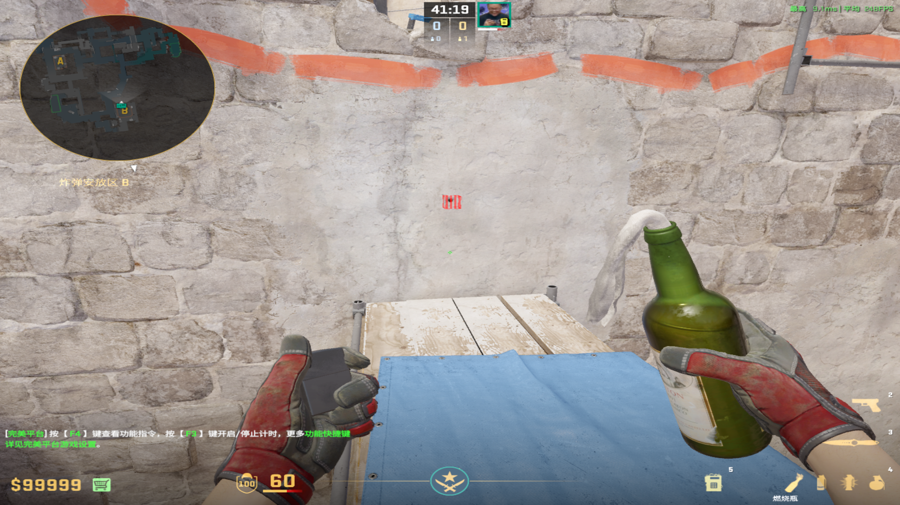
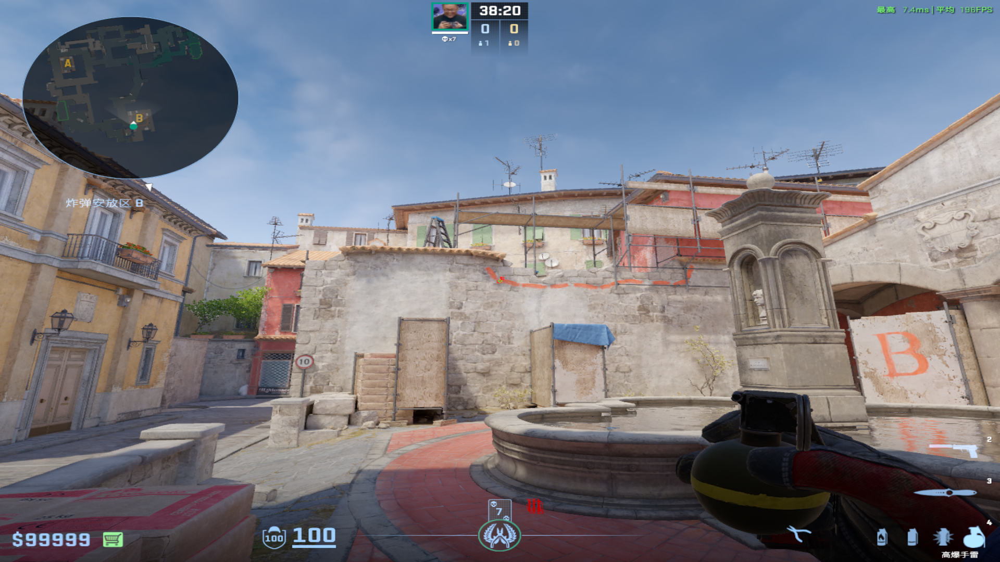
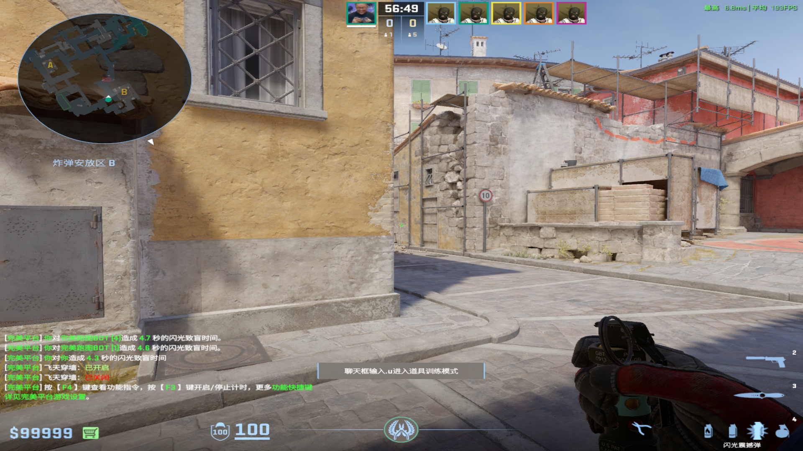
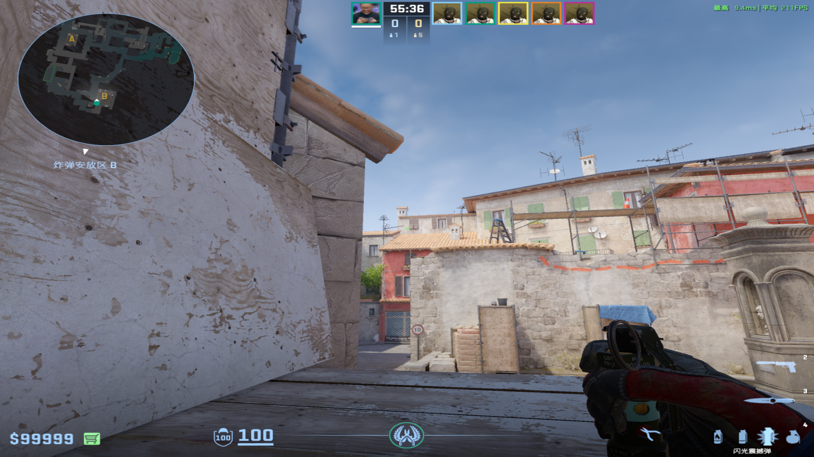

# 手雷
	- ## 警家丢
	  collapsed:: true
		- 投掷：W跑半步左键跳投
		- 站位：CT墙和窗户的左边平齐
		  collapsed:: true
			- 
		- 描点：小黄长方形的左中部分
		  collapsed:: true
			- 
			-
	-
	- ## 二箱丢
	  collapsed:: true
		- 投掷：左键跳投
		- 站位：向下拉到和小斜树叶平齐
		  collapsed:: true
			- 
		- 描点：和二箱最大缝隙向上平移到一个凹进去的污渍
		  collapsed:: true
			- 
			-
		- 备注：同样丢法——对准二箱左下角的方框右下角，后蹲着找水滴左下角，后站起来左键跳投
		  collapsed:: true
			- 
			- 
	-
	- ## 棺材丢
	  collapsed:: true
		- 投掷：W跑到台阶处左键跳投
		- 站位：棺材箱子前
		- 描点：红色条纹左下
		  collapsed:: true
			- 
			-
-
- # 闪光弹
	- ## 黄墙反清闪
		- ### CT丢
		  collapsed:: true
			- 投掷：W+双键跳投
			- 站位：CT经典裂缝&水管窗户位
			- 描点：黑色左下角，砖块左上角
				- 
				-
		-
		- ### 棺材丢
		  collapsed:: true
			- 投掷：左键直接丢
			- 站位：棺材箱子上
			- 描点：棕色窗户左下角往左一个准心
				- 
				-
	- ## 石板反清闪
	-