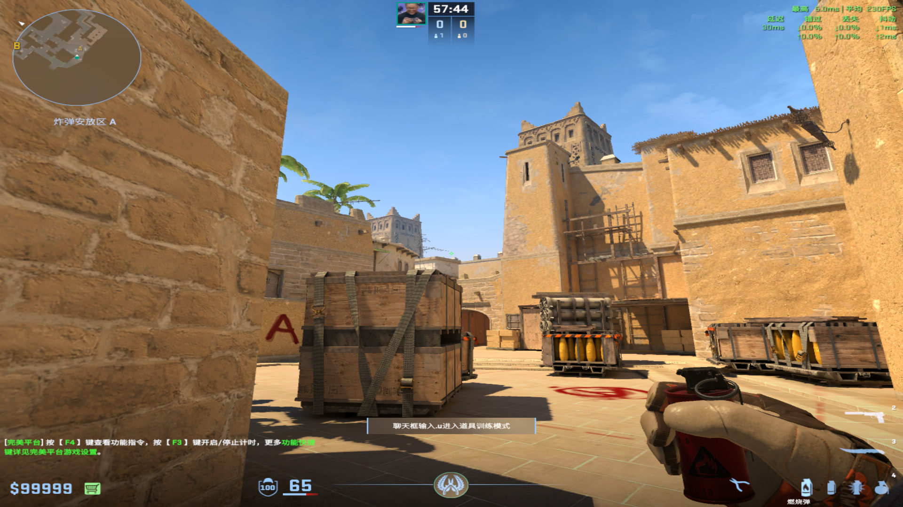
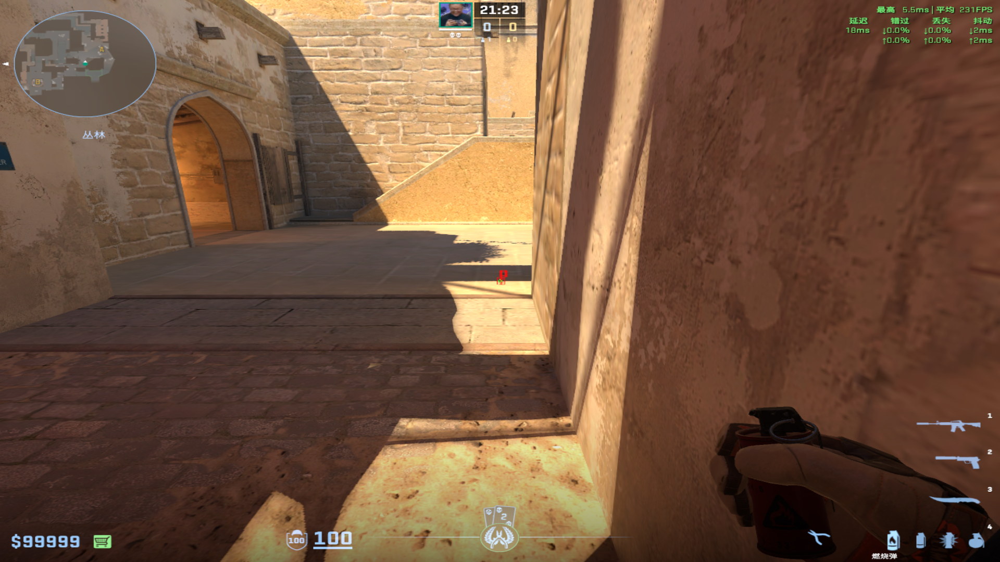
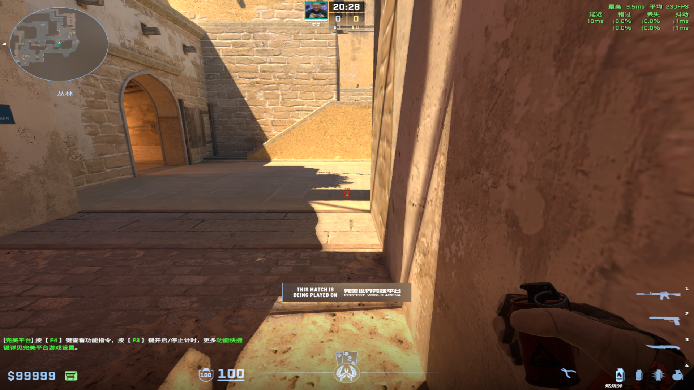
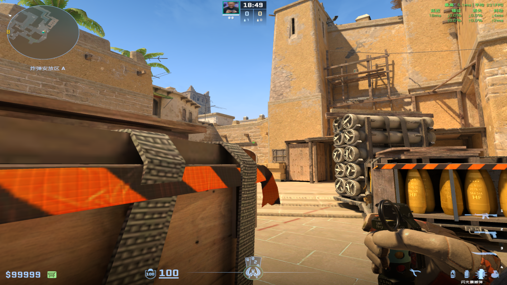
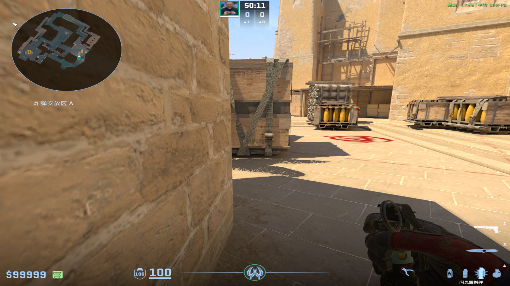
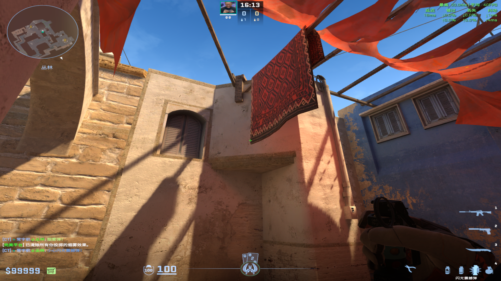
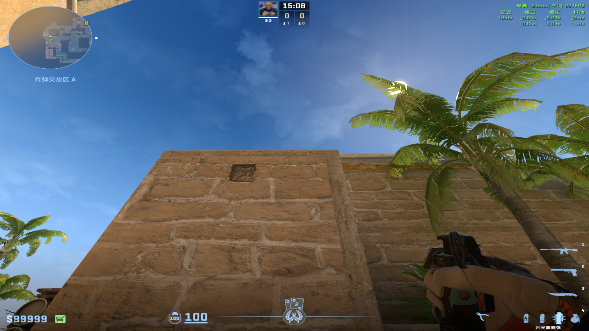
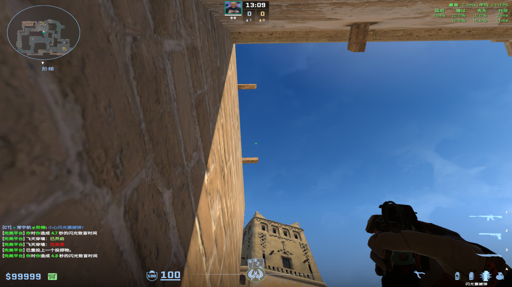
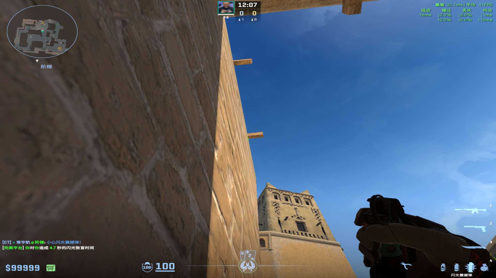
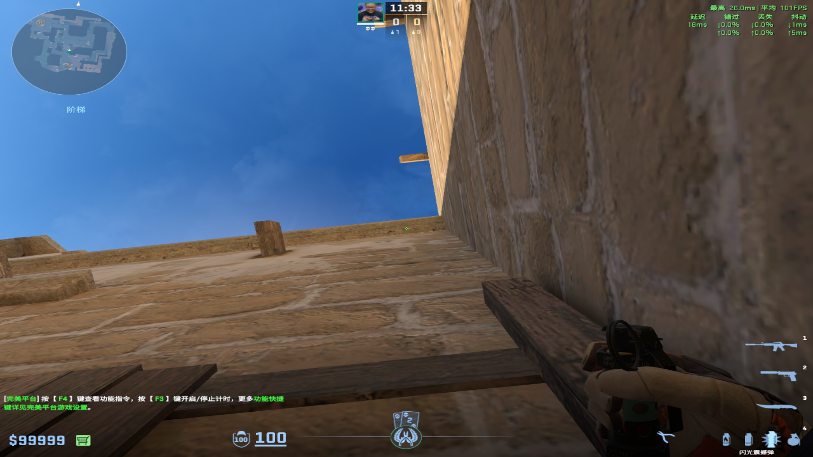

# 燃烧弹
collapsed:: true
	- ## A1火（开局丢）
	  collapsed:: true
		- 投掷：跑着左键投掷
		- 站位：警家到长箱区域
		- 描点：A1上面柱子和电线中间
			- 
	-
	- ## 匪跳火
	  collapsed:: true
		- 投掷：W跑一步+左键跳投
		- 站位：Jungle死角
		- 描点：阴影下端到白线
			- 
	-
	- ## A1深火（阻挡后续补枪踩出来）
	  collapsed:: true
		- 投掷：W跑一步+左键跳投
		- 站位：Jungle死角
		- 描点：白线到阴影上端
			- 
			-
-
- # 闪光弹
  collapsed:: true
	- ## 清A1闪
	  collapsed:: true
		- ### Jungle丢
		  collapsed:: true
			- 投掷：W跑一步+左键跳投
			- 描点：白线到阴影上端
		-
		- ### 259闪
		  collapsed:: true
			- 投掷：左键直接丢
			- 站位：长箱两个箱子中间
			- 描点：A1上面木条右端
				- 
				-
		-
		- ### 黑闪闪光
		  collapsed:: true
			- 投掷：静步走一步左键跳投
			- 站位：Ropz位
			- 描点：长箱单词下面
				- 
	-
	- ## Jungle保命闪
	  collapsed:: true
		- 投掷：W走一步+左键投掷
		- 站位：Jungle死角
		- 描点：毯子左下角
			- 
			-
	-
	- ## 长箱保命闪
	  collapsed:: true
		- 投掷：左键直接丢
		- 站位：长箱后
		- 描点：后面墙最上面的白线都可以
			- 
			-
	-
	- ## 跳台自助闪
	  collapsed:: true
		- ### 丢法1：
		  collapsed:: true
			- 投掷：双键投掷
			- 描点：两个柱子之间偏下1/4
			  collapsed:: true
				- 
				-
		- ### 丢法2：
		  collapsed:: true
			- 投掷：左键投掷
			- 描点：下面柱子的左端下侧
			  collapsed:: true
				- 
		- ### 丢法3：
		  collapsed:: true
			- 投掷：左键投掷
			- 描点：后面上端黑点
				- 
				-
		-