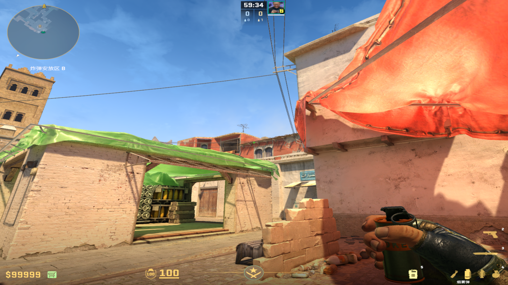
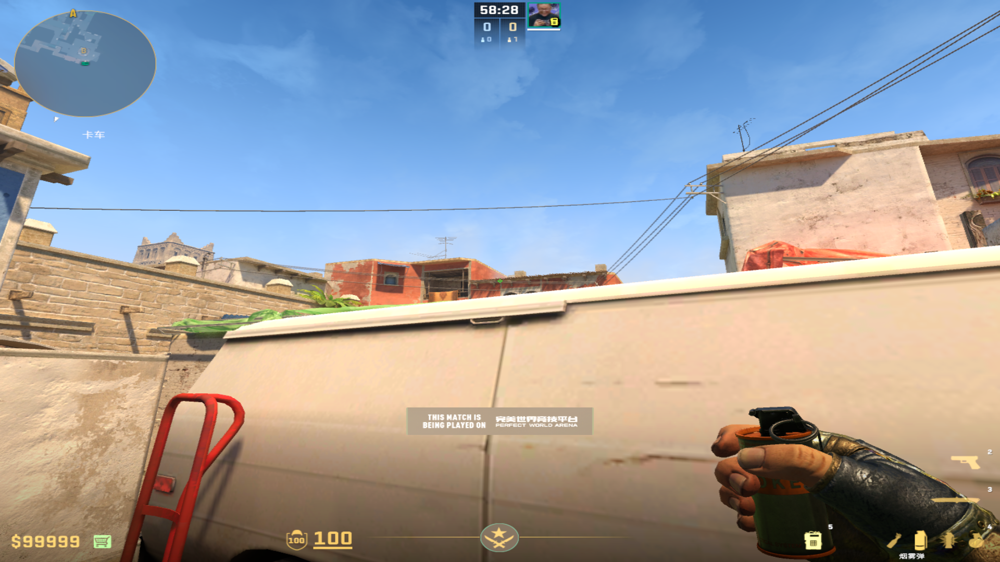
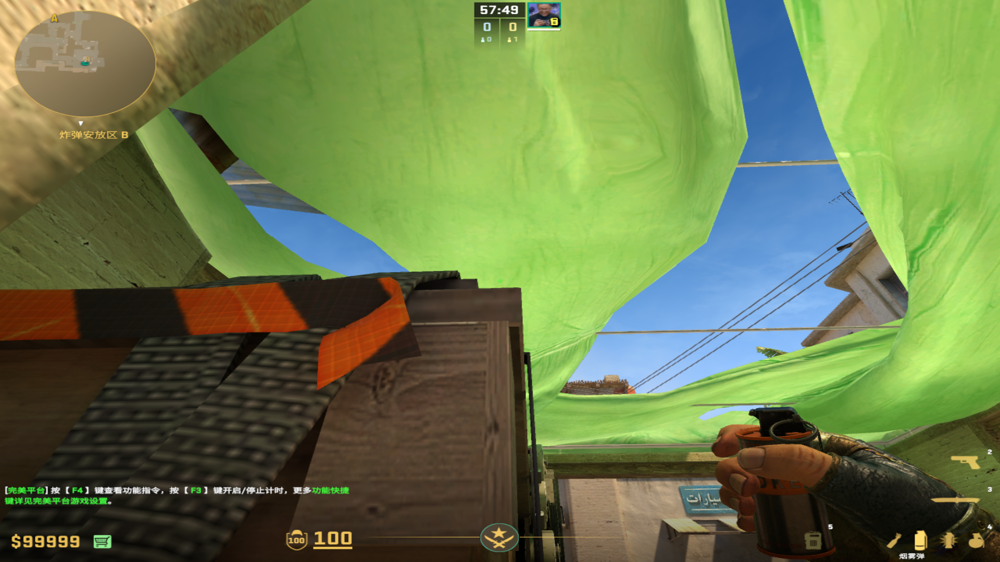
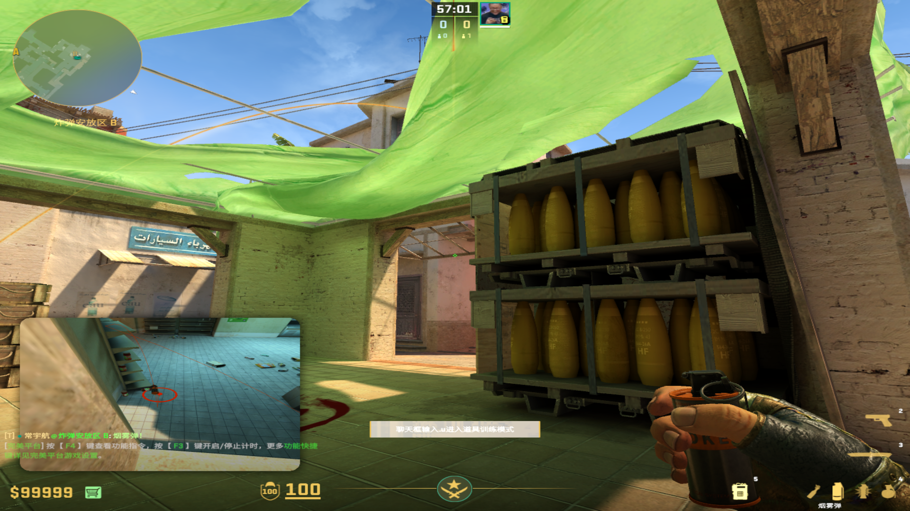
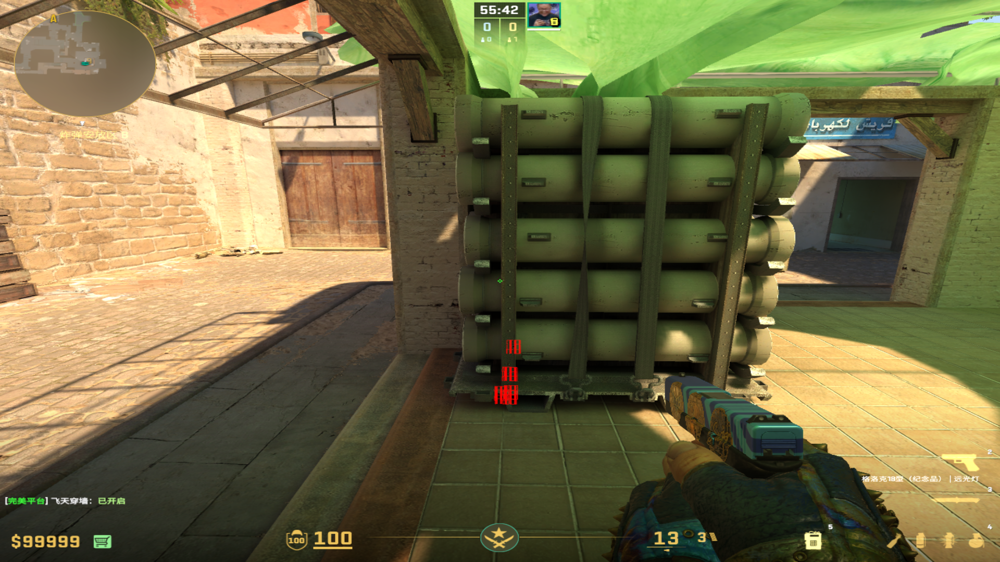
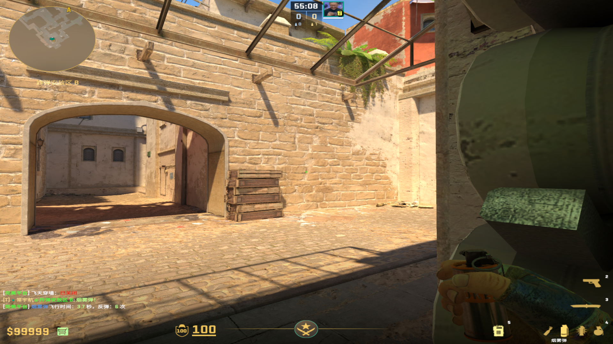
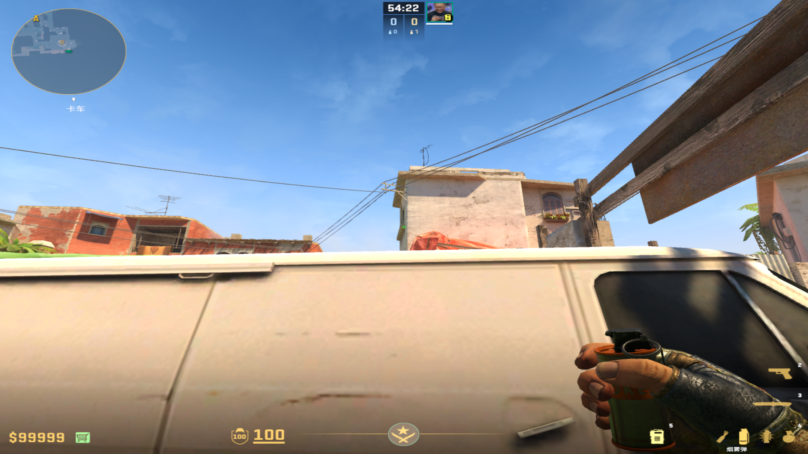
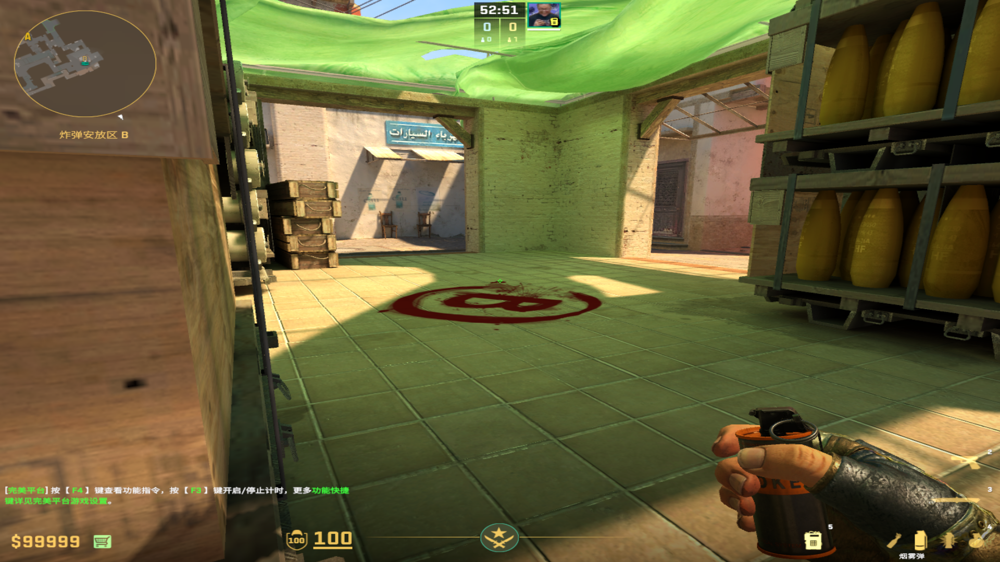

public:: true

- # 烟雾弹
  collapsed:: true
	- ## 补窗口烟
		- ### 玩机器位
		  collapsed:: true
			- 投掷：左键直接丢
			- 描点：窗户左上角向上到屋檐
				- 
				-
		-
		- ### 白车死角
		  collapsed:: true
			- 投掷：左键直接丢
			- 描点：窗户左上角向上到屋檐
				- 
				-
		-
		- ### 二楼近包位
		  collapsed:: true
			- #### 双键投掷
				- 投掷：蹲瞄站起来双键投掷
				- 描点：箱子右上角缺口
				  collapsed:: true
					- 
					-
			- #### 跳投
			  collapsed:: true
				- 投掷：蹲着跳投
				- 描点：木条栏杆的中间
					- 
					-
		-
		- ### B小包位
		  collapsed:: true
			- 投掷：左键跳投
			- 站位：这个大箱子的左边杆
				- 
			- 描点：砖块右下角的深色污渍
			  collapsed:: true
				- 
				-
	-
	- ## 补门口烟
		- ### 白车死角
		  collapsed:: true
			- 投掷：左键直接丢
			- 描点：窗户右下角横杠
				- 
				-
		-
		- ### 二楼近包位
		  collapsed:: true
			- 投掷：蹲下双键跳投
			- 描点：下面红色的右上角红点
				- 
				-