# 烟雾弹
	- ## 超市窗口烟
	  collapsed:: true
		- ### 中间丢
			- 投掷：左键跳投
			- 站位：B2路中间，和台阶线平齐
			  collapsed:: true
				- 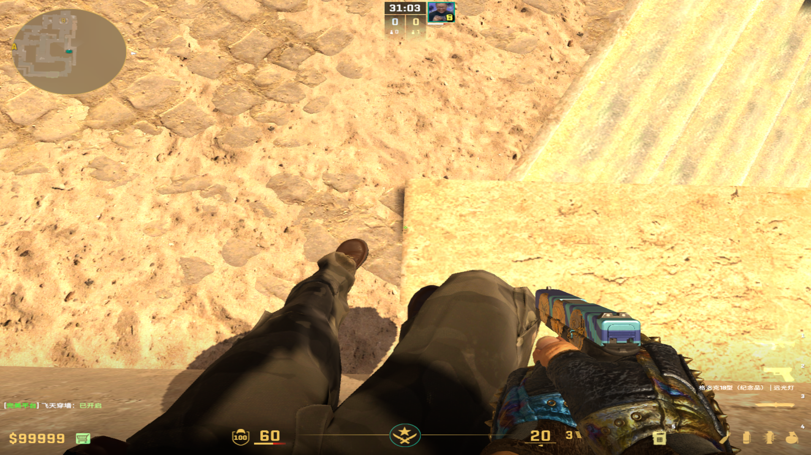
				-
			- 描点：窗户平行移到两个木条中间
			  collapsed:: true
				- 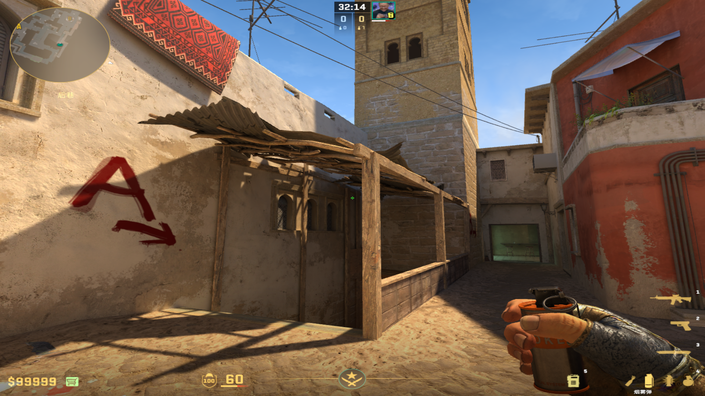
				-
		- ### 259烟（略慢）
		  collapsed:: true
			- 投掷：左键跳投
			- 站位：B2经典爆弹位
			- 描点：眺望塔窗户上段平移到棱角
			  collapsed:: true
				- 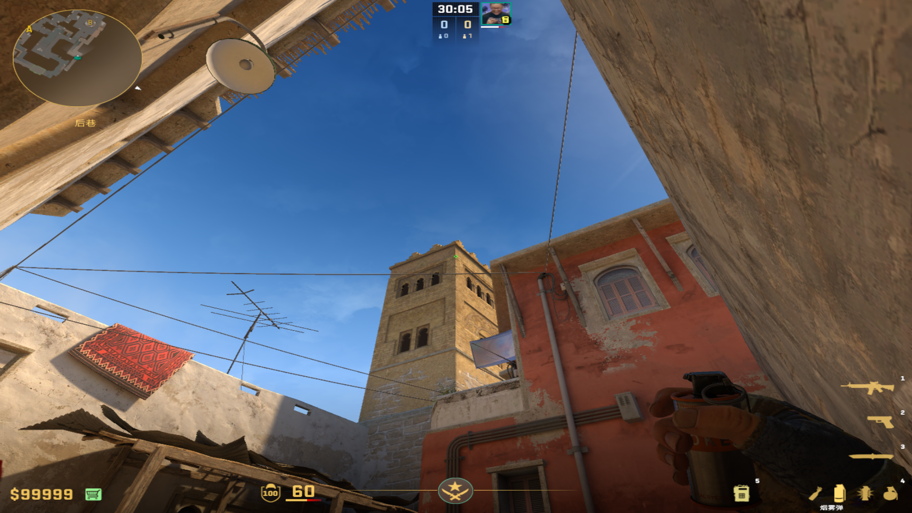
				-
	-
	- ## 超市门口烟
		- 投掷：W+左键跳投
		- 站位：B2经典爆弹位
		- 描点：眺望塔和红墙夹角左侧石墩
			- 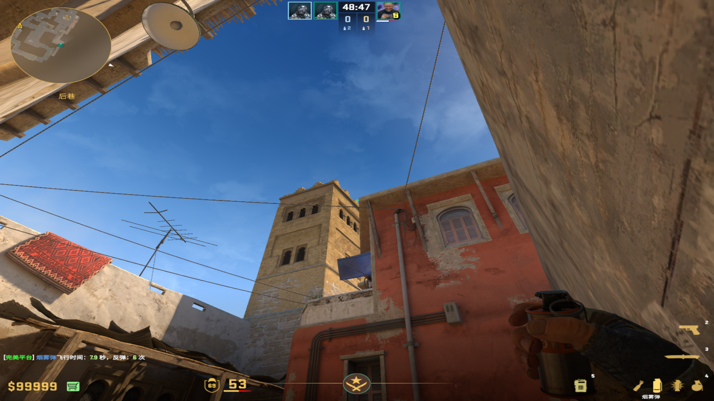
			-
- # 闪光弹
	- ## Kxysan组合闪
	  collapsed:: true
		- 投掷：均为左键跳投
		- 站位：门框右侧
		- 描点：第一颗污渍下方，第二颗灯柱下方
			- 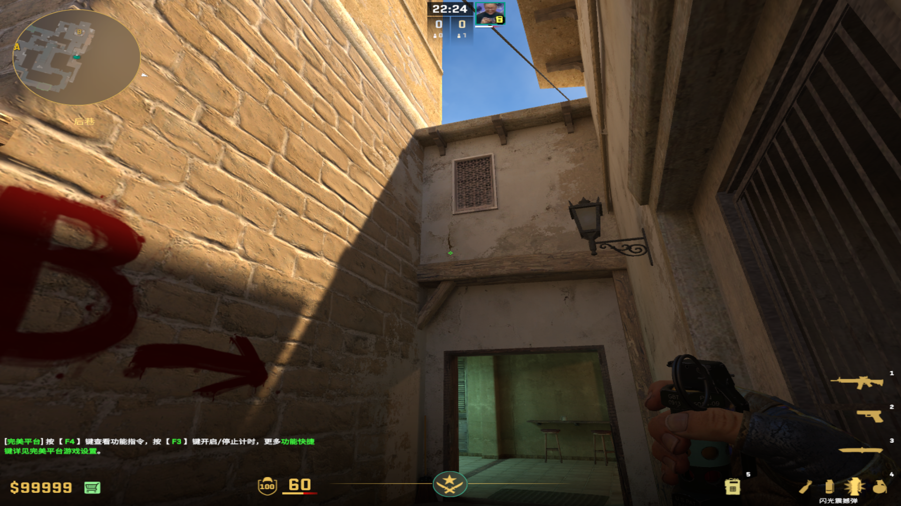
			- 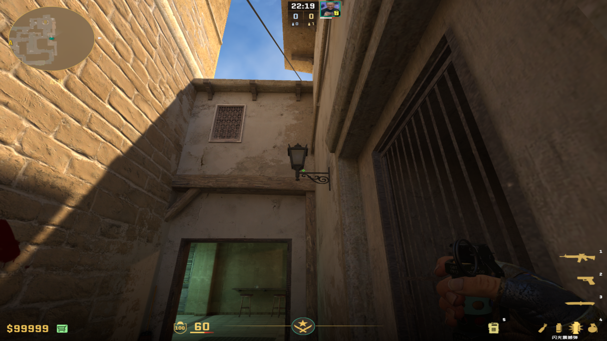
	-
	- ## 910闪
	  collapsed:: true
		- 投掷：左键直接丢
		- 站位：台阶角落
			- 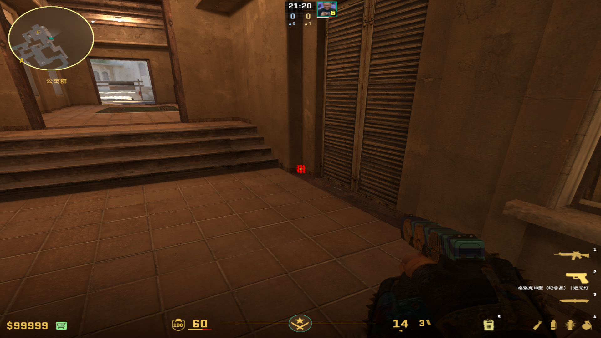
		- 描点：阴影右下角
			- 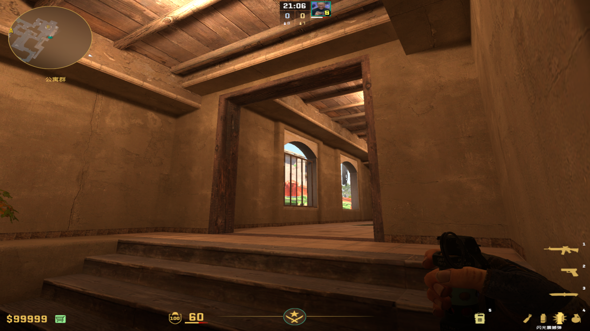
			-
- # 燃烧弹
	- ## 白车上下火
	  collapsed:: true
		- 投掷：左键直接丢
		- 站位：B2贴墙
		  collapsed:: true
			- 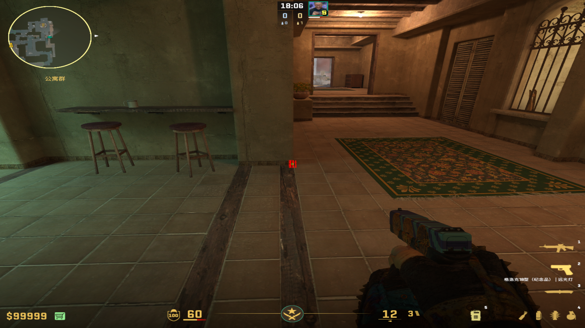
		- 描点：门框和房顶中间那个线
		  collapsed:: true
			- 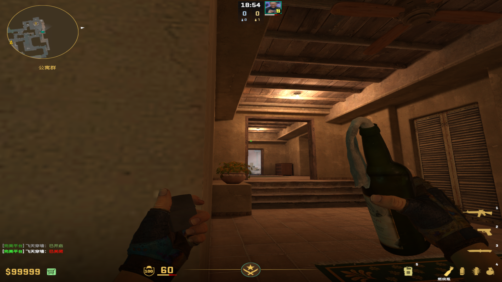
			-
	-
	- ## 沙发&玩机器
	  collapsed:: true
		- 投掷：（蹲着）左键直接丢
		- 站位：910闪位置
		- 描点：白布右端，大概是窗户棱角高度
		  collapsed:: true
			- 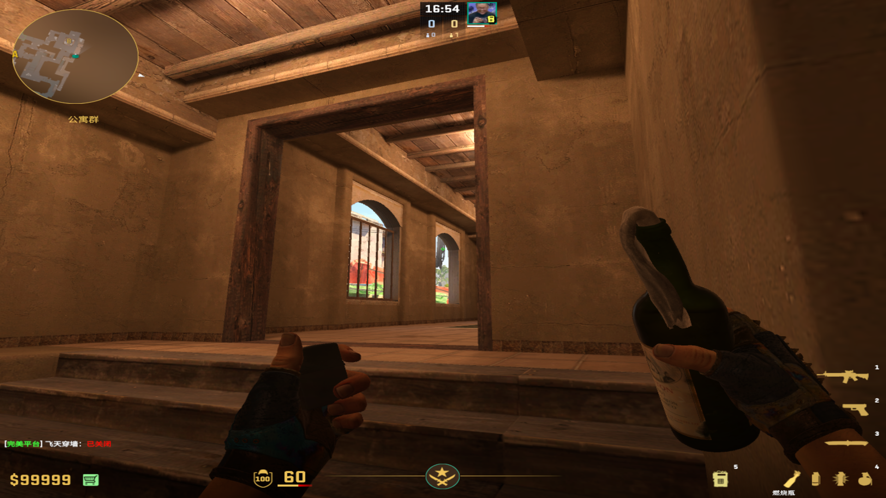
			-
	-
	- ## 黄金位&钻石位（超市外围）
	  collapsed:: true
		- 投掷：跑着左键投掷
		- 站位：尽量不漏窗户
		  collapsed:: true
			- 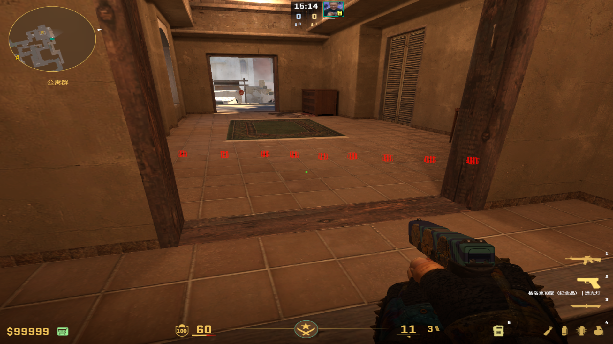
		- 描点：窗户右端木条和方框光的左上角
		  collapsed:: true
			- 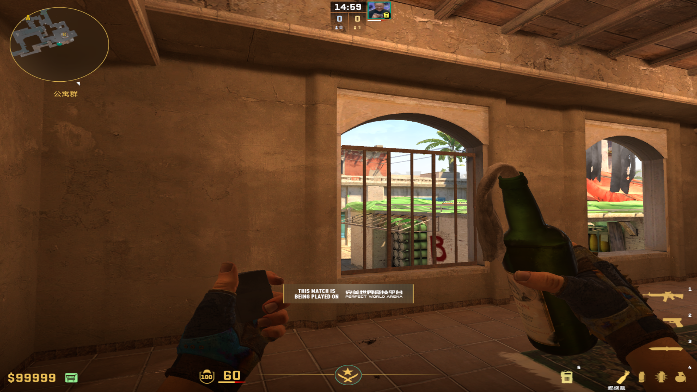
			-
	-