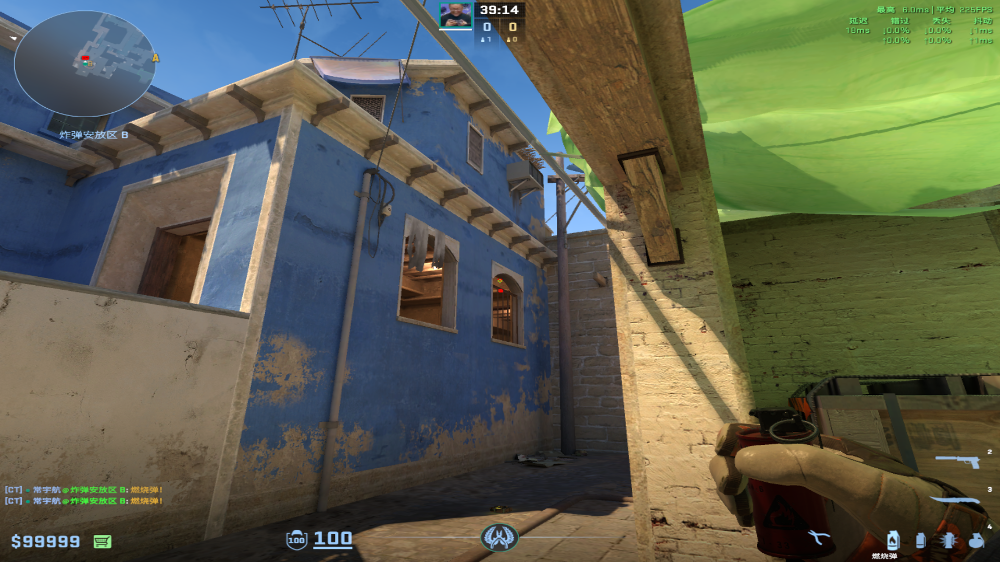
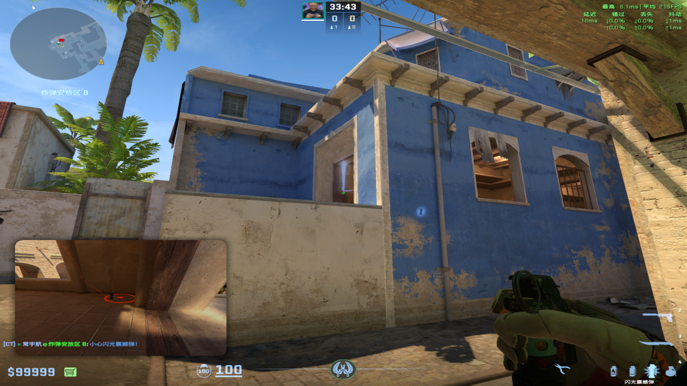
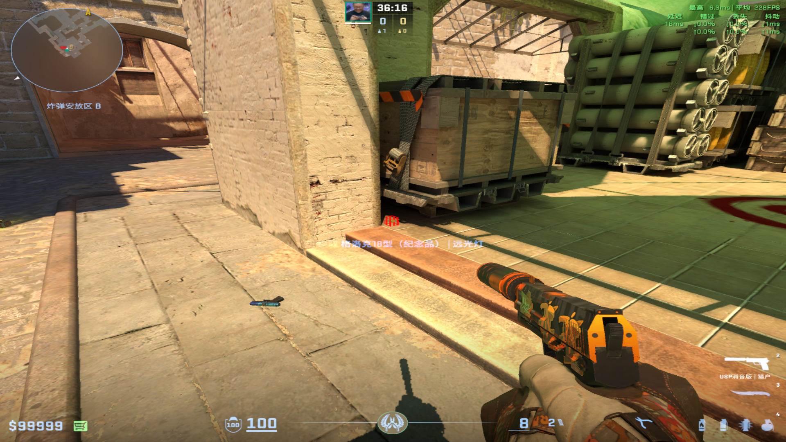
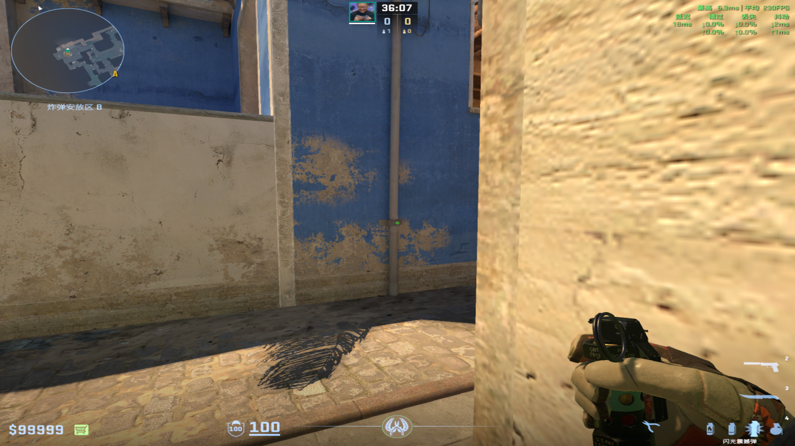
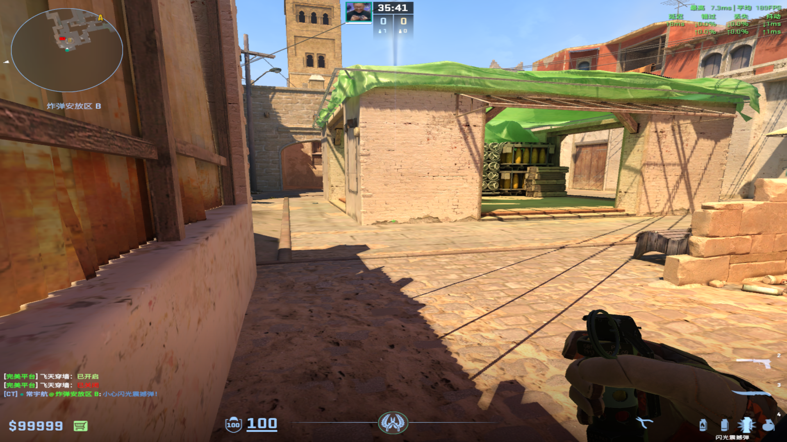
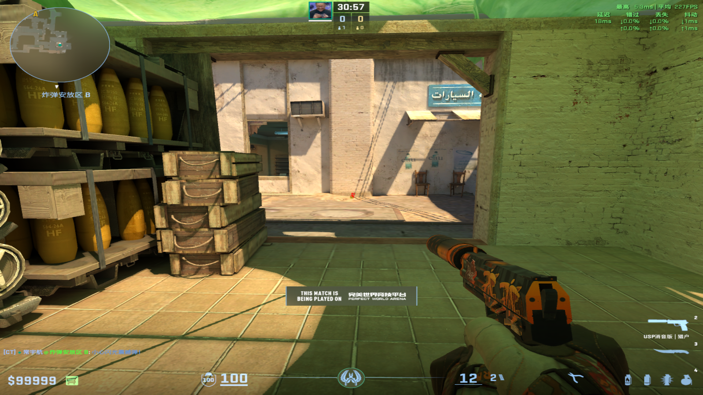
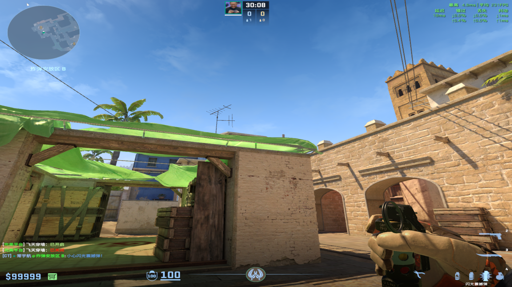

# 燃烧弹
	- ## 厨房火
	  collapsed:: true
		- 投掷：W跑两步左键投掷
		- 站位：忍者位箱子后面
		- 描点：窗户下端到白色线条
		  collapsed:: true
			- 
			-
-
- # 闪光弹
  collapsed:: true
	- ## 防Rush保活
	  collapsed:: true
		- 投掷：左键直接丢
		- 描点：弹门框能丢到角落就行
			- 
			-
	-
	- ## 白B小自助闪光
	  collapsed:: true
		- ### 包点投掷
		  collapsed:: true
			- 投掷：W+左键跳投
			- 站位：忍者位下面死角
				- 
			- 描点：B二楼水管结点
				- 
				-
		-
		- ### 玩机器投掷
		  collapsed:: true
			- 投掷：W+左键跳投
			- 描点：下面污渍，左面那个大的的右面部分
			  collapsed:: true
				- 
				-
	-
	- ## 清B2楼闪光
	  collapsed:: true
		- 投掷：W+左键投掷
		- 站位：超市外围的柱子
		  collapsed:: true
			- 
		- 描点：黑色阴影上端
		  collapsed:: true
			- 
			-
	-
	-