public:: true

- # 手雷
  collapsed:: true
	- ## vip炸烟雷
		- ### Zywoo右侧炸烟雷（第一时间丢）
		  collapsed:: true
			- 投掷：左键直接丢
			- 站位：凳子前侧
				- 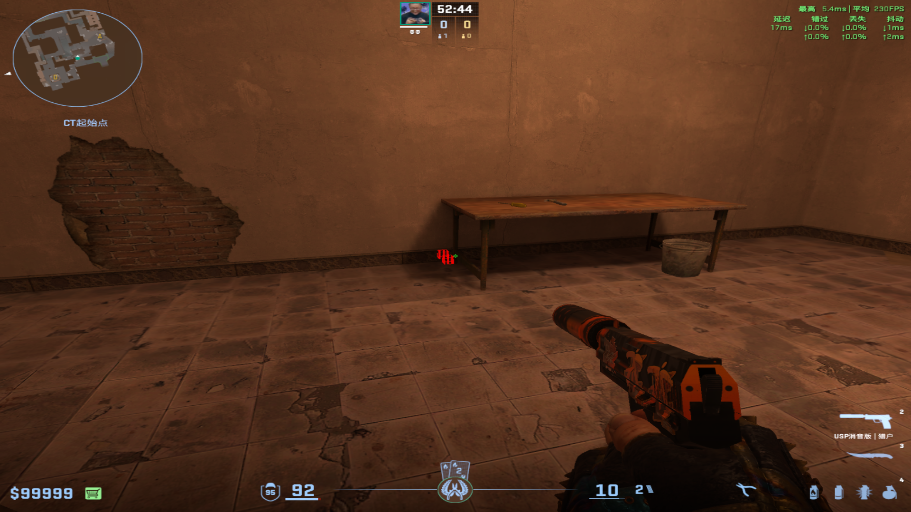
			- 描点：头顶右下角木板左侧黑斑
				- 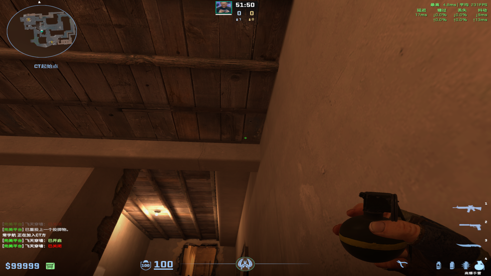
				-
		-
		- ###  Monesy炸烟雷（第一时间丢）
		  collapsed:: true
			- 投掷：左键直接丢
			- 站位：板凳死角
			- 描点：地板深色区域
				- 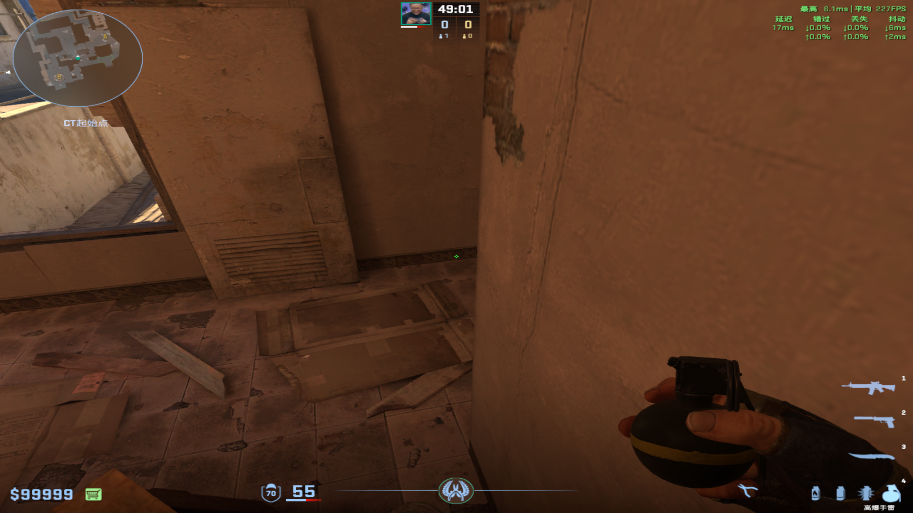
		-
		- ###  R3炸烟雷
		  collapsed:: true
			- 投掷：右键直接丢
			- 站位：VIP跳黑屋箱子的前侧
			- 描点：视角拉到最上面，丢完跑到右面
-
- # 闪光弹
  collapsed:: true
	- ## 长箱闪（第一时间让对面缓慢一点）
	  collapsed:: true
		- 投掷：左键跑着跳投
		- 描点：从第一个缺口丢出去
		  collapsed:: true
			- 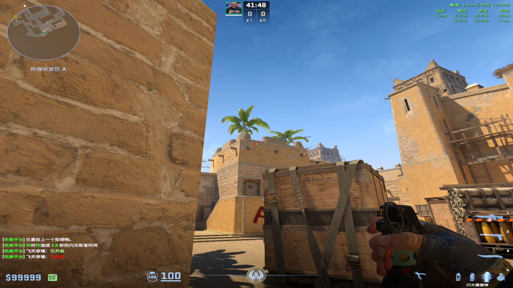
			-
	-
	- ## YGG闪光弹（二时间反清）
	  collapsed:: true
		- 投掷：左键跳投
		- 站位：VIP底线后花坛死角
		  collapsed:: true
			- 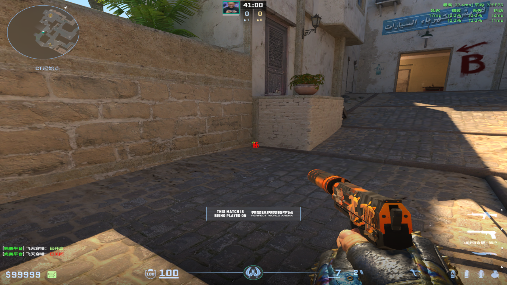
		- 描点：最上面一排砖块缝隙
		  collapsed:: true
			- 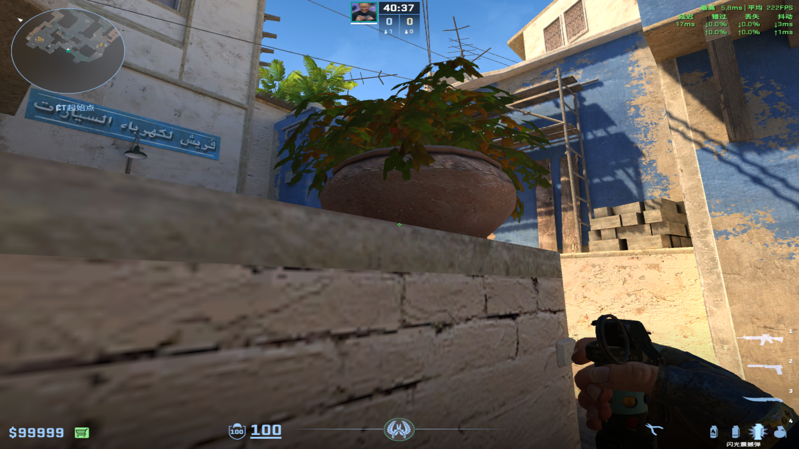
			-
	-
	- ## Ropz自助闪（一时间出去打）
	  collapsed:: true
		- 投掷：跑着右键跳投
		- 站位：最好是在B小箱子后面
		- 描点：这个房棱，越往上越好
			- 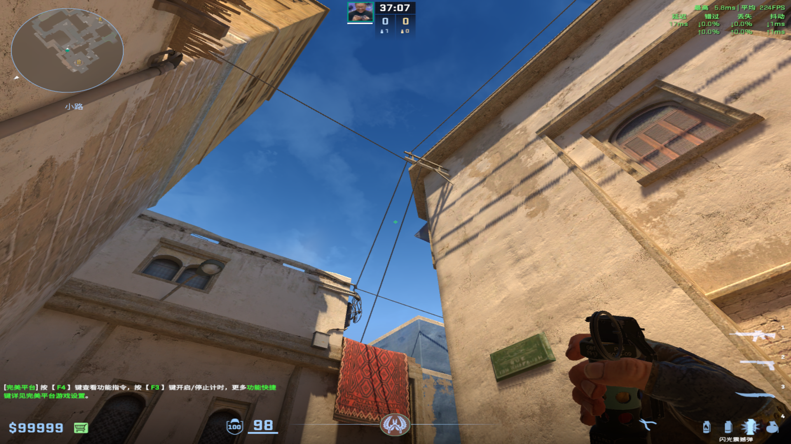
			-
	-
	- ## 白车丢中路闪（二时间反清）
	  collapsed:: true
		- 投掷：走一步左键跳投
		- 描点：忍者位上面木栏杆旁边
		  collapsed:: true
			- 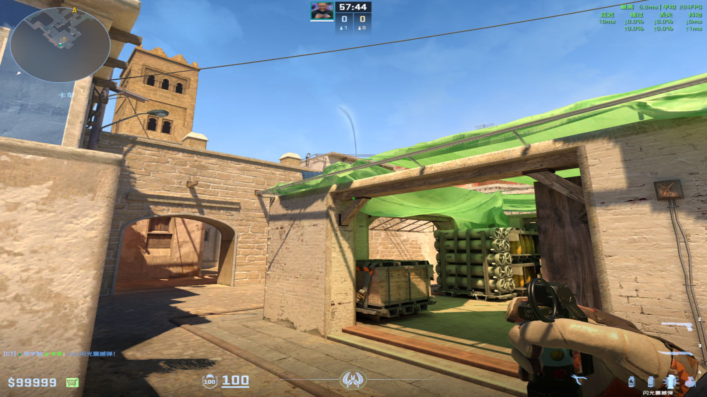
			-
	-
	- ## 马圣拱门自助（出去打）
	  collapsed:: true
		- 投掷：跑着左键直接丢
		- 描点：小窗户下面
			- 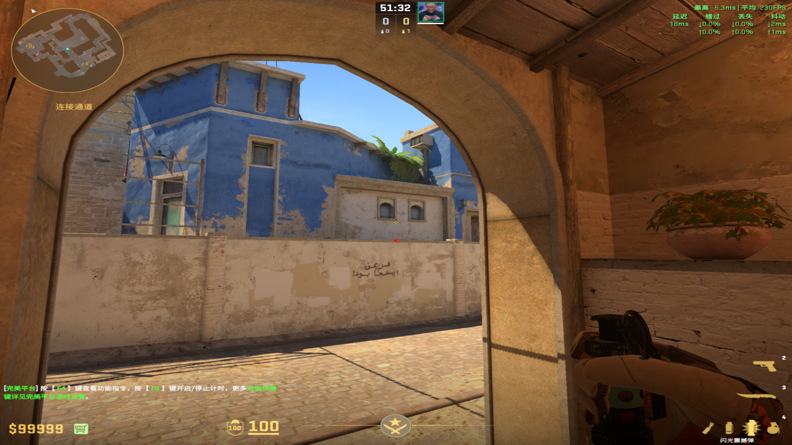
			-
	-
	- ## 拱门自助保命（没办法了）
	  collapsed:: true
		- 投掷：W跑一步左键直接丢
		- 站位：拱门大死角
		- 描点：木板右侧黑色污渍
			- 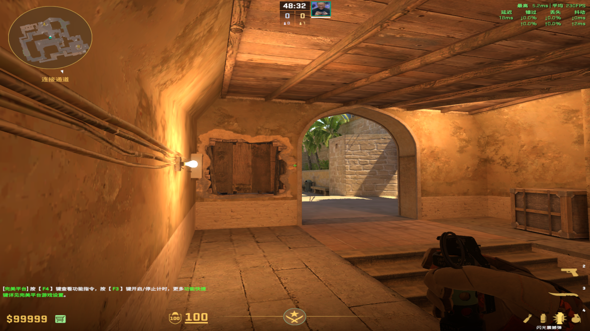
			-
	-
	- ## R3自助闪（藏烟）
	  collapsed:: true
		- 投掷：右键直接丢
		- 站位：拱门大死角漏出来一点
		- 描点：B小木板上
		  collapsed:: true
			- 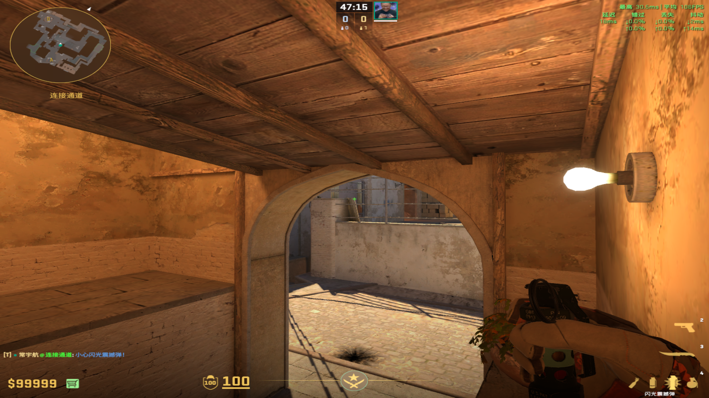
-