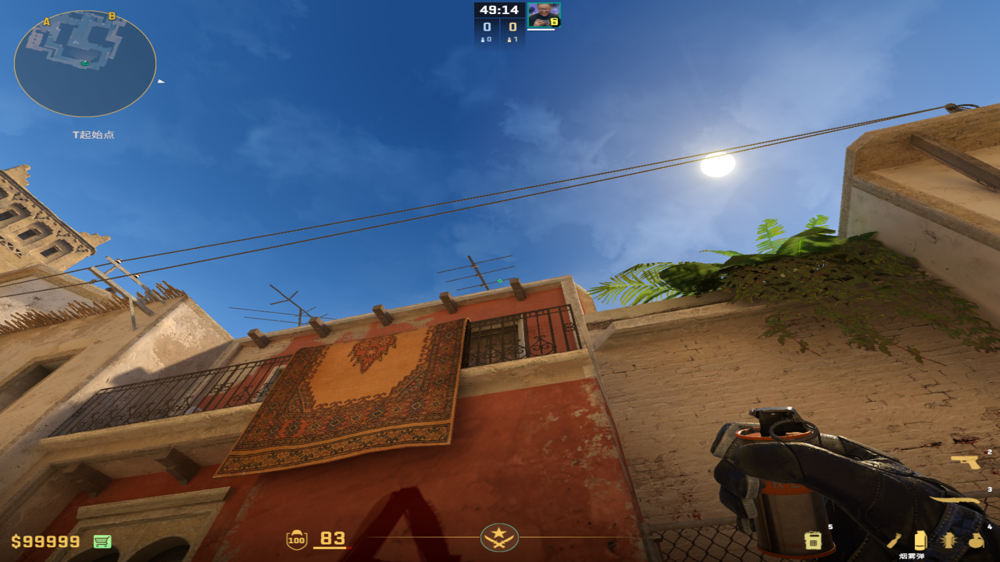

# 烟雾弹
	- ## 过点烟
		- ### 慢过点烟
			- #### 左侧丢
				- 投掷：左键直接丢
				- 站位：匪家左侧死角
					- 
					-
				- 描点：天线夹角
					- 
					-
			- #### 右侧丢
				- 投掷：左键直接丢
				- 站位：垃圾桶左侧
					- 
					-
				- 描点：天线最顶端
					- 
					-
		- ### 快过点烟
			- 
			- #### 1号位
				- 投掷：双键跳投
				- 描点：丢快烟的那个污渍
					- 
			- #### 2号位（不丢，或者直接丢慢的右手）
			- #### 3号位
				- 投掷：左键直接丢
				- 描点：最下面的天线的右半条的中间
					- 
					-
			- #### 4号位
				- 投掷：左键直接丢
				- 描点：第三根木棍的左上角
					- 
					-
			- #### 5号位
				- 投掷：左键直接丢
				- 描点：最左面木棍的右端 和 左侧墙壁右上角的交界处
					- 
					-
			- #### 6号位
				- 投掷：W+双键跳投
				- 描点：窗户红色和黄色的右上角交界处
					- 
					-
			- #### 7号位
				- 投掷：左键直接丢
				- 站位：出生位瞄准后向后走到准心在电线中间
					- 
				- 描点：底下最左面木棍的左侧夹角
					- 
					-
			- #### 8号位
				- 投掷：左键直接丢
				- 站位：出生位瞄准后向后走到准心在电线中间
					- 
				- 描点：木棍右侧的第一条竖线，向下平移到木条底端
					- 
					-
			- #### 9号位
				- 投掷：左键直接丢
				- 站位：出生位瞄准后向后走到准心在天线上面
					- 
				- 描点：地毯右下角，尖尖朝下的那个图形向下拉到地毯底部
					- 
					-
			- #### 10号位
				- 投掷：W+双键跳投
				- 描点：这个像天平一样的污渍的左边的左上角
					- 
					-
			-
-