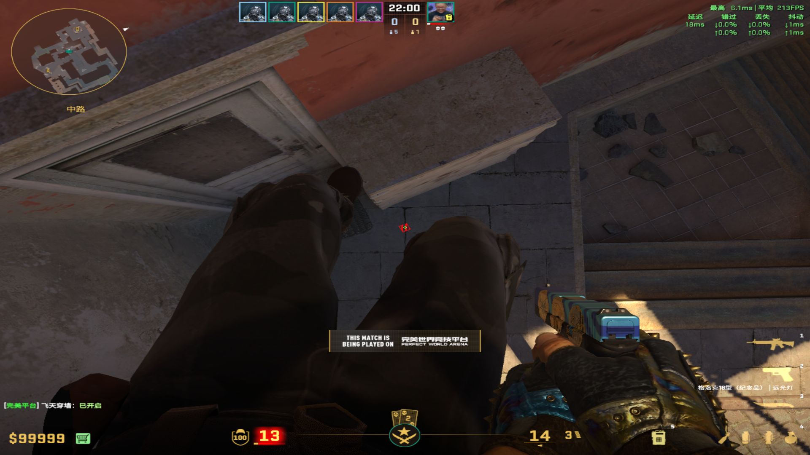
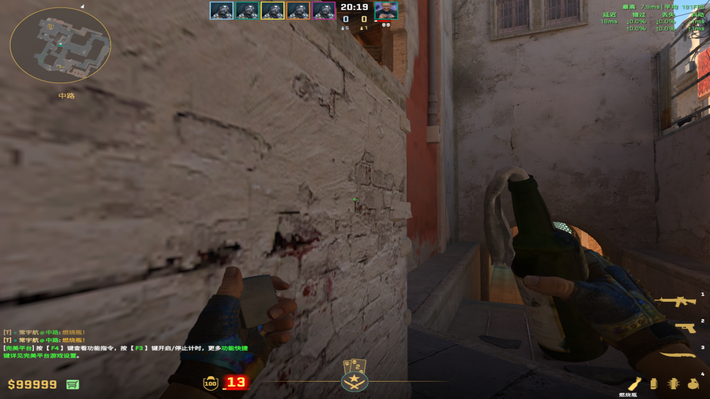
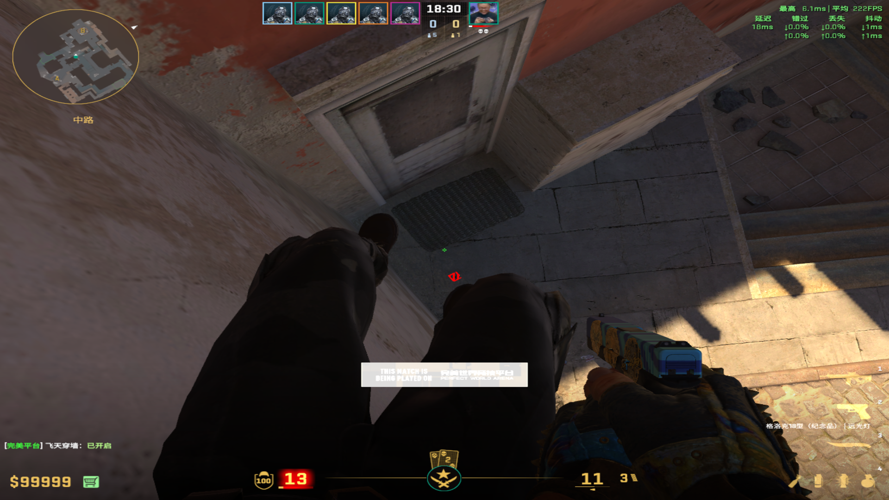
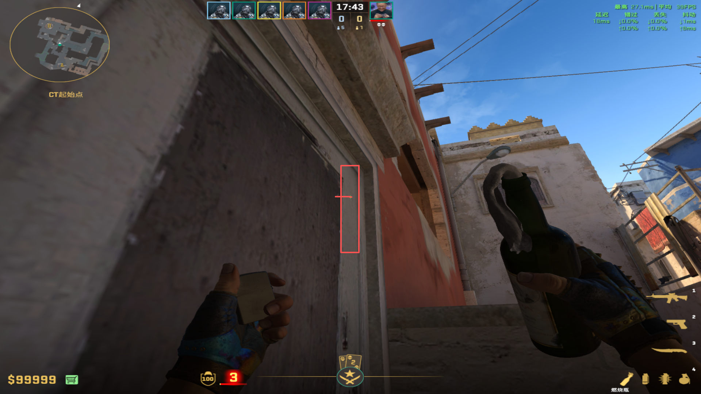
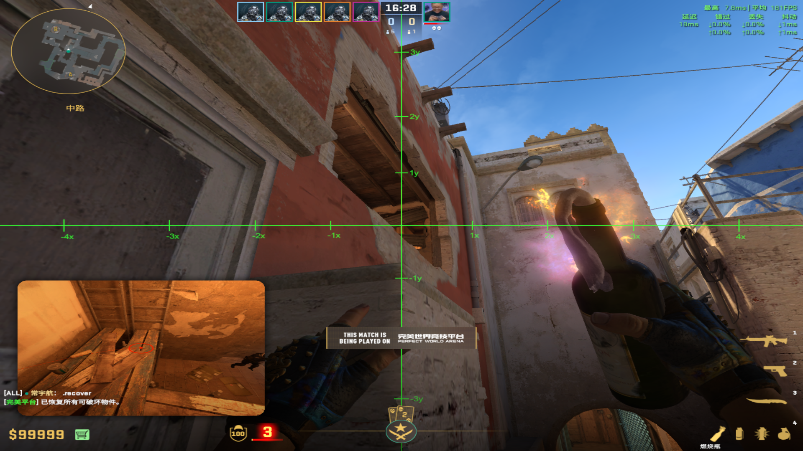
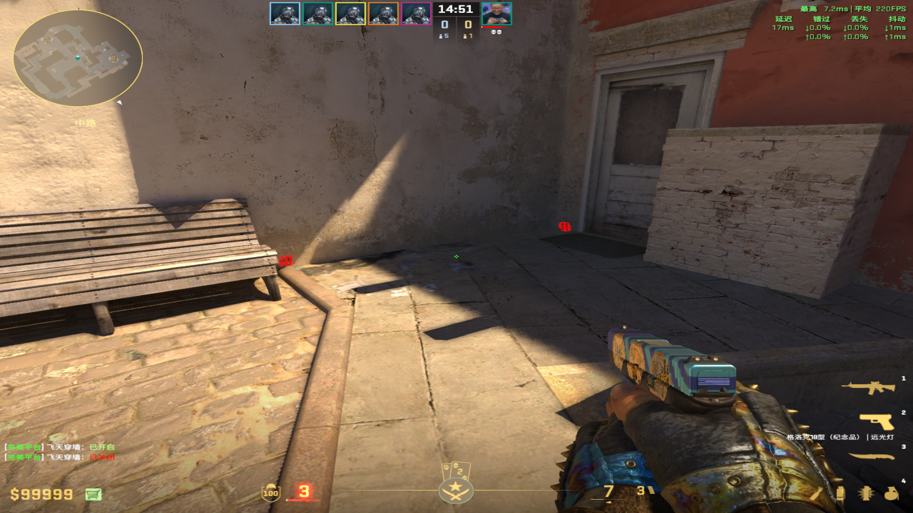
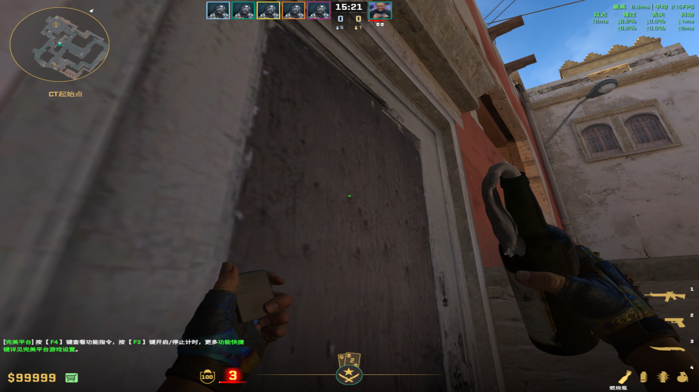
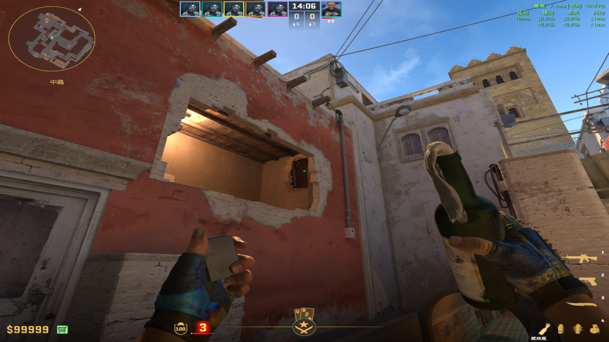
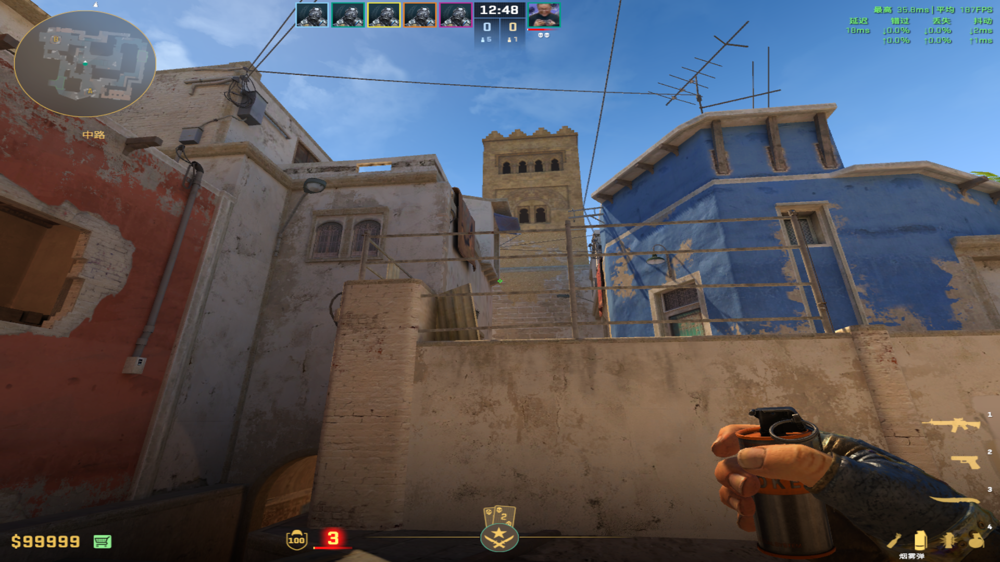

public:: true

- # 燃烧弹
  collapsed:: true
	- ## 黑屋火
	  collapsed:: true
		- ### Zweih火
		  collapsed:: true
			- 投掷：双键跳投
			- 站位：VIP箱子下砖块斜线
				- 
			- 描点：小斜线和竖线的交点
				- 
				-
		-
		- ### 改良Zweih火
		  collapsed:: true
			- 投掷：左键直接丢
			- 站位：VIP下死角描点后s到投掷位置
				- 
			- 描点：先瞄准白点到右侧白门的中间，s到箱子棱角，后蹲下让-1y的中间对准箱子的深浅区域
			  collapsed:: true
				- 
				- {:height 291, :width 503}
				-
				-
		-
		- ### 京介火（破窗）
		  collapsed:: true
			- 投掷：左键直接丢
			- 站位：VIP下死角描点后s到板凳
			  collapsed:: true
				- 
			- 描点：窗户上斜的三连黑斑的上面那个，s到板凳前方
			  collapsed:: true
				- 
				- 
				-
		-
-
- # 闪光弹
  collapsed:: true
	- ## 蒙古闪
		- 投掷：左键直接丢
		- 站位：板凳后侧
		- 描点：B小上方凸出来的墙体右下角
		  collapsed:: true
			- 