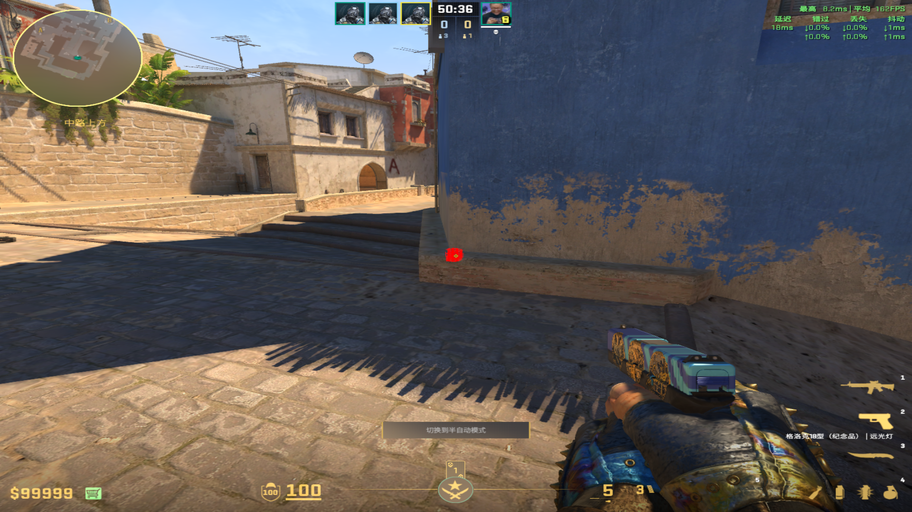
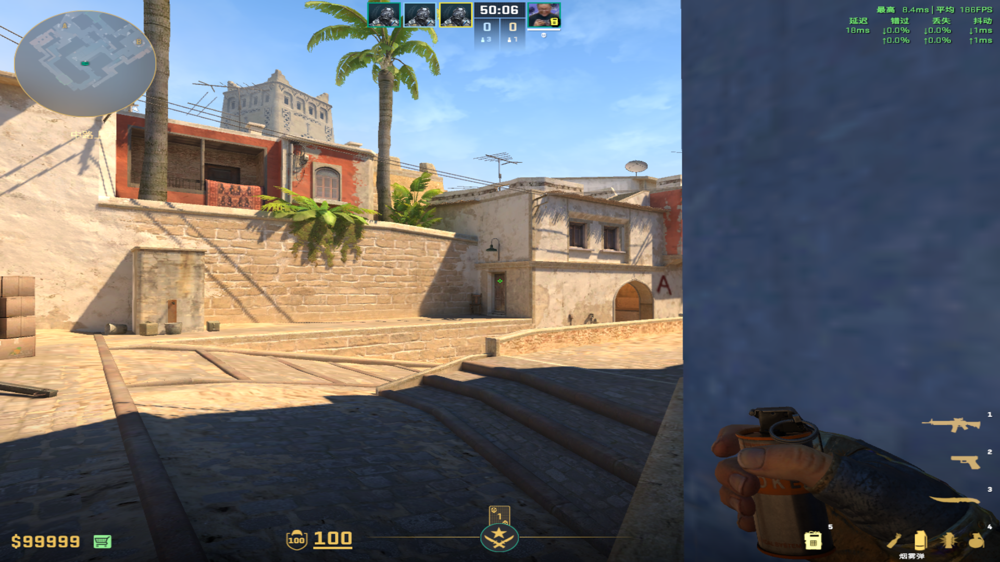
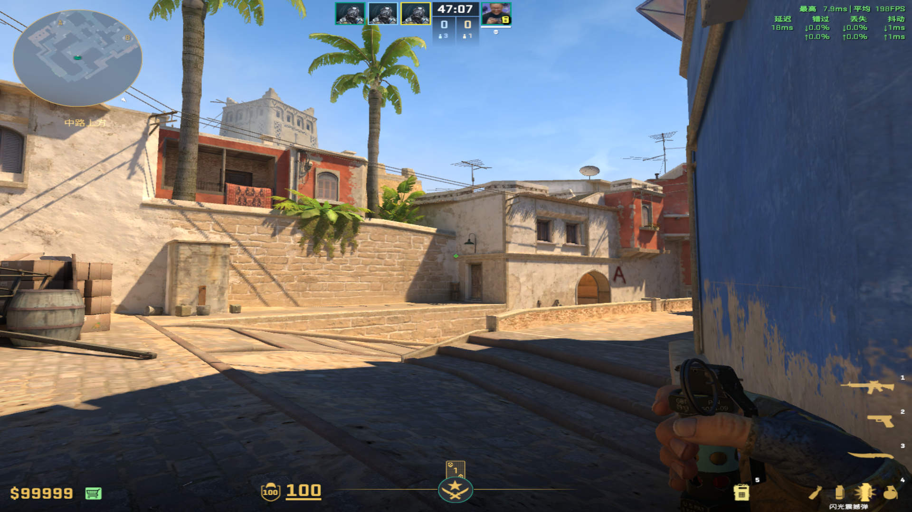
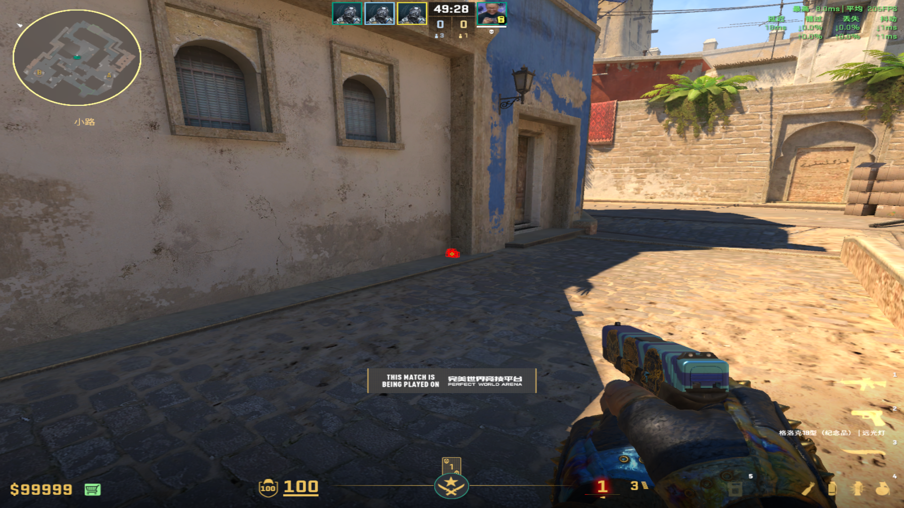
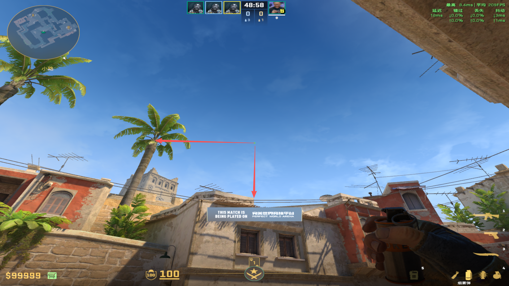
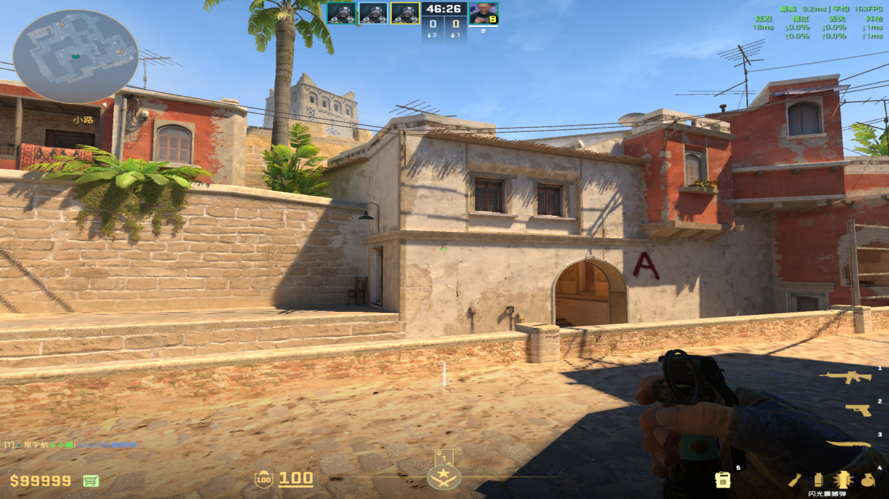
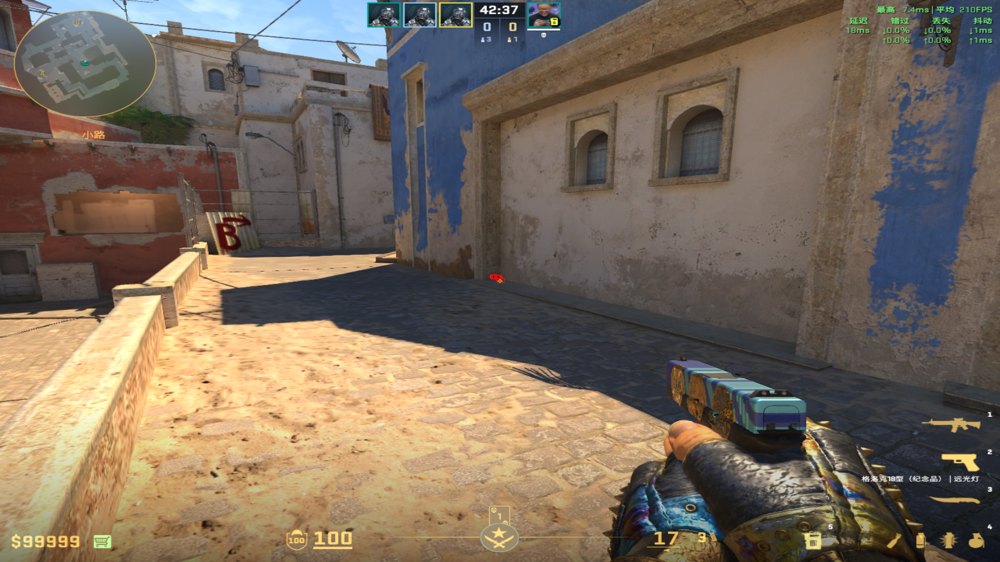
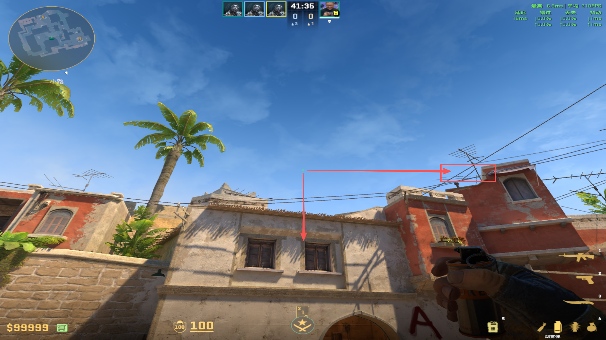
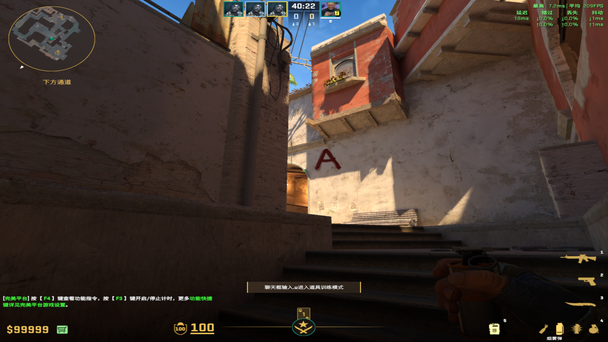

public:: true

- # 烟雾弹
  collapsed:: true
	- ## Jungle烟（配闪光）
		- ### 匪口丢
			- 投掷：左键跳投
			- 站位：匪口拐角
			  collapsed:: true
				- 
			- 描点：门偏上部分中间
			  collapsed:: true
				- 
			- 闪光：跑一步左键跳投&水平木条上端到下端
			  collapsed:: true
				- 
				-
		- ### Broky套餐
		  collapsed:: true
			- 投掷：左键跳投
			- 站位：中路后凹槽
			  collapsed:: true
				- 
			- 描点：椰子树根顶部和房顶石墩围栏交点
			  collapsed:: true
				- 
				-
			- 闪光：左键跳投&污渍下端
			  collapsed:: true
				- 
				-
	-
	- ## 拱门内侧烟补充
		- ### 自研这一块
			- 投掷：左键直接丢
			- 站位：中路前凹槽
			  collapsed:: true
				- 
			- 描点：第二个窗户木条左侧和烟囱到天线的交界处
			  collapsed:: true
				- 
				-
		- ### 下水道丢
			- 投掷：跑一步左键直接丢
			- 描点：拱门阴影左下角
				- 
				-